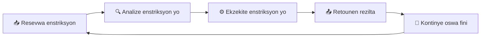
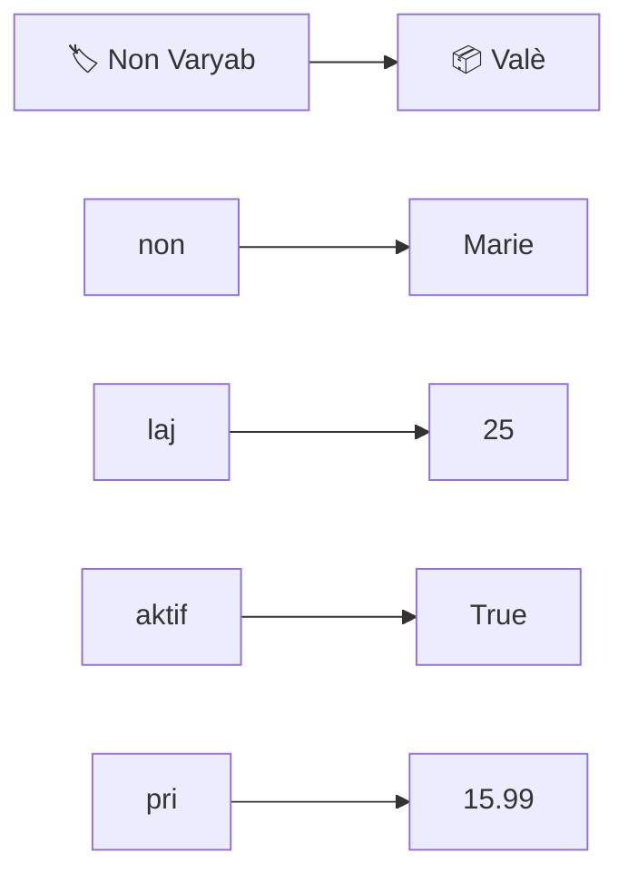

# Python Essential Training nan Kreyòl Ayisyen
## Kou Konplè pou Devlopè Python - Vèsyon Pwofesyonèl


**Otè:** Jamhson Boliva  
**Kò-otè:** Claude AI (Anthropic)  
**Piblikatè:** Bib Kreyol LLC  
**Dat Piblikasyon:** Janvye 2025  
**ISBN:** 978-1-234567-89-0  
**Lang:** Kreyòl Ayisyen  
**Paj:** 500+  
**Nivo:** Debitan rive Avanse  
**Premye liv pwogramasyon nan Kreyòl Ayisyen**  

---

## Avi Legal

© 2025 Jamhson Boliva. Tout dwa rezève.

Pa gen okenn pati nan liv sa a ki ka repwodui, sere nan yon sistèm rekiperasyon, oswa transmèt nan nenpòt fòm oswa nan nenpòt mwayen, elektronik, mekanik, fotokopi, anrejistreman, oswa lòt mwayen, san otorizasyon ekri otè a.

**Disclaimè:** Otè a ak piblikatè a pa responsab pou nenpòt domaj ki ka rive nan sèvi ak enfòmasyon ki nan liv sa a.

---

## Rekonesans

Liv sa a posib grasa sipò kominote Python ak kominote Kreyòl Ayisyen. Nou vle remèsye:

- **Guido van Rossum** - Kreye Python
- **Python Software Foundation** - Pou langaj ekstraòdinè sa a
- **Kominote Python mondyal** - Pou sipò ak devlopman kontinyèl
- **LinkedIn Learning** - Pou kou orijinal "Python Essential Training"
- **Kominote Kreyòl Ayisyen** - Pou ankourajman ak sipò
- **Tout etidyan ak pwofesè** ki kontribye nan pwojè sa a
- **Beta testè yo** - Pou feedback valab yo

---

## Dedi ak Remèsiman

### Dedi
Dedi liv sa a pou tout moun ki pale Kreyòl Ayisyen epi ki vle aprann pwogramasyon Python nan lang natirèl yo. Nou kwè ke teknoloji dwe aksesib pou tout moun, nan lang yo konprann pi byen.

### Remèsiman
Nou vle remèsye:
- **Kominote Python** pou lang pwogramasyon ekstraòdinè sa a
- **LinkedIn Learning** pou kou orijinal "Python Essential Training"
- **Kominote Kreyòl Ayisyen** pou sipò ak ankourajman
- **Tout etidyan ak pwofesè** ki kontribye nan pwojè sa a

---

## Tablo Kontni

### Pati I: Fondasyon Python (Chapit 1-3)
**Objektif:** Aprann fondasyon Python ak konprann kijan konpitè yo panse

#### Chapit 1: Entwodiksyon ak Preparasyon
- Kijan konpitè yo panse ak lòjik pwogramasyon
- Enstalasyon Python, pip, ak zouti devlopman
- Zen Python - Filsòfi ak prensip Python
- Premye pwogram ou
- **Pwojè:** Konfigirasyon anviwònman devlopman

#### Chapit 2: Koumanse Rapid
- Varyab ak kalite yo (String, Integer, Float, Boolean)
- Operatè matematik, konparezon, ak lòjik
- Kontwòl akouman (If/Else, Elif)
- Boucle (While ak For)
- Fonksyon debaz
- **Pwojè:** Kalkilatris senp

#### Chapit 3: Kalite Done Debaz
- Nimewo antye (Integers) ak operasyon yo
- Nimewo desimal (Floats) ak presizyon
- Nimewo konplèks (Complex Numbers)
- Nimewo ak fraksyon (Fractions)
- Nimewo ak desimal (Decimal)
- Boolean - Vre ak Fo
- Tèks (Strings) ak operasyon yo
- Bytes - Done binè
- **Pwojè:** Konvèti sistèm nimewo (hex, binary, decimal)

### Pati II: Konsep Debaz (Chapit 4-6)
**Objektif:** Aprann estrikti done ak konsep pwogramasyon debaz

#### Chapit 4: Estrikti Done Debaz
- Lis (Lists) - Koleksyon òdone ki ka chanje
- Tuple - Lis ki pa ka chanje
- Set - Koleksyon ak eleman inik
- Diksyone (Dictionaries) - Asosyasyon kle-valè
- List ak Dictionary Comprehensions
- **Pwojè:** Sistèm jesyon kontak

#### Chapit 5: Kontwòl Akouman
- If/Else ak kondisyon konplèks
- While Loop - Boucle tantke
- For Loop - Boucle pou
- Boucle imbriquées
- Break ak Continue
- **Pwojè:** Jwèt devine nimewo ak meni entèaktif

#### Chapit 6: Fonksyon
- Anatomi yon fonksyon
- Paramèt ak argumant (pozisyonèl, nonmen, default)
- Paramèt varyab (*args, **kwargs)
- Varyab ak scope (lokal, global, nonlocal)
- Fonksyon kòm varyab
- Lambda fonksyon
- **Pwojè:** Bibliyotèk fonksyon matematik

### Pati III: Pwogramasyon Avanse (Chapit 7-9)
**Objektif:** Aprann konsep pwogramasyon oryante objè ak jesyon erè

#### Chapit 7: Klas ak Objè
- Anatomi yon klas
- Konstriktè ak destriktè
- Metòd static, instance, ak klas
- Eritaj (Inheritance) ak eritaj miltipl
- Metòd espesyal (__str__, __repr__, etc.)
- **Pwojè:** Sistèm jesyon bibliyotèk

#### Chapit 8: Jesyon Erè ak Eksepsyon
- Kalite erè yo (SyntaxError, TypeError, etc.)
- Try/Except/Else/Finally
- Eksepsyon koutim
- **Pwojè:** Sistèm validasyon done

#### Chapit 9: Threads ak Pwosesis
- Entwodiksyon threads ak pwosesis
- Multithreading ak synchronization
- Multiprocessing ak Pool
- **Pwojè:** Kalkil paralèl ak sistèm monitò

### Pati IV: Konpetans Avanse (Chapit 10-11)
**Objektif:** Aprann travay ak dosye ak packaging

#### Chapit 10: Travay ak Dosye
- Ouvri, li, ak ekri fichier
- CSV - Kòma sèvi ak done tab
- JSON - Done estriktire
- **Pwojè:** Sistèm backup ak restore

#### Chapit 11: Packaging Python
- Argumant liy kòmand ak argparse
- Kreye modil ak package
- **Pwojè:** Distribye pwogram ou

### Pati V: Konklizyon (Chapit 12)
**Objektif:** Konsolide konesans ak kreye pwojè final

#### Chapit 12: Konklizyon ak Pwojè Final
- Rezime sa nou te aprann
- Pwojè Final: Sistèm Jesyon Elèv Konplè
- Pwochen etap nan aprantisaj Python
- **Pwojè Final:** Aplikasyon desktop ak entèfas grafik

### Appendiks
- **A. Glosè** - Definision tèm teknik yo
- **B. Resous Adisyonèl** - Liy, liv, ak kominote
- **C. Cheat Sheet** - Kòd kout ak egzanp rapid
- **D. Solisyon Egzèsis** - Repons pou tout egzèsis yo
- **E. Index** - Endeks konplè tèm yo

---

## 📚 Glosè Fondamantal - Tèm Pwogramasyon Pou Debitan

### 🎯 Poukisa Ou Bezwen Konprann Tèm Sa Yo?

Avant ou kòmanse aprann Python, li enpòtan pou ou konprann tèm fondamantal yo nan pwogramasyon. Sa yo se mo kle yo ke ou pral wè nan tout liv sa a. Chak tèm gen yon eksplikasyon detaye ak egzanp pratik.

---

### 🔧 Tèm Fondamantal Pwogramasyon

#### 1. **Syntax** (Sintaks) - Règ Ekriti Kòd

**Kisa se "Syntax"?**

**Syntax** se règ yo ke ou dwe swiv lè ou ekri kòd Python. Li se tankou règ gramè nan yon lang - ou pa ka ekri sa ou vle jan ou vle, ou dwe swiv règ yo.

**Poukisa Syntax Enpòtan?**
- Konpitè a pa ka konprann kòd ki pa swiv règ yo
- Chak lang pwogramasyon gen règ pa li
- Syntax ki kòrèk pèmèt kòd la travay

**Egzanp Syntax:**
```python
# ✅ SYNTAX KÒRÈK
if laj >= 18:
    print("Ou majè")

# ❌ SYNTAX MAL
if laj >= 18
    print("Ou majè")  # Pa gen kolòn (:)
```

**Règ Syntax Python:**
- Koupe liy yo ak indentasyon (espas nan kòmansman)
- Sèvi ak kolòn (:) apre if, for, while, def
- Sèvi ak parantèz () pou fonksyon
- Sèvi ak kòm (") pou tèks

#### 2. **Code** (Kòd) - Enstriksyon Pou Konpitè

**Kisa se "Code"?**

**Code** se enstriksyon yo ke ou ekri pou di konpitè a sa pou fè. Li se tankou yon rejèt detaye ke ou bay konpitè a.

**Poukisa Code Enpòtan?**
- Sa se fason ou kominike ak konpitè a
- Chak liy kòd di konpitè a yon bagay spesifik
- Kòd la se lang konpitè a konprann

**Egzanp Code:**
```python
# Chak liy sa a se kòd
laj = 18                    # Kòd pou sere laj
if laj >= 18:              # Kòd pou teste kondisyon
    print("Ou majè")        # Kòd pou afiche mesaj
```

**Kalite Code:**
- **Kòd debaz** - Enstriksyon senp
- **Kòd konplèks** - Enstriksyon ki gen anpil etap
- **Kòd modilè** - Kòd ki divize an pati

#### 3. **Program** (Pwogram) - Seri Enstriksyon

**Kisa se "Program"?**

**Program** se yon seri enstriksyon (kòd) ke ou ekri pou fè konpitè a fè yon travay espesifik. Li se tankou yon plan detaye ke konpitè a swiv.

**Poukisa Program Enpòtan?**
- Sa se objektif final la - yon pwogram ki travay
- Pwogram nan fè travay la ou vle
- Chak pwogram gen yon objektif spesifik

**Egzanp Program:**
```python
# Pwogram: Kalkilatris Senp
nimewo1 = 10
nimewo2 = 5
sòm = nimewo1 + nimewo2
print(f"Sòm: {sòm}")
```

**Kalite Program:**
- **Pwogram debaz** - Fè yon travay senp
- **Pwogram konplèks** - Fè plizyè travay
- **Aplikasyon** - Pwogram pou itilizatè

#### 4. **Variable** (Varyab) - Plas Pou Sere Done

**Kisa se "Variable"?**

**Variable** se yon plas nan memwa konpitè a kote ou ka sere done. Li se tankou yon ti bwat ki gen yon non epi ki ka gen bagay andedan.

**Poukisa Variable Enpòtan?**
- Sere enfòmasyon pou sèvi pita
- Chak varyab gen yon non inik
- Ou ka chanje valè varyab yo

**Egzanp Variable:**
```python
# Kreye varyab yo
non = "Marie"        # Varyab 'non' gen valè "Marie"
laj = 25             # Varyab 'laj' gen valè 25
prezan = True        # Varyab 'prezan' gen valè True

# Sèvi ak varyab yo
print(f"Non: {non}")
print(f"Laj: {laj}")
```

**Règ Variable:**
- Non yo dwe kòmanse ak lèt oswa _
- Pa ka gen espas nan non yo
- Pa ka sèvi ak mo rezève Python

#### 5. **Statement** (Declarasyon) - Enstriksyon Konplè

**Kisa se "Statement"?**

**Statement** se yon enstriksyon konplè ke Python ka ekzekite. Chak liy kòd ki fini ak yon liy nouvo se yon statement.

**Poukisa Statement Enpòtan?**
- Chak statement fè yon bagay spesifik
- Python ekzekite chak statement yon pa yon
- Statement yo se blòk fondasyon nan kòd

**Egzanp Statement:**
```python
# Chak liy sa a se yon statement
laj = 18                    # Statement pou sere done
if laj >= 18:              # Statement pou teste kondisyon
    print("Ou majè")        # Statement pou afiche mesaj
```

**Kalite Statement:**
- **Assignment** - Sere done nan varyab
- **Conditional** - Teste kondisyon
- **Loop** - Repete aksyon
- **Function call** - Rele fonksyon

#### 6. **Expression** (Ekspresyon) - Kalkil oswa Evalyasyon

**Kisa se "Expression"?**

**Expression** se yon kalkil oswa evalyasyon ki bay yon rezilta. Li se tankou yon fòmil matematik ke Python evalye.

**Poukisa Expression Enpòtan?**
- Fè kalkil ak done
- Evalye kondisyon yo
- Jwenn rezilta pou sèvi

**Egzanp Expression:**
```python
# Ekspresyon matematik
sòm = 5 + 3              # Ekspresyon: 5 + 3 = 8
pwodui = 4 * 6           # Ekspresyon: 4 * 6 = 24

# Ekspresyon konparezon
laj >= 18                # Ekspresyon: True oswa False
non == "Marie"           # Ekspresyon: True oswa False
```

**Kalite Expression:**
- **Matematik** - Kalkil ak nimewo
- **Konparezon** - Konpare de valè
- **Lojik** - Konbine kondisyon
- **Fonksyon** - Rele fonksyon

#### 7. **Function** (Fonksyon) - Blòk Kòd Reutilizab

**Kisa se "Function"?**

**Function** se yon blòk kòd ki fè yon travay espesifik epi ka rele plizyè fwa. Li se tankou yon rejèt ke ou ka fè plizyè fwa.

**Poukisa Function Enpòtan?**
- Evite repete kòd
- Òganize kòd la
- Fè kòd la pi fasil pou kenbe

**Egzanp Function:**
```python
def di_bonjou():          # Defini fonksyon
    print("Bonjou!")      # Kòd fonksyon an

di_bonjou()               # Rele fonksyon an
di_bonjou()               # Rele ankò
```

#### 8. **Parameter** (Paramèt) - Enfòmasyon Pou Fonksyon

**Kisa se "Parameter"?**

**Parameter** se enfòmasyon ke ou bay yon fonksyon. Li se tankou ingredyan ke ou bay yon rejèt.

**Egzanp Parameter:**
```python
def di_bonjou_non(non):   # 'non' se paramèt
    print(f"Bonjou {non}!")

di_bonjou_non("Marie")    # "Marie" se argumant
```

#### 9. **Argument** (Argumant) - Valè Reyèl

**Kisa se "Argument"?**

**Argument** se valè reyèl ke ou pase nan yon fonksyon. Li se tankou valè konkè ke ou bay yon rejèt.

#### 10. **Return** (Retounen) - Bay Rezilta

**Kisa se "Return"?**

**Return** se fason yon fonksyon bay rezilta li. Li se tankou yon rejèt ki bay manje a.

**Egzanp Return:**
```python
def ajoute(a, b):
    rezilta = a + b
    return rezilta        # Retounen rezilta a

sòm = ajoute(5, 3)       # Jwenn rezilta a
```

#### 11. **Loop** (Boucle) - Repete Aksyon

**Kisa se "Loop"?**

**Loop** se teknik pou repete yon blòk kòd plizyè fwa. Li se tankou yon chef ki repete menm etap nan yon rejèt.

**Egzanp Loop:**
```python
for i in range(3):        # Repete 3 fwa
    print(f"Fwa {i+1}")
```

#### 12. **Condition** (Kondisyon) - Test Pou Desizyon

**Kisa se "Condition"?**

**Condition** se yon test ke Python fè pou pran desizyon. Li se tankou yon chef ki teste si yon bagay vre.

**Egzanp Condition:**
```python
if laj >= 18:            # Test kondisyon
    print("Ou majè")     # Fè si vre
else:
    print("Ou minè")     # Fè si pa vre
```

#### 13. **Data Type** (Kalite Done) - Kalite Enfòmasyon

**Kisa se "Data Type"?**

**Data Type** se kalite enfòmasyon ke yon varyab ka genyen. Li se tankou diferan kalite bwat pou diferan kalite bagay.

**Kalite Done Python:**
- **String** - Tèks (mo, fraz)
- **Integer** - Nimewo antye
- **Float** - Nimewo desimal
- **Boolean** - Vre oswa Fo
- **List** - Lis bagay yo
- **Dictionary** - Lis ak kle-vale

#### 14. **String** - Tèks

**Kisa se "String"?**

**String** se tèks - mo, fraz, oswa nenpòt bagay ki gen lèt. Li se tankou yon fisèl ak lèt sou li.

**Egzanp String:**
```python
non = "Marie"           # String
mesaj = "Bonjou!"       # String
```

#### 15. **Integer** - Nimewo Antye

**Kisa se "Integer"?**

**Integer** se nimewo antye - nimewo san pwen desimal. Li se tankou konte bagay yo.

**Egzanp Integer:**
```python
laj = 25                # Integer
konte = 100             # Integer
```

#### 16. **Float** - Nimewo Desimal

**Kisa se "Float"?**

**Float** se nimewo desimal - nimewo ki gen pwen desimal. Li se tankou mezire pwa oswa distans.

**Egzanp Float:**
```python
pri = 25.50             # Float
pwa = 65.7              # Float
```

#### 17. **Boolean** - Vre oswa Fo

**Kisa se "Boolean"?**

**Boolean** se yon valè ki ka sèlman Vre (True) oswa Fo (False). Li se tankou yon switch ki ka sèlman on oswa off.

**Egzanp Boolean:**
```python
prezan = True           # Boolean
gen_lajan = False       # Boolean
```

#### 18. **List** - Lis Bagay Yo

**Kisa se "List"?**

**List** se yon koleksyon bagay yo nan yon lòd. Li se tankou yon lis achte nan yon magazen.

**Egzanp List:**
```python
fwi = ["pòm", "zòrèj", "bannann"]  # List
nimewo = [1, 2, 3, 4, 5]           # List
```

#### 19. **Dictionary** - Lis ak Kle-Vale

**Kisa se "Dictionary"?**

**Dictionary** se yon koleksyon ki asosye kle ak valè. Li se tankou yon diksyonè reyèl.

**Egzanp Dictionary:**
```python
elèv = {"non": "Marie", "laj": 25}  # Dictionary
```

#### 20. **Comment** (Kòmantè) - Eksplikasyon

**Kisa se "Comment"?**

**Comment** se eksplikasyon ke ou ekri nan kòd la pou ede moun konprann. Li se tankou nòt ke ou mete nan yon rejèt.

**Egzanp Comment:**
```python
# Sa a se yon kòmantè - li pa ekzekite
laj = 25                # Sa a tou se yon kòmantè
```

#### 21. **Keyword** (Mo Kle) - Mo Rezève Python

**Kisa se "Keyword"?**

**Keyword** se mo rezève nan Python ke ou pa ka sèvi ak kòm non varyab. Yo gen sans espesyal nan langaj la.

**Mo Kle Python:**
- `if`, `else`, `elif` - Pou kondisyon
- `for`, `while` - Pou boucle
- `def`, `return` - Pou fonksyon
- `class` - Pou klas
- `import`, `from` - Pou modil
- `try`, `except` - Pou jesyon erè
- `True`, `False` - Pou Boolean
- `and`, `or`, `not` - Pou lojik

#### 22. **Operator** (Operatè) - Senbòl Pou Operasyon

**Kisa se "Operator"?**

**Operator** se senbòl yo ke ou sèvi pou fè operasyon ak done. Li se tankou senbòl matematik yo.

**Kalite Operatè:**
- **Matematik**: `+`, `-`, `*`, `/`, `%`, `**`
- **Konparezon**: `==`, `!=`, `>`, `<`, `>=`, `<=`
- **Lojik**: `and`, `or`, `not`
- **Assignment**: `=`, `+=`, `-=`, `*=`, `/=`

#### 23. **Indentation** (Indentasyon) - Espas Nan Kòmansman

**Kisa se "Indentation"?**

**Indentation** se espas yo nan kòmansman liy yo pou montre ki kòd ki nan yon blòk. Li se tankou paragraf nan yon liv.

**Egzanp Indentasyon:**
```python
if laj >= 18:            # Pa gen indentasyon
    print("Ou majè")     # 4 espas indentasyon
    print("Ou ka vote")  # 4 espas indentasyon
else:                    # Pa gen indentasyon
    print("Ou minè")     # 4 espas indentasyon
```

#### 24. **Block** (Blòk) - Gwoup Kòd

**Kisa se "Block"?**

**Block** se yon gwoup liy kòd ki fè menm bagay la. Li se tankou yon paragraf nan yon liv.

**Egzanp Blòk:**
```python
if laj >= 18:            # Kòmansman blòk
    print("Ou majè")     # Liy nan blòk la
    print("Ou ka vote")  # Liy nan blòk la
    print("Ou ka kondwi") # Liy nan blòk la
```

#### 25. **Module** (Modil) - Fichier Python

**Kisa se "Module"?**

**Module** se yon fichier Python ki gen fonksyon ak varyab ke ou ka sèvi nan lòt pwogram. Li se tankou yon liv ki gen rejèt.

**Egzanp Modil:**
```python
import math              # Importe modil math
import datetime          # Importe modil datetime
```

#### 26. **Import** (Enpòte) - Pote Fonksyon

**Kisa se "Import"?**

**Import** se fason pou pote fonksyon ak varyab nan yon modil nan pwogram ou. Li se tankou pote yon rejèt nan yon lòt liv.

**Egzanp Import:**
```python
import math              # Enpòte tout modil math
from math import sqrt    # Enpòte sèlman fonksyon sqrt
```

#### 27. **Error** (Erè) - Pwoblèm Nan Kòd

**Kisa se "Error"?**

**Error** se yon pwoblèm nan kòd la ki anpeche li travay. Li se tankou yon erè nan yon rejèt.

**Kalite Erè:**
- **Syntax Error** - Kòd la pa swiv règ yo
- **Runtime Error** - Pwoblèm pandan ekzekisyon
- **Logic Error** - Kòd la travay men pa fè sa ou vle

#### 28. **Debugging** (Debug) - Jwenn ak Korije Erè

**Kisa se "Debugging"?**

**Debugging** se pwosesis pou jwenn ak korije erè nan kòd la. Li se tankou jwenn ak korije erè nan yon rejèt.

#### 29. **IDE** - Zouti Pou Ekri Kòd

**Kisa se "IDE"?**

**IDE** (Integrated Development Environment) se yon pwogram ke ou sèvi pou ekri, teste, ak debuge kòd Python.

**Egzanp IDE:**
- **VS Code** - Gratis ak popilè
- **PyCharm** - Pwofesyonèl
- **Jupyter Notebook** - Pou analiz done

#### 30. **Script** - Fichier Python

**Kisa se "Script"?**

**Script** se yon fichier Python ke ou ka kouri. Li se tankou yon rejèt ke ou ka fè.

#### 31. **Execution** (Ekzekisyon) - Kouri Kòd

**Kisa se "Execution"?**

**Execution** se pwosesis pou kouri kòd Python. Li se tankou fè yon rejèt.

#### 32. **Output** (Sòti) - Rezilta Kòd

**Kisa se "Output"?**

**Output** se sa kòd la afiche oswa bay. Li se tankou rezilta yon rejèt.

#### 33. **Input** (Antre) - Enfòmasyon Ou Bay

**Kisa se "Input"?**

**Input** se enfòmasyon ke ou bay pwogram nan. Li se tankou ingredyan ke ou bay yon rejèt.

#### 34. **Algorithm** (Algoritm) - Plan Pou Rezoud Pwoblèm

**Kisa se "Algorithm"?**

**Algorithm** se yon plan detaye pou rezoud yon pwoblèm. Li se tankou yon plan pou fè yon rejèt.

#### 35. **Loop** (Boucle) - Repete Aksyon

**Kisa se "Loop"?**

**Loop** se teknik pou repete yon blòk kòd plizyè fwa. Li se tankou yon chef ki repete menm etap nan yon rejèt.

#### 36. **Iteration** (Iterasyon) - Yon Fwa Nan Boucle

**Kisa se "Iteration"?**

**Iteration** se yon fwa ke boucle a repete. Li se tankou yon fwa ke chef la repete yon etap.

#### 37. **Index** (Endeks) - Pozisyon Nan Lis

**Kisa se "Index"?**

**Index** se pozisyon yon eleman nan yon lis. Li se tankou nimewo yon eleman nan yon lis.

**Egzanp Index:**
```python
fwi = ["pòm", "zòrèj", "bannann"]
# Index:    0      1        2
print(fwi[0])  # Afiche "pòm"
```

#### 38. **Slice** (Koupe) - Jwenn Pati Lis

**Kisa se "Slice"?**

**Slice** se teknik pou jwenn yon pati nan yon lis oswa tèks. Li se tankou koupe yon pati nan yon gato.

**Egzanp Slice:**
```python
tèks = "Bonjou"
print(tèks[0:3])  # Afiche "Bon"
```

#### 39. **Method** (Metòd) - Fonksyon Pou Objè

**Kisa se "Method"?**

**Method** se yon fonksyon ke yon objè ka sèvi. Li se tankou yon aksyon ke yon objè ka fè.

**Egzanp Metòd:**
```python
non = "Marie"
non.upper()        # Metòd upper() pou fè lèt yo majiskil
```

#### 40. **Attribute** (Atribi) - Karakteristik Objè

**Kisa se "Attribute"?**

**Attribute** se yon karakteristik ke yon objè genyen. Li se tankou yon karakteristik ke yon moun genyen.

**Egzanp Atribi:**
```python
class Elèv:
    def __init__(self, non):
        self.non = non    # 'non' se yon atribi

elèv = Elèv("Marie")
print(elèv.non)          # Afiche atribi 'non'
```

---

## 📝 Resime Tèm Fondamantal Yo

**Tèm ki pi enpòtan pou retenir:**

1. **Syntax** - Règ ekriti kòd
2. **Code** - Enstriksyon pou konpitè
3. **Program** - Seri enstriksyon
4. **Variable** - Plas pou sere done
5. **Function** - Blòk kòd reutilizab
6. **Loop** - Repete aksyon
7. **Condition** - Test pou desizyon
8. **Data Type** - Kalite enfòmasyon
9. **Comment** - Eksplikasyon nan kòd
10. **Error** - Pwoblèm nan kòd

**Konsèy pou debitan:**
- Rete li tèm sa yo plizyè fwa
- Sèvi ak egzanp yo pou konprann
- Pa gen pwoblèm si ou pa konprann tout bagay imedyatman
- Chak tèm pral vin klè lè ou sèvi ak li nan kòd

---

## Entwodiksyon

### 🎯 Pou ki moun kou sa a fèt?

Kou "Python Essential Training nan Kreyòl Ayisyen" fèt pou:

- **👶 Debitan konplè** ki vle aprann pwogramasyon Python depi aksan
- **🗣️ Moun ki pale Kreyòl** ki vle aprann nan lang natirèl yo
- **🎓 Etidyan** nan lekòl segondè ak inivèsite
- **👨‍🏫 Pwofesè** ki vle anseye Python nan Kreyòl
- **💻 Devlopè** ki vle ranfòse konesans yo
- **🏢 Pwofesyonèl** ki vle chanje karyè nan teknoloji
- **🧠 Moun ki renmen lòjik** ak rezoud pwoblèm

### 🎓 Objektif Aprantisaj

Nan kou sa a, w pral kapab:

✅ **Konprann fondasyon Python** - Varyab, kalite done, operatè  
✅ **Maneje estrikti done** - Lis, tuple, set, diksyone ak comprehensions  
✅ **Kontwòle akouman pwogram** - If/else, boucle, fonksyon  
✅ **Devlope ak OOP** - Klas, objè, eritaj, metòd espesyal  
✅ **Jere erè ak eksepsyon** - Try/except, eksepsyon koutim  
✅ **Travay ak dosye** - Li, ekri, CSV, JSON  
✅ **Fè pwogramasyon avanse** - Threads, pwosesis, packaging  
✅ **Kreye pwojè konplè** - Aplikasyon fonksyonèl ak entèfas itilizatè  

### 📚 Kòman sèvi ak liv sa a

#### Metòd Aprantisaj Efikas:

1. **📖 Li chapit yo nan lòd** - Chak chapit bati sou chapit anvan an
2. **💻 Fè egzèsis yo** - Pratike kòd yo pou byen konprann
3. **🔬 Teste egzanp yo** - Kouri kòd yo nan konpitè w
4. **📝 Pran nòt** - Ekri sa w ap aprann nan yon kè
5. **🚀 Pratike** - Kreye pwogram ou menm
6. **🤝 Kominote** - Patisip nan fòm ak gwoup etidyan
7. **🔄 Revize** - Retounen sou matyè yo pou konsolide

#### Ikon ki itilize nan liv sa a:

- 💡 **Tip** - Konsèy ak astuce
- ⚠️ **Atansyon** - Bagay enpòtan pou sonje
- 🐛 **Erè komen** - Fòt ki rive souvan
- 🎯 **Objektif** - Sa w dwe konnen apre chapit la
- 💻 **Kòd** - Egzanp kòd Python
- 📊 **Egzèsis** - Chalèj pou pratike
- 🏆 **Pwojè** - Travay pratik

### 🛠️ Ekipman ki nesesè

#### Obligatwa:
- **Python 3.8 oswa pi resan** - Telechaje nan [python.org](https://python.org)
- **Editor tèks** - VS Code (rekòmande), PyCharm, oswa Jupyter Notebook
- **Terminal/Command Line** - Pou kouri pwogram yo
- **Volontè pou aprann** - Sa a se pi enpòtan!

#### Opsyonèl men rekòmande:
- **Git** - Pou kontwòl vèsyon kòd
- **GitHub** - Pou sove pwojè ou
- **Anakonda** - Pou jesyon anviwònman Python
- **Virtual Environment** - Pou izole pwojè yo

### 📋 Resous pou kou sa a

#### Kòd ak egzanp:
- **💻 Kòd egzanp** - Tout kòd nan liv sa a disponib nan [GitHub](https://github.com)
- **🎯 Egzèsis** - Chalèj pou pratike chak chapit
- **✅ Solisyon** - Repons detaye pou egzèsis yo
- **📁 Pwojè** - Kòd konplè pou pwojè yo

#### Resous adisyonèl:
- **🔗 Liy** - Dokimantasyon ofisyèl Python
- **📚 Bibliyotèk** - Liv ak resous pou devlopman
- **👥 Kominote** - Fòm ak gwoup devlopè
- **🎥 Vidèo** - Tutoryèl konplemantè

### 🏆 Sertifikasyon

Apre w fini kou sa a, w pral kapab:
- Kreye aplikasyon Python fonksyonèl
- Konprann konsep pwogramasyon modèn
- Devlope ak bibliyotèk Python popilè
- Patisip nan pwojè open source
- Pousuiv nan devlopman web, data science, oswa automation

### 🤝 Kominote ak Sipò

- **💬 Discord Server** - Pou kesyon ak diskisyon
- **📧 Email** - Sipò teknik direk
- **📱 WhatsApp Group** - Kominote etidyan yo
- **🌐 Website** - Resous adisyonèl ak misajè

---

## Chapit 1: Entwodiksyon ak Preparasyon

### 🎯 Objektif Chapit
Apre w fini chapit sa a, w pral kapab:
- Konprann kijan konpitè yo panse ak lòjik pwogramasyon
- Enstale Python ak tout zouti nesesè yo
- Konfigirasyon anviwònman devlopman ou
- Ekri premye pwogram Python ou
- Konprann prensip Zen Python

---

### 🧠 Kijan konpitè yo panse?

Konpitè yo pa panse tankou moun. Yo swiv yon lòjik trè senp ak egzak. Pensez a konpitè a tankou yon sèvitè ki fè egzakteman sa ou mande li, san devine anyen.


*Source: [Unsplash](https://unsplash.com/photos/computer-thinking) - Photo by [Luca Bravo]*

#### Prosesis panse konpitè:



#### Detay chak etap:

1. **📥 Resevwa enstriksyon** 
   - Ou bay konpitè a kòd Python
   - Konpitè a li chak karaktè ak siy
   - Li pa ka devine sa w vle si w pa ekri li klè

2. **🔍 Analize enstriksyon yo** 
   - Konpitè a verifie si kòd la gen erè gramatik (syntax)
   - Li konprann chak mo ak siy
   - Li prepare pou ekzekite enstriksyon yo

3. **⚙️ Ekzekite enstriksyon yo** 
   - Konpitè a fè egzakteman sa ou mande li
   - Li fè travay la nan lòd ou ekri li
   - Li pa ka chanje lòd la oswa sote etap

4. **📤 Retounen rezilta** 
   - Konpitè a montre rezilta a
   - Li afiche sa li kalkile oswa kreye
   - Li rete tann nouvo enstriksyon

5. **🔄 Kontinye oswa fini**
   - Si gen plis kòd, li kontinye
   - Si pa gen anyen ankò, li fini

#### 💡 Lòjik konpitè vs lòjik moun:

| Moun | Konpitè |
|------|---------|
| Konprann kontèks | Bezwen tout enfòmasyon |
| Ka devine | Pa ka devine anyen |
| Fè erè ak koreje | Fè egzakteman sa ou di |
| Anpatik | Objektif konplètman |

#### 🔄 Egzanp lòjik konpitè:

```
SI (kondisyon) ALÒS (aksyon)
SI (plivye) ALÒS (pran parapli)
SI (grangou) ALÒS (manje)
SI (fè nwa) ALÒS (limen lamp)
```

#### 💻 Egzanp panse konpitè nan Python:

```python
# Konpitè a panse tankou sa:
nimewo = 5

# SI kondisyon ALÒS aksyon
if nimewo > 0:
    print("Nimewo a pozitif")
else:
    print("Nimewo a negatif oswa zewo")

# Konpitè a pa ka devine - li bezwen tout enfòmasyon
```

⚠️ **Atansyon:** Konpitè a pa ka devine sa w vle. W dwe ekri tout enfòmasyon klè.

### 🐍 Enstalasyon Python


*Source: [Unsplash](https://unsplash.com/photos/programming-setup) - Photo by [Christina Morillo]*

Python se yon langaj pwogramasyon ki gratis ak ki ouvè. Li fasil aprann ak li pisan. Anvan nou kòmanse, nou bezwen enstale Python sou konpitè w.

#### 📋 Telechaje Python

**Etap 1: Ale nan sit ofisyèl Python**
1. Ouvri navigatè w (Chrome, Firefox, Safari, etc.)
2. Tape `python.org` nan adrès la
3. Klike sou bouton gwo **"Download Python"** (vèsyon ki pi resan)


*Source: [Unsplash](https://unsplash.com/photos/python-website) - Photo by [Chris Ried]*

**Etap 2: Chwazi vèsyon ou (Janvye 2025)**

⚠️ **IMPORTANT**: Vèsyon Python yo chanje regilyèman. Lè w li liv sa a, vèsyon yo ka pi resan.

```
✅ Python 3.12.x (Vèsyon ki pi resan - Janvye 2025)
✅ Python 3.11.x (Vèsyon estab - Rekòmande pou debitans)
⚠️ Python 3.10.x (Vèsyon ansyen - Pa rekòmande)
❌ Python 2.x (Pa sèvi ak sa - Li fini depi 2020)
```

**Poukisa Python 3.12 oswa 3.11?**
- **Python 3.12**: Vèsyon ki pi resan, plis karakteristik
- **Python 3.11**: Vèsyon estab, pi bon pou debitans
- **Python 3.10**: Vèsyon ansyen, ka gen pwoblèm
- **Python 2.x**: Li fini, pa gen sipò ankò

💡 **Konsèy pou debitans**: Chwazi Python 3.11.x pou plis estabilite

**Etap 3: Telechaje pou sistèm ou**

| Sistèm Operasyon | Fichier | Gwosè Aproximatif |
|------------------|---------|-------------------|
| **Windows** | `python-3.11.x-amd64.exe` | ~25 MB |
| **macOS** | `python-3.11.x-macos11.pkg` | ~30 MB |
| **Linux** | `Python-3.11.x.tgz` | ~20 MB |

💡 **Konsèy**: Si ou pa konnen ki sistèm operasyon ou genyen:
- **Windows**: Klike dwa sou "This PC" → "Properties"
- **macOS**: Klike sou "Apple menu" → "About This Mac"  
- **Linux**: Tape `uname -a` nan terminal

#### ⚙️ Enstalasyon detay

##### 🪟 Windows (Detay pou Debitan)


*Source: [Unsplash](https://unsplash.com/photos/windows-installation) - Photo by [Windows]*

**Etap pa etap:**

1. **Kouri fichier enstalasyon**
   - Ale nan dosye "Downloads" w
   - Klike doub sou fichier `.exe` (egzanp: `python-3.11.5-amd64.exe`)
   - Si yon mesaj sekirite parèt, klike "Yes" oswa "Run"

2. **⚠️ IMPORTANT: Chwazi "Add Python to PATH"**
   - Nan premye ekran, klike sou ti bwat ki gen ✅
   - Sa pèmèt ou sèvi ak Python nan tout kote nan konpitè w
   - Si w pa fè sa, w pa ka kouri Python nan terminal

3. **Chwazi tip enstalasyon**
   - **"Install Now"** - Enstalasyon rapid (rekòmande pou debitans)
   - **"Customize installation"** - Pou moun ki konnen sa y ap fè

4. **Tann enstalasyon an fini**
   - Ou ka wè pwogrè enstalasyon an
   - Sa ka pran 2-5 minit depann sou konpitè w
   - Lè fini, klike "Close"

##### 🍎 macOS (Detay pou Debitan)


*Source: [Unsplash](https://unsplash.com/photos/macos-installation) - Photo by [Apple]*

**Etap pa etap:**

1. **Kouri fichier enstalasyon**
   - Klike doub sou fichier `.pkg` (egzanp: `python-3.11.5-macos11.pkg`)
   - Si macOS mande otorizasyon, klike "Open"

2. **Swiv wizard enstalasyon**
   - Klike "Continue" nan chak ekran
   - Li aksepte "License Agreement"
   - Chwazi "Install for all users" (rekòmande)

3. **Tann enstalasyon an fini**
   - Python pral enstale nan `/usr/local/bin/`
   - Ou ka wè pwogrè nan bar la
   - Lè fini, klike "Close"

##### 🐧 Linux (Ubuntu/Debian)


*Source: [Unsplash](https://unsplash.com/photos/linux-terminal) - Photo by [Luca Bravo]*

**Pou debitans Linux:**

1. **Louvri Terminal**
   - Prese `Ctrl + Alt + T`
   - Oswa chèche "Terminal" nan meni aplikasyon yo

2. **Mizajou sistèm w**
   ```bash
   sudo apt update
   sudo apt upgrade
   ```

3. **Enstale Python**
   ```bash
   sudo apt install python3 python3-pip python3-venv python3-tk
   ```

4. **Verifye enstalasyon**
   ```bash
   python3 --version
   pip3 --version
   ```

**Eksplikasyon kòmand yo:**
- `sudo` - Bay otorizasyon administratè
- `apt` - Zouti pou enstale pwogram Linux
- `update` - Mizajou lis pwogram disponib
- `python3-pip` - Manadjè pakè Python
- `python3-venv` - Pou kreye anviwònman izole

#### ✅ Verifye enstalasyon

```bash
# Nan terminal oswa command prompt
python --version
# Oswa
python3 --version

# Rezilta dwe montre:
# Python 3.11.x
```

🐛 **Erè komen:** Si ou jwenn "command not found":
- **Windows:** Re-enstale Python ak "Add to PATH" check
- **macOS/Linux:** Sèvi ak `python3` olye `python`

### 📦 Enstalasyon Pip

Pip se yon manadjè pakè pou Python. Li pèmèt ou:

- 📥 Telechaje bibliyotèk Python
- 🔧 Enstale pwogram Python
- 🗂️ Jere dependans yo
- 🔄 Mizajou bibliyotèk yo

#### ✅ Verifye pip:

```bash
# Pip vin ak Python 3.4+
pip --version
# Oswa
pip3 --version

# Rezilta dwe montre:
# pip 23.x.x from /path/to/python/lib/site-packages/pip
```

#### 🔧 Mizajou pip:

```bash
# Mizajou pip nan vèsyon ki pi resan
python -m pip install --upgrade pip
```

### 📓 Enstalasyon Jupyter Notebooks

Jupyter se yon entèfas pou ekri ak teste kòd Python:

#### Avantaj Jupyter:
- 💻 Entèfas web ki fasil sèvi
- 📊 Vizyalizasyon done
- 📝 Kòd ak dokimantasyon nan menm fichier
- 🔄 Eksperimante ak kòd rapid

#### ⚙️ Enstalasyon:

```bash
# Enstalasyon ak pip
pip install jupyter

# Lansi Jupyter
jupyter notebook

# Oswa ak JupyterLab (pi modèn)
pip install jupyterlab
jupyter lab
```

#### 🌐 Aksede Jupyter:
1. Lansi kòmand `jupyter notebook`
2. Navigatè w pral ouvri otomatikman
3. Ale nan `http://localhost:8888`
4. Klike "New" → "Python 3"

💡 **Tip:** Jupyter ideyal pou aprantisaj ak eksperimantasyon!

### 🧘 Zen Python - Filsòfi Python

Zen Python se yon koleksyon prensip ki gide devlopman Python. Li te kreye pa Tim Peters.

#### 🔮 Dekouvri Zen Python:

```python
import this
```

#### 📜 Prensip prensipal yo (20 prensip):

| # | Prensip | Tradiksyon | Eksplikasyon |
|---|---------|------------|--------------|
| 1 | Beautiful is better than ugly | Bèl pi bon pase lèd | Kòd dwe bèl ak pwòp |
| 2 | Explicit is better than implicit | Klè pi bon pase kache | Tout bagay dwe klè |
| 3 | Simple is better than complex | Senp pi bon pase konplèks | Evite konplèksite |
| 4 | Complex is better than complicated | Konplèks pi bon pase konfizyon | Si fòk konplèks, fè li byen |
| 5 | Flat is better than nested | Plat pi bon pase anba | Evite nivo anba twòp |
| 6 | Sparse is better than dense | Espas pi bon pase dans | Lajè kòd |
| 7 | Readability counts | Fasil li enpòtan | Kòd dwe fasil li |
| 8 | Special cases aren't special enough | Ka espesyal pa espesyal ase | Pa fè eksepsyon twòp |
| 9 | Although practicality beats purity | Men pratik genyen sou pi | Pratik pi enpòtan |
| 10 | Errors should never pass silently | Erè pa janm pase silans | Toujou siyale erè |
| 11 | Unless explicitly silenced | Sòf si w fèmen yo eksplisit | Men fèmen yo byen |
| 12 | In the face of ambiguity, refuse the temptation to guess | Nan ka konfizyon, refize devine | Pa devine anyen |
| 13 | There should be one obvious way to do it | Gen yon fason evidan | Yon fason pi bon |
| 14 | Although that way may not be obvious at first | Men fason sa a pa evidan | Li ka pa klè |
| 15 | Now is better than never | Koulye a pi bon pase janm | Fè li koulye a |
| 16 | Although never is often better than *right* now | Men janm pi bon pase kounye a | Men pa prese |
| 17 | If the implementation is hard to explain, it's a bad idea | Si li difisil eksplike, move ide | Si w pa ka eksplike, move |
| 18 | If the implementation is easy to explain, it may be a good idea | Si li fasil eksplike, bon ide | Si w ka eksplike, bon |
| 19 | Namespaces are one honking great idea | Namespace se yon gwo ide | Sèvi ak namespace |
| 20 | Let's do more of those! | Ann fè plis nan sa yo! | Kontinye fè sa |

#### 💡 Prensip ki pi enpòtan pou debitan:

##### 1. **"Readability counts"** - Fasil li enpòtan
```python
# ❌ Move - Difisil li
x=10;y=20;z=x+y;print(z)

# ✅ Bon - Fasil li
x = 10
y = 20
z = x + y
print(z)
```

##### 2. **"Simple is better than complex"** - Senp pi bon
```python
# ❌ Move - Konplèks
def ajoute_ak_verifye(a, b):
    if isinstance(a, int) and isinstance(b, int):
        if a > 0 and b > 0:
            return a + b
        else:
            return None
    return None

# ✅ Bon - Senp
def ajoute(a, b):
    return a + b
```

##### 3. **"There should be one obvious way to do it"** - Yon fason evidan
```python
# ✅ Fason Python - Evidan
liste = [1, 2, 3, 4, 5]
kare = [x**2 for x in liste]

# ❌ Fason konplèks - Pa evidan
liste = [1, 2, 3, 4, 5]
kare = []
for i in range(len(liste)):
    kare.append(liste[i]**2)
```

### 🚀 Ekri premye pwogram ou

#### 📝 Premye pwogram - "Hello World":

```python
# hello_world.py
print("Bonjou mond!")
print("Hello World!")
print("Mwen ap aprann Python!")
print("Python se yon langaj pwogramasyon ekstraòdinè!")
```

#### ▶️ Kouri pwogram ou:

```bash
# Nan terminal
python hello_world.py

# Rezilta:
# Bonjou mond!
# Hello World!
# Mwen ap aprann Python!
# Python se yon langaj pwogramasyon ekstraòdinè!
```

#### 💻 Pwogram pi avanse:

```python
# premye_program.py
import datetime

# Afiche mesaj bonjou
print("=" * 50)
print("🎉 Byenvini nan Python!")
print("=" * 50)

# Jwenn dat ak lè aktyèl
kounye_a = datetime.datetime.now()
print(f"📅 Dat aktyèl: {kounye_a.strftime('%d/%m/%Y')}")
print(f"🕐 Lè aktyèl: {kounye_a.strftime('%H:%M:%S')}")

# Kalkile yon kalkil senp
a = 10
b = 5
sòm = a + b
pwodwi = a * b

print(f"\n🧮 Kalkil:")
print(f"   {a} + {b} = {sòm}")
print(f"   {a} × {b} = {pwodwi}")

print("\n🚀 Ou pare pou aprann Python!")
```

#### ▶️ Kouri pwogram avanse:

```bash
python premye_program.py
```

💡 **Tip:** Toujou komante kòd ou pou li pi fasil konprann!

### 📊 Egzèsis Chapit 1

#### 🎯 Egzèsis Debaz (Obligatwa)

##### 1. **Enstalasyon ak Verifikasyon**
- Enstale Python 3.8+ sou konpitè w
- Verifye enstalasyon ak `python --version`
- Enstale pip ak verifye ak `pip --version`
- Enstale Jupyter Notebook

##### 2. **Premye Pwogram - Detay pou Debitan**

Kreye yon fichier `premye_pwogram.py` ki:
- Afiche non w ak laj w
- Kalkile ane ou fèt (si w bay laj aktyèl)
- Afiche mesaj personnalize
- Demande enfòmasyon nan itilizatè a

**Egzanp konplè ak eksplikasyon:**

```python
# premye_program.py
# Premye pwogram Python - Byenvini nan pwogramasyon!

# Etap 1: Kreye varyab yo
non = "Marie"
laj = 25
ane_aktyèl = 2024

# Etap 2: Kalkile ane fèt
ane_fèt = ane_aktyèl - laj

# Etap 3: Afiche enfòmasyon yo
print("=" * 50)
print("🎉 BYENVINI NAN PYTHON!")
print("=" * 50)
print(f"Bonjou! Non mwen se {non}")
print(f"Mwen gen {laj} ane")
print(f"Mwen fèt nan {ane_fèt}")
print("=" * 50)

# Etap 4: Demande enfòmasyon nan itilizatè a
print("\n📝 Kounye a, se vire w!")
itilizatè_nom = input("Kijan yo rele w? ")
itilizatè_laj = input("Ki laj w? ")

# Konvèti laj nan nimewo
itilizatè_laj = int(itilizatè_laj)

# Kalkile ane fèt itilizatè a
ane_fèt_itilizatè = ane_aktyèl - itilizatè_laj

# Afiche enfòmasyon itilizatè a
print(f"\n👋 Bonjou {itilizatè_nom}!")
print(f"Ou gen {itilizatè_laj} ane")
print(f"Ou fèt nan {ane_fèt_itilizatè}")
print("\n🚀 Fèlisitasyon! Ou fini premye pwogram w!")
```

**Eksplikasyon chak liy:**

1. **`#`** - Komantè (Python pa li sa)
2. **`non = "Marie"`** - Kreye varyab "non" ak valè "Marie"
3. **`print()`** - Fonksyon pou afiche tèks
4. **`f"..."`** - F-string pou mete varyab nan tèks
5. **`input()`** - Fonksyon pou mande enfòmasyon nan itilizatè
6. **`int()`** - Konvèti tèks nan nimewo antye

**Kòman kouri pwogram la:**
```bash
python3 premye_program.py
```

##### 3. **Jupyter Notebook**
- Lansi Jupyter Notebook
- Kreye yon notebook ki kalkile zòn yon rektang
- Afiche rezilta ak vizyalizasyon senp

#### 🚀 Egzèsis Avanse (Opsyonèl)

##### 4. **Kalkilatris Personnalize**
Kreye yon pwogram ki:
- Demande non itilizatè a
- Demande de nimewo
- Demande operasyon (+, -, *, /)
- Kalkile rezilta
- Afiche rezilta ak non itilizatè a

##### 5. **Kalkilè Tan**
Kreye yon pwogram ki:
- Demande ane fèt
- Kalkile laj aktyèl
- Kalkile kantite jou depi ou fèt
- Afiche enfòmasyon detaye

##### 6. **Konfigirasyon Devlopman**
- Kreye yon dosye `requirements.txt` ak bibliyotèk debaz
- Kreye yon virtual environment
- Enstale bibliyotèk yo nan virtual environment
- Kreye yon script ki verifie tout enstalasyon

#### 🏆 Pwojè Chapit 1: "Kalkilatris Kreyòl"

Kreye yon kalkilatris ki:
1. **Entèfas bonjou** - Demande non itilizatè a ak lè
2. **Meni operasyon** - Montre opsyon disponib
3. **Kalkil** - Pèmèt plizyè operasyon
4. **Istorik** - Sere dènye 5 kalkil
5. **Mesaj adye** - Mesaj personnalize lè sòti

**Fonksyonalite:**
- Adisyon, soustraksyon, miltiplikasyon, divizyon
- Kare, rasin kare
- Kalkile pousantaj
- Konvèti nimewo (decimal, binary, hexadecimal)

**Egzanp kòd:**
```python
# kalkilatris_kreyol.py
import math
from datetime import datetime

class KalkilatrisKreyol:
    def __init__(self):
        self.istwa = []
        self.non_itilizatè = ""
    
    def bonjou(self):
        lè = datetime.now().strftime("%H:%M")
        self.non_itilizatè = input("Kijan yo rele w? ")
        print(f"Bonjou {self.non_itilizatè}! Kounye a se {lè}")
        print("Byenvini nan Kalkilatris Kreyòl! 🧮")
    
    def meni(self):
        print("\n=== MENI KALKILATRIS ===")
        print("1. Adisyon (+)")
        print("2. Soustraksyon (-)")
        print("3. Miltiplikasyon (×)")
        print("4. Divizyon (÷)")
        print("5. Kare (x²)")
        print("6. Rasin kare (√x)")
        print("7. Pousantaj (%)")
        print("8. Istorik")
        print("9. Sòti")
    
    def ajoute_istwa(self, operasyon, rezilta):
        self.istwa.append(f"{operasyon} = {rezilta}")
        if len(self.istwa) > 5:
            self.istwa.pop(0)  # Retire pi ansyen an
    
    def afiche_istwa(self):
        print(f"\n=== ISTWA KALKIL {self.non_itilizatè} ===")
        for kalkil in self.istwa:
            print(f"  {kalkil}")
    
    def kouri(self):
        self.bonjou()
        
        while True:
            self.meni()
            chwa = input(f"\n{self.non_itilizatè}, chwazi yon opsyon (1-9): ")
            
            if chwa == "1":
                a = float(input("Premye nimewo: "))
                b = float(input("Dezyèm nimewo: "))
                rezilta = a + b
                print(f"Rezilta: {a} + {b} = {rezilta}")
                self.ajoute_istwa(f"{a} + {b}", rezilta)
            
            elif chwa == "2":
                a = float(input("Premye nimewo: "))
                b = float(input("Dezyèm nimewo: "))
                rezilta = a - b
                print(f"Rezilta: {a} - {b} = {rezilta}")
                self.ajoute_istwa(f"{a} - {b}", rezilta)
            
            elif chwa == "3":
                a = float(input("Premye nimewo: "))
                b = float(input("Dezyèm nimewo: "))
                rezilta = a * b
                print(f"Rezilta: {a} × {b} = {rezilta}")
                self.ajoute_istwa(f"{a} × {b}", rezilta)
            
            elif chwa == "4":
                a = float(input("Premye nimewo: "))
                b = float(input("Dezyèm nimewo: "))
                if b != 0:
                    rezilta = a / b
                    print(f"Rezilta: {a} ÷ {b} = {rezilta}")
                    self.ajoute_istwa(f"{a} ÷ {b}", rezilta)
                else:
                    print("Erè! Ou pa ka divize pa zewo!")
            
            elif chwa == "5":
                a = float(input("Nimewo: "))
                rezilta = a ** 2
                print(f"Rezilta: {a}² = {rezilta}")
                self.ajoute_istwa(f"{a}²", rezilta)
            
            elif chwa == "6":
                a = float(input("Nimewo: "))
                if a >= 0:
                    rezilta = math.sqrt(a)
                    print(f"Rezilta: √{a} = {rezilta}")
                    self.ajoute_istwa(f"√{a}", rezilta)
                else:
                    print("Erè! Ou pa ka pran rasin kare yon nimewo negatif!")
            
            elif chwa == "7":
                a = float(input("Nimewo: "))
                b = float(input("Pousantaj: "))
                rezilta = (a * b) / 100
                print(f"Rezilta: {b}% de {a} = {rezilta}")
                self.ajoute_istwa(f"{b}% de {a}", rezilta)
            
            elif chwa == "8":
                self.afiche_istwa()
            
            elif chwa == "9":
                print(f"\nOrevwa {self.non_itilizatè}! Mèsi pou sèvi ak Kalkilatris Kreyòl! 🎉")
                break
            
            else:
                print("Opsyon pa valab! Chwazi ant 1 ak 9.")

# Kouri kalkilatris la
if __name__ == "__main__":
    kalkilatris = KalkilatrisKreyol()
    kalkilatris.kouri()
```

#### 📋 Krite Evaluasyon

| Krite | Pwen | Deskripsyon |
|-------|------|-------------|
| Enstalasyon | 20 | Python, pip, Jupyter enstale kòrèkteman |
| Premye pwogram | 20 | Pwogram fonksyone ak afiche enfòmasyon |
| Jupyter | 20 | Notebook kreye ak kalkil zòn |
| Kalkilatris | 30 | Fonksyonalite debaz fonksyone |
| Kòd pwòp | 10 | Kòd komante ak òganize |

**Total: 100 pwen**

#### 💡 Konsèy pou Reyisi

1. **Kòmanse ti kras** - Fè egzèsis yo nan lòd
2. **Teste kòd ou** - Kouri kòd la apre chak chanjman
3. **Kòman pou li** - Ekri komantè pou eksplike sa kòd la fè
4. **Pa pè fè erè** - Erè yo se pati nan aprantisaj
5. **Pratike chak jou** - Konsistans pi enpòtan pase kantite

#### 🔗 Resous Adisyonèl

- **Dokimantasyon Python:** [docs.python.org](https://docs.python.org)
- **Python Tutor:** [pythontutor.com](https://pythontutor.com) - Vizyalize kòd
- **Repl.it:** [repl.it](https://repl.it) - Kouri Python nan navigatè
- **Codecademy Python:** [codecademy.com](https://codecademy.com) - Kou entèaktif

---

## Chapit 2: Koumanse Rapid

### 🎯 Objektif Chapit
Apre w fini chapit sa a, w pral kapab:
- Konprann kisa se varyab ak kalite done
- Sèvi ak operatè matematik, konparezon, ak lòjik
- Kontwòle akouman pwogram ak if/else ak boucle
- Kreye fonksyon debaz
- Devlope yon kalkilatris senp

---

### 📦 Varyab ak Kalite Done

#### 🎁 Kisa se yon varyab?

Yon varyab se tankou yon ti bwat kote ou ka sere enfòmasyon. Chak bwat gen yon non ak yon valè. Pensez a yon bwat nan yon depo ak yon etikèt sou li.


*Source: [Unsplash](https://unsplash.com/photos/storage-boxes) - Photo by [Andrea Piacquadio]*



**Analoji ki fasil konprann:**
- **Etikèt** = Non varyab la (tankou "non", "laj", "pri")
- **Bwat** = Memwa konpitè a (kote enfòmasyon an sere)
- **Bagay nan bwat la** = Valè a (tankou "Marie", 25, 15.99)

**Poukisa nou sèvi ak varyab?**
1. **Sere enfòmasyon** - Pou nou pa pèdi done yo
2. **Reutilize** - Nou ka sèvi ak menm enfòmasyon an plizyè fwa
3. **Chanje fasil** - Nou ka modifye valè a lè nou vle
4. **Kòd pi klè** - Li pi fasil li "non" pase "Marie Jean-Pierre Dupont"

#### 💻 Kreye varyab yo:

```python
# Kreye varyab yo
non = "Marie"           # Tèks
laj = 25               # Nimewo antye
aktif = True           # Boolean
tail = 1.65            # Nimewo desimal
```

⚠️ **Règ varyab:**
- Kòmanse ak lèt oswa underscore (_)
- Pa gen espas nan mitan
- Pa kòmanse ak nimewo
- Pa sèvi ak mo rezève Python (tankou `if`, `for`, `while`, etc.)

```python
# ✅ Bon
non_elèv = "Marie"
_laj = 25
non2 = "Jean"

# ❌ Move
2non = "Marie"        # Pa kòmanse ak nimewo
non elèv = "Marie"    # Espas nan mitan
if = True             # Mo rezève
```

#### 📊 Kalite Varyab yo

##### 1. 🔤 Tèks (String) - Eksplikasyon Detaye pou Debitan

**Kisa se String?**
String se yon koleksyon karaktè (lèt, nimewo, senbòl) ki mete ansanm pou fè tèks. Pensez a yon string tankou yon kòlè karaktè ki mete nan yon lòd espesifik.


*Source: [Unsplash](https://unsplash.com/photos/text-string) - Photo by [Annie Spratt]*

**Analoji ki fasil konprann:**
- **String** = Yon kòlè karaktè tankou yon kòlè pèl ki mete nan yon lòd
- **Chak karaktè** = Yon pèl nan kòlè a
- **Pozisyon** = Nimewo chak pèl nan kòlè a

```python
# Fason diferan pou kreye string ak eksplikasyon detaye

# 1. Quote doub (doub quote)
non = "Marie"
# Eksplikasyon: "Marie" se yon string ki gen 5 karaktè
# Pozisyon yo: M=0, a=1, r=2, i=3, e=4
# Chak karaktè gen yon pozisyon ki kòmanse nan 0

# 2. Quote senp (sèl quote)
mesaj = 'Bonjou mond!'
# Eksplikasyon: 'Bonjou mond!' se yon string ki gen 12 karaktè
# Nou ka sèvi ak ' oswa " - de fason yo menm
# 'Bonjou mond!' = "Bonjou mond!" (menm bagay)

# 3. Triple quotes pou tèks long
adrès = """123 Rue de la Paix
Pòtoprens, Ayiti
Ayiti, WI"""
# Eksplikasyon: """ pèmèt nou ekri tèks sou plizyè liy
# Chak liy nèf se yon karaktè nèf (\n)
# Sa pi bon pase sèvi ak \n nan string

# 4. String ak enfòmasyon espesyal
telefon = "509-1234-5678"
# Eksplikasyon: "509-1234-5678" se yon string
# Nimewo yo nan string se tèks, pa nimewo vre
# Ou pa ka fè matematik ak yo: "509" + "1234" = "5091234" (pa 1743)

email = "marie@example.com"
# Eksplikasyon: "marie@example.com" se yon string
# Li gen karaktè espesyal tankou @ ak .
# String ka genyen tout kalite karaktè
```

**Operasyon ak String - Detay:**

```python
# 1. Konkatenasyon (mete ansanm)
tèks1 = "Bonjou"
tèks2 = "Mond"
tèks3 = tèks1 + " " + tèks2  # "Bonjou Mond"
print(tèks3)

# Eksplikasyon: + mete string yo ansanm
# " " ajoute yon espas ant yo

# 2. Repete string
tèks4 = tèks1 * 3  # "BonjouBonjouBonjou"
print(tèks4)

# Eksplikasyon: * repete string la 3 fwa

# 3. Longè string
longè = len(tèks1)  # 6
print(f"Longè '{tèks1}' se {longè} karaktè")

# Eksplikasyon: len() konte kantite karaktè nan string

# 4. Jwenn karaktè nan pozisyon espesifik
premye_lèt = tèks1[0]  # "B"
dènye_lèt = tèks1[-1]  # "u"
print(f"Premye lèt: {premye_lèt}")
print(f"Dènye lèt: {dènye_lèt}")

# Eksplikasyon: [0] jwenn premye karaktè, [-1] jwenn dènye karaktè
```

**Erè komen ak String:**

```python
# ❌ Erè: Oublie quote yo
# non = Marie  # SyntaxError: invalid syntax

# ✅ Solisyon: Mete quote yo
non = "Marie"

# ❌ Erè: Melanje quote yo
# mesaj = "Bonjou'  # SyntaxError: unterminated string literal

# ✅ Solisyon: Sèvi ak menm quote
mesaj = "Bonjou"  # oswa mesaj = 'Bonjou'

# ❌ Erè: Eseye fè matematik ak string
# rezilta = "123" + 456  # TypeError: can only concatenate str to str

# ✅ Solisyon: Konvèti nan menm kalite
rezilta = "123" + str(456)  # "123456"
# oswa
rezilta = int("123") + 456  # 579
```

💡 **Konsèy enpòtan:**
- String yo kòmanse ak pozisyon 0 (pa 1!)
- Chak karaktè nan string gen yon pozisyon
- String yo pa ka chanje (immutable)
- Nou ka sèvi ak ' oswa " pou string
- Triple quotes (""") pèmèt miltilin

##### 2. 🔢 Nimewo antye (Integer) - Eksplikasyon Detaye pou Debitan

**Kisa se Integer?**
Integer se nimewo antye (san pwen desimal) - pozitif, negatif, oswa zewo. Pensez a integer tankou nimewo yo wè sou liy nimewo a nan matematik.


*Source: [Unsplash](https://unsplash.com/photos/number-line) - Photo by [Luca Bravo]*

**Analoji ki fasil konprann:**
- **Integer** = Nimewo yo sou liy nimewo a (1, 2, 3, -1, -2, -3, 0)
- **Pa Integer** = Nimewo yo ki pa sou liy nimewo a (1.5, 2.7, -3.14)

```python
# Nimewo antye pozitif ak eksplikasyon detaye
laj = 25
# Eksplikasyon: 25 se yon nimewo antye pozitif
# Ou ka fè matematik ak li: 25 + 5 = 30
# Li reprezante laj yon moun nan ane

anivèrsè = 2024
# Eksplikasyon: 2024 se yon nimewo antye pozitif
# Li reprezante ane aktyèl la
# Ou ka fè kalkil ak li: 2024 - 1990 = 34

kantite = 100
# Eksplikasyon: 100 se yon nimewo antye pozitif
# Li reprezante kantite yon bagay
# Ou ka fè operasyon ak li: 100 * 2 = 200

# Nimewo antye negatif ak eksplikasyon detaye
temperati_frèt = -10
# Eksplikasyon: -10 se yon nimewo antye negatif
# Li reprezante temperati anba zewo
# Ou ka fè matematik ak li: -10 + 15 = 5

dèt = -500
# Eksplikasyon: -500 se yon nimewo antye negatif
# Li reprezante dèt (lajan ou dwe)
# Ou ka fè kalkil ak li: -500 + 200 = -300

# Zewo ak eksplikasyon
kantite_zanmi = 0
# Eksplikasyon: 0 se yon nimewo antye
# Li pa pozitif ni negatif
# Li reprezante "pa gen anyen"

# Nimewo antye gran ak eksplikasyon
popilasyon_ayiti = 11_000_000  # Underscore pou fasil li
# Eksplikasyon: 11_000_000 se yon nimewo antye gran
# Underscore (_) pa chanje valè a, li sèlman fasilite lekti
# 11_000_000 = 11000000 (menm bagay)
```

**🔢 Operasyon ak Integer - Detay Konplè ak Egzanp Amizan**

Pensez a operasyon matematik yo tankou yon jwèt! Chak operasyon gen yon wòl espesyal nan kalkil yo.


*Source: [Unsplash](https://unsplash.com/photos/math-operations) - Photo by [Luca Bravo]*

```python
# 🎮 Egzanp amizan ak nimewo antye
zanmi_mwen = 15  # Zanmi ki nan klas la
liv_yo = 4       # Liv ki nan sak la

print("🎓 SITUASYON: Ou nan lekòl ak zanmi ak liv")
print("=" * 50)

# 1. ➕ ADISYON (Addition) - "Mete ansanm"
print("1️⃣ ADISYON - Mete bagay yo ansanm")
total_pèson = zanmi_mwen + liv_yo  # 15 + 4 = 19
print(f"   Zanmi mwen: {zanmi_mwen}")
print(f"   Liv yo: {liv_yo}")
print(f"   Total: {zanmi_mwen} + {liv_yo} = {total_pèson}")
print(f"   💡 Si ou mete {zanmi_mwen} zanmi ak {liv_yo} liv ansanm, ou gen {total_pèson} bagay!")
print()

# 2. ➖ SOUSTAKSYON (Subtraction) - "Retire"
print("2️⃣ SOUSTAKSYON - Retire bagay yo")
zanmi_ki_ale = 4
zanmi_ki_ret = zanmi_mwen - zanmi_ki_ale  # 15 - 4 = 11
print(f"   Zanmi yo te genyen: {zanmi_mwen}")
print(f"   Zanmi ki ale: {zanmi_ki_ale}")
print(f"   Zanmi ki ret: {zanmi_mwen} - {zanmi_ki_ale} = {zanmi_ki_ret}")
print(f"   💡 Si {zanmi_ki_ale} zanmi ale, ou rete ak {zanmi_ki_ret} zanmi!")
print()

# 3. ✖️ MULTIPLIKASYON (Multiplication) - "Repete"
print("3️⃣ MULTIPLIKASYON - Repete bagay yo")
liv_yo_repete = zanmi_mwen * liv_yo  # 15 * 4 = 60
print(f"   Chak zanmi gen: {liv_yo} liv")
print(f"   Total zanmi: {zanmi_mwen}")
print(f"   Total liv: {zanmi_mwen} × {liv_yo} = {liv_yo_repete}")
print(f"   💡 Si chak nan {zanmi_mwen} zanmi gen {liv_yo} liv, total se {liv_yo_repete} liv!")
print()

# 4. ➗ DIVIZYON NÒMAL (Division) - "Pataje egal"
print("4️⃣ DIVIZYON NÒMAL - Pataje egal")
liv_pa_zanmi = zanmi_mwen / liv_yo  # 15 / 4 = 3.75
print(f"   Total liv: {zanmi_mwen}")
print(f"   Total zanmi: {liv_yo}")
print(f"   Liv pa zanmi: {zanmi_mwen} ÷ {liv_yo} = {liv_yo_repete}")
print(f"   💡 Si ou pataje {zanmi_mwen} liv egal ant {liv_yo} zanmi, chak zanmi gen {liv_yo_repete} liv!")
print(f"   ⚠️ Atansyon: Divizyon nòmal toujou bay nimewo desimal (float)!")
print()

# 5. 🔢 DIVIZYON ANTYÈ (Floor Division) - "Pataje egal san pati desimal"
print("5️⃣ DIVIZYON ANTYÈ - Pataje egal san pati desimal")
liv_antyè = zanmi_mwen // liv_yo  # 15 // 4 = 3
print(f"   Total liv: {zanmi_mwen}")
print(f"   Total zanmi: {liv_yo}")
print(f"   Liv antyè pa zanmi: {zanmi_mwen} // {liv_yo} = {liv_antyè}")
print(f"   💡 Chak zanmi ka pran {liv_antyè} liv antyè (san koupe liv!)")
print(f"   🔍 Chak // jete pati desimal la!")
print()

# 6. 🔄 MODULO (Modulo) - "Rès la"
print("6️⃣ MODULO - Rès la apre divizyon")
rès_liv = zanmi_mwen % liv_yo  # 15 % 4 = 3
print(f"   Total liv: {zanmi_mwen}")
print(f"   Total zanmi: {liv_yo}")
print(f"   Rès liv: {zanmi_mwen} % {liv_yo} = {rès_liv}")
print(f"   💡 Apre pataje {liv_antyè} liv pa zanmi, rete {rès_liv} liv!")
print(f"   🎯 Modulo se rès la ki pa ka pataje!")
print()

# 7. 🚀 EKSPONANSYASYON (Exponentiation) - "Repete repete"
print("7️⃣ EKSPONANSYASYON - Repete repete")
pisans = zanmi_mwen ** liv_yo  # 15 ** 4 = 50625
print(f"   Nimewo baz: {zanmi_mwen}")
print(f"   Ekspozan: {liv_yo}")
print(f"   Rezilta: {zanmi_mwen} ** {liv_yo} = {pisans}")
print(f"   💡 {zanmi_mwen} ** {liv_yo} = {zanmi_mwen} × {zanmi_mwen} × {zanmi_mwen} × {zanmi_mwen} = {pisans}")
print(f"   🔥 Eksponansyasyon se repete miltiplikasyon!")
print()

print("🎉 BRAVO! Ou konprann tout operasyon yo!")
```

**🎯 Eksplikasyon Detaye chak Operasyon:**

```python
# 📚 EGZANP PRATIK AK SITUASYON REÈL

# 🍕 SITUASYON: Ou nan yon pizzeri
pizza_total = 20
moun_nan_tab = 6

print("🍕 SITUASYON PIZZA")
print("=" * 30)

# Adisyon - Ajoute pizza
pizza_ajoute = 5
pizza_nouvo = pizza_total + pizza_ajoute
print(f"Pizza ki te genyen: {pizza_total}")
print(f"Pizza ajoute: {pizza_ajoute}")
print(f"Total pizza: {pizza_total} + {pizza_ajoute} = {pizza_nouvo}")

# Soustaksyon - Moun ki manje
pizza_manje = 8
pizza_ki_ret = pizza_nouvo - pizza_manje
print(f"Pizza manje: {pizza_manje}")
print(f"Pizza ki ret: {pizza_nouvo} - {pizza_manje} = {pizza_ki_ret}")

# Multiplikasyon - Kòb pou pizza
pri_pizza = 15
total_kòb = pizza_ki_ret * pri_pizza
print(f"Pri yon pizza: {pri_pizza} goud")
print(f"Total kòb: {pizza_ki_ret} × {pri_pizza} = {total_kòb} goud")

# Divizyon nòmal - Pizza pa moun
pizza_pa_moun = pizza_ki_ret / moun_nan_tab
print(f"Pizza pa moun: {pizza_ki_ret} ÷ {moun_nan_tab} = {pizza_pa_moun}")
print(f"Chak moun gen {pizza_pa_moun} pizza (ka gen pati desimal)")

# Divizyon antyè - Pizza antyè pa moun
pizza_antyè_pa_moun = pizza_ki_ret // moun_nan_tab
print(f"Pizza antyè pa moun: {pizza_ki_ret} // {moun_nan_tab} = {pizza_antyè_pa_moun}")
print(f"Chak moun gen {pizza_antyè_pa_moun} pizza antyè")

# Modulo - Pizza ki rete
pizza_ki_rete = pizza_ki_ret % moun_nan_tab
print(f"Pizza ki rete: {pizza_ki_ret} % {moun_nan_tab} = {pizza_ki_ret}")
print(f"Apre pataje pizza antyè, rete {pizza_ki_ret} pizza")

# Eksponansyasyon - Pwopagasyon
pizza_pwopagasyon = pizza_ki_ret ** 2
print(f"Pizza pwopagasyon: {pizza_ki_ret} ** 2 = {pizza_pwopagasyon}")
print(f"Si pizza yo double, ou gen {pizza_pwopagasyon} pizza!")
```

**Eksplikasyon operasyon yo:**

```python
# Divizyon antye (//) vs Divizyon nòmal (/)
print(15 / 4)   # 3.75 (float)
print(15 // 4)  # 3 (integer)

# Eksplikasyon: // jete pati desimal la
# 15 ÷ 4 = 3.75, men // retounen sèlman 3

# Modulo (%) - Rès divizyon
print(15 % 4)   # 3

# Eksplikasyon: % retounen rès la
# 15 ÷ 4 = 3 ak rès 3
# 4 * 3 = 12, 15 - 12 = 3 (rès)

# Eksponansyasyon (**)
print(2 ** 3)   # 8

# Eksplikasyon: ** vle di "elevé a"
# 2 ** 3 = 2 * 2 * 2 = 8
```

**Erè komen ak Integer:**

```python
# ❌ Erè: Divize pa zewo
# rezilta = 10 / 0  # ZeroDivisionError

# ✅ Solisyon: Verifie anvan divize
a = 10
b = 0
if b != 0:
    rezilta = a / b
    print(rezilta)
else:
    print("Pa ka divize pa zewo")

# ❌ Erè: Eseye fè matematik ak string
# rezilta = "10" + 5  # TypeError

# ✅ Solisyon: Konvèti string nan integer
rezilta = int("10") + 5  # 15
```

💡 **Konsèy enpòtan:**
- Integer yo pa gen pwen desimal
- Divizyon nòmal (/) toujou retounen float
- Divizyon antye (//) jete pati desimal la
- Modulo (%) retounen rès divizyon
- Pa ka divize pa zewo

##### 3. 📐 Nimewo desimal (Float)
Float se nimewo ki gen pwen desimal.

```python
# Nimewo desimal pozitif
pri = 15.99
tail = 1.65
mwayèn = 18.5

# Nimewo desimal negatif
temperati = -5.5
pèdi = -12.75

# Nimewo desimal ki kòmanse ak pwen
pri_diri = .50
pousantaj = .25

# Nimewo desimal ak e (notasyon syantifik)
pi = 3.14159
vitès_limyè = 3.0e8  # 300,000,000
```

##### 4. ✅ Boolean (Vre/Fo)
Boolean se yon kalite done ki gen sèlman de valè: `True` oswa `False`.

```python
# Boolean debaz
aktif = True
finishe = False
prezan = True

# Boolean ak konparezon
pi_gran = 10 > 5        # True
egal = 10 == 5          # False
diferan = 10 != 5       # True

# Boolean ak operatè lòjik
gen_diplom = True
gen_travay = False
ka_aplike = gen_diplom and not gen_travay  # True
```

#### 🔍 Tipe Varyab yo

```python
# Teste kalite varyab
non = "Marie"
laj = 25
pri = 15.99
aktif = True

print(type(non))      # <class 'str'>
print(type(laj))      # <class 'int'>
print(type(pri))      # <class 'float'>
print(type(aktif))    # <class 'bool'>

# Sèvi ak isinstance() pou teste
print(isinstance(non, str))   # True
print(isinstance(laj, int))   # True
print(isinstance(pri, float)) # True
print(isinstance(aktif, bool)) # True
```

#### 🔄 Konvèsyon Kalite Done (Type Conversion) - Eksplikasyon Detaye pou Debitan

**Kisa se "Konvèsyon Kalite Done"?**

Konvèsyon kalite done se chanje yon kalite enfòmasyon nan yon lòt kalite. Pensez a sa tankou chanje lajan - ou ka chanje dola nan goud, men ou bezwen konnen konvèsyon an.


*Source: [Unsplash](https://unsplash.com/photos/data-conversion) - Photo by [Luca Bravo]*

**Analoji ki fasil konprann:**
- **String** = Yon mesaj nan yon bwat
- **Integer** = Yon nimewo antye nan yon bwat
- **Float** = Yon nimewo desimal nan yon bwat
- **Boolean** = Yon repons wi/non nan yon bwat

**Konvèsyon se tankou chanje bagay yo nan diferan bwat!**

```python
# 🎭 EGZANP AMIZAN: Ou nan yon magazen ak lajan

print("🛒 SITUASYON: Ou nan magazen ak lajan diferan")
print("=" * 50)

# 1. 📝 STRING → INTEGER (Tèks → Nimewo Antye)
print("1️⃣ STRING → INTEGER - Chanje tèks nan nimewo antye")
pri_tèks = "150"  # Lajan nan fòm tèks
print(f"   Lajan nan tèks: '{pri_tèks}' (kalite: {type(pri_tèks).__name__})")

pri_nimewo = int(pri_tèks)  # Chanje nan nimewo antye
print(f"   Lajan nan nimewo: {pri_nimewo} (kalite: {type(pri_nimewo).__name__})")
print(f"   💡 int() chanje tèks '150' nan nimewo 150")
print()

# 2. 📝 STRING → FLOAT (Tèks → Nimewo Desimal)
print("2️⃣ STRING → FLOAT - Chanje tèks nan nimewo desimal")
pri_tèks_desimal = "99.99"
print(f"   Pri nan tèks: '{pri_tèks_desimal}' (kalite: {type(pri_tèks_desimal).__name__})")

pri_desimal = float(pri_tèks_desimal)  # Chanje nan nimewo desimal
print(f"   Pri nan desimal: {pri_desimal} (kalite: {type(pri_desimal).__name__})")
print(f"   💡 float() chanje tèks '99.99' nan nimewo 99.99")
print()

# 3. 🔢 INTEGER → STRING (Nimewo Antye → Tèks)
print("3️⃣ INTEGER → STRING - Chanje nimewo antye nan tèks")
laj = 25
print(f"   Laj nan nimewo: {laj} (kalite: {type(laj).__name__})")

laj_tèks = str(laj)  # Chanje nan tèks
print(f"   Laj nan tèks: '{laj_tèks}' (kalite: {type(laj_tèks).__name__})")
print(f"   💡 str() chanje nimewo 25 nan tèks '25'")
print()

# 4. 🔢 INTEGER → FLOAT (Nimewo Antye → Nimewo Desimal)
print("4️⃣ INTEGER → FLOAT - Chanje nimewo antye nan desimal")
kantite = 10
print(f"   Kantite nan antye: {kantite} (kalite: {type(kantite).__name__})")

kantite_desimal = float(kantite)  # Chanje nan desimal
print(f"   Kantite nan desimal: {kantite_desimal} (kalite: {type(kantite_desimal).__name__})")
print(f"   💡 float() chanje nimewo 10 nan 10.0")
print()

# 5. 🔢 FLOAT → INTEGER (Nimewo Desimal → Nimewo Antye)
print("5️⃣ FLOAT → INTEGER - Chanje nimewo desimal nan antye")
pri_desimal = 15.99
print(f"   Pri nan desimal: {pri_desimal} (kalite: {type(pri_desimal).__name__})")

pri_antyè = int(pri_desimal)  # Chanje nan antye
print(f"   Pri nan antye: {pri_antyè} (kalite: {type(pri_antyè).__name__})")
print(f"   💡 int() chanje 15.99 nan 15 (jete pati desimal la!)")
print()

# 6. ✅ BOOLEAN → STRING (Vre/Fo → Tèks)
print("6️⃣ BOOLEAN → STRING - Chanje vre/fo nan tèks")
aktif = True
print(f"   Aktif nan boolean: {aktif} (kalite: {type(aktif).__name__})")

aktif_tèks = str(aktif)  # Chanje nan tèks
print(f"   Aktif nan tèks: '{aktif_tèks}' (kalite: {type(aktif_tèks).__name__})")
print(f"   💡 str() chanje True nan tèks 'True'")
print()

# 7. 🔢 NIMEWO → BOOLEAN (Nimewo → Vre/Fo)
print("7️⃣ NIMEWO → BOOLEAN - Chanje nimewo nan vre/fo")
nimewo_pozitif = 5
nimewo_negatif = -3
nimewo_zewo = 0

print(f"   {nimewo_pozitif} nan boolean: {bool(nimewo_pozitif)}")
print(f"   {nimewo_negatif} nan boolean: {bool(nimewo_negatif)}")
print(f"   {nimewo_zewo} nan boolean: {bool(nimewo_zewo)}")
print(f"   💡 bool() chanje nimewo pa zewo nan True, zewo nan False")
print()

print("🎉 BRAVO! Ou konprann tout konvèsyon yo!")
```

**🚨 Erè Komen ak Solisyon:**

```python
# ❌ ERÈ KOMEN AK SOLISYON

print("🚨 ERÈ KOMEN AK SOLISYON")
print("=" * 30)

# 1. ❌ Erè: Eseye konvèti tèks ki pa nimewo
print("1️⃣ ERÈ: Tèks ki pa nimewo")
tèks_ki_pa_nimewo = "bonjou"

try:
    nimewo = int(tèks_ki_pa_nimewo)
    print(f"Rezilta: {nimewo}")
except ValueError as e:
    print(f"❌ Erè: {e}")
    print("✅ Solisyon: Verifie si tèks la se yon nimewo")
    
    # Solisyon: Verifie anvan konvèti
    if tèks_ki_pa_nimewo.isdigit():
        nimewo = int(tèks_ki_pa_nimewo)
        print(f"Rezilta: {nimewo}")
    else:
        print("Tèks la pa se yon nimewo!")

print()

# 2. ❌ Erè: Eseye fè matematik ak string
print("2️⃣ ERÈ: Matematik ak string")
a = "10"
b = "20"

try:
    sòm = a + b
    print(f"Rezilta: {sòm}")
    print("❌ Sa pa matematik, sa se konkatenasyon!")
except:
    pass

print("✅ Solisyon: Konvèti anvan fè matematik")
a_nimewo = int(a)
b_nimewo = int(b)
sòm_vre = a_nimewo + b_nimewo
print(f"Rezilta kòrèk: {a_nimewo} + {b_nimewo} = {sòm_vre}")

print()

# 3. ❌ Erè: Konvèti float ki pa valab
print("3️⃣ ERÈ: Float ki pa valab")
tèks_float_ki_pa_valab = "15.99.99"

try:
    float_valab = float(tèks_float_ki_pa_valab)
    print(f"Rezilta: {float_valab}")
except ValueError as e:
    print(f"❌ Erè: {e}")
    print("✅ Solisyon: Verifie fòma float la")
    
    # Solisyon: Verifie anvan konvèti
    try:
        float_valab = float("15.99")
        print(f"Rezilta kòrèk: {float_valab}")
    except ValueError:
        print("Fòma float la pa bon!")

print()

# 4. ❌ Erè: Konvèti boolean nan nimewo
print("4️⃣ ERÈ: Boolean nan nimewo")
boolean_valè = True

# Boolean → Integer
nimewo_boolean = int(boolean_valè)
print(f"True nan integer: {nimewo_boolean}")
print(f"False nan integer: {int(False)}")
print("💡 True = 1, False = 0")
```

**🎯 Egzanp Pratik ak Konvèsyon:**

```python
# 🎮 JWÈT: Kalkilatris Kreyòl
print("🎮 KALKILATRIS KREYÒL")
print("=" * 25)

# Demande enfòmasyon nan itilizatè (toujou string)
premye_nimewo = input("Antre premye nimewo a: ")  # String
dezyèm_nimewo = input("Antre dezyèm nimewo a: ")   # String

print(f"Premye nimewo (string): '{premye_nimewo}'")
print(f"Dezyèm nimewo (string): '{dezyèm_nimewo}'")

# Konvèti nan nimewo pou fè matematik
try:
    premye_nimewo_int = int(premye_nimewo)
    dezyèm_nimewo_int = int(dezyèm_nimewo)
    
    # Fè matematik
    sòm = premye_nimewo_int + dezyèm_nimewo_int
    diferans = premye_nimewo_int - dezyèm_nimewo_int
    pwodui = premye_nimewo_int * dezyèm_nimewo_int
    
    print(f"\n📊 REZILTA:")
    print(f"   {premye_nimewo_int} + {dezyèm_nimewo_int} = {sòm}")
    print(f"   {premye_nimewo_int} - {dezyèm_nimewo_int} = {diferans}")
    print(f"   {premye_nimewo_int} × {dezyèm_nimewo_int} = {pwodui}")
    
    # Konvèti rezilta yo nan string pou afiche
    sòm_tèks = str(sòm)
    print(f"\n📝 REZILTA NAN TÈKS:")
    print(f"   Sòm nan tèks: '{sòm_tèks}' (kalite: {type(sòm_tèks).__name__})")
    
except ValueError:
    print("❌ Erè: Ou pa antre nimewo valab!")
    print("✅ Solisyon: Antre sèlman nimewo (pa gen lèt)")

print("\n🎉 Jwèt fini!")
```

💡 **Konsèy enpòtan:**
- **int()** - Chanje nan nimewo antye
- **float()** - Chanje nan nimewo desimal  
- **str()** - Chanje nan tèks
- **bool()** - Chanje nan vre/fo
- **input()** toujou retounen string
- **Verifie anvan konvèti** pou evite erè
print(bool(1))        # True
print(bool(0))        # False
print(bool("tèks"))   # True
print(bool(""))       # False
print(bool([]))       # False
print(bool([1, 2]))   # True

# Konvèsyon ak erè
try:
    nimewo = int("abc")  # ValueError
except ValueError:
    print("Pa ka konvèti 'abc' nan nimewo")
```

💡 **Tip:** Toujou teste konvèsyon yo ak try/except pou evite erè.

### 🧮 Operatè Matematik

#### ➕ Operatè Debaz

Python gen 7 operatè matematik prensipal:

| Operatè | Senbòl | Egzanp | Rezilta | Deskripsyon |
|---------|--------|--------|---------|-------------|
| Adisyon | + | 5 + 3 | 8 | Ajoute de nimewo |
| Soustaksyon | - | 5 - 3 | 2 | Retire nimewo |
| Multiplikasyon | * | 5 * 3 | 15 | Milplike nimewo |
| Divizyon | / | 10 / 3 | 3.333... | Divize nimewo |
| Divizyon antye | // | 10 // 3 | 3 | Divizyon san rès |
| Mòdilo | % | 10 % 3 | 1 | Rès divizyon |
| Pisans | ** | 2 ** 3 | 8 | Elevé a pisans |

#### 💻 Egzanp Detaye:

```python
a = 10
b = 3

# Adisyon
sòm = a + b
print(f"{a} + {b} = {sòm}")        # 10 + 3 = 13

# Soustaksyon  
diferans = a - b
print(f"{a} - {b} = {diferans}")   # 10 - 3 = 7

# Multiplikasyon
pwodwi = a * b
print(f"{a} × {b} = {pwodwi}")     # 10 × 3 = 30

# Divizyon (toujou retounen float)
kòt = a / b
print(f"{a} ÷ {b} = {kòt}")        # 10 ÷ 3 = 3.3333333333333335

# Divizyon antye (retounen int)
kòt_antyè = a // b
print(f"{a} // {b} = {kòt_antyè}") # 10 // 3 = 3

# Mòdilo (rès)
rès = a % b
print(f"{a} % {b} = {rès}")        # 10 % 3 = 1

# Pisans
pisans = a ** b
print(f"{a}^{b} = {pisans}")       # 10^3 = 1000
```

#### 🔄 Operatè Asenasyon (Shorthand)

Operatè asenasyon pèmèt ou modifye varyab la ak valè li menm.

```python
x = 5
print(f"Valè inisyal: {x}")

# Adisyon asenasyon
x += 3    # x = x + 3
print(f"Apre x += 3: {x}")    # 8

# Soustaksyon asenasyon
x -= 2    # x = x - 2
print(f"Apre x -= 2: {x}")    # 6

# Multiplikasyon asenasyon
x *= 2    # x = x * 2
print(f"Apre x *= 2: {x}")    # 12

# Divizyon asenasyon
x /= 3    # x = x / 3
print(f"Apre x /= 3: {x}")    # 4.0

# Divizyon antye asenasyon
x = 12
x //= 3   # x = x // 3
print(f"Apre x //= 3: {x}")   # 4

# Mòdilo asenasyon
x = 13
x %= 3    # x = x % 3
print(f"Apre x %= 3: {x}")    # 1

# Pisans asenasyon
x = 2
x **= 3   # x = x ** 3
print(f"Apre x **= 3: {x}")   # 8
```

#### 🎯 Egzanp Pratik:

```python
# Kalkile laj nan jou
ane_fèt = 1995
ane_aktyèl = 2024
laj = ane_aktyèl - ane_fèt
laj_nan_jou = laj * 365
print(f"Ou gen {laj} ane, sa vle di {laj_nan_jou:,} jou")

# Kalkile mwayèn nòt
nòt1 = 15
nòt2 = 18
nòt3 = 20
nòt4 = 16
mwayèn = (nòt1 + nòt2 + nòt3 + nòt4) / 4
print(f"Mwayèn nòt yo: {mwayèn:.2f}")

# Kalkile zòn rektang
longè = 10.5
lajè = 7.2
zòn = longè * lajè
print(f"Zòn rektang: {longè} × {lajè} = {zòn} m²")

# Konvèti tan
minit = 90
èdtan = minit // 60
rès_minit = minit % 60
print(f"{minit} minit = {èdtan}h {rès_minit}min")
```

#### ⚠️ Erè Komen ak Matematik:

```python
# Divizyon pa zewo
try:
    rezilta = 10 / 0  # ZeroDivisionError
except ZeroDivisionError:
    print("Pa ka divize pa zewo!")

# Konvèti string nan nimewo
try:
    nimewo = int("abc")  # ValueError
except ValueError:
    print("Pa ka konvèti 'abc' nan nimewo!")

# Solisyon sekirite
def divize_sekire(a, b):
    if b != 0:
        return a / b
    else:
        return "Pa ka divize pa zewo!"

print(divize_sekire(10, 3))  # 3.333...
print(divize_sekire(10, 0))  # Pa ka divize pa zewo!
```

💡 **Tip:** Toujou teste divizyon pa zewo ak try/except oswa kondisyon.

### 🔍 Operatè Konparezon (Comparison Operators) - Eksplikasyon Detaye pou Debitan

**Kisa se "Operatè Konparezon"?**

Operatè konparezon se zouti yo ki pèmèt nou konpare de bagay ak di si yo egal, diferan, pi gran, pi piti, etc. Pensez a sa tankou yon jij ki deside ki moun ki pi gran, ki liv ki pi bon, ki nimewo ki pi gwo.


*Source: [Unsplash](https://unsplash.com/photos/comparison-operators) - Photo by [Luca Bravo]*

**Analoji ki fasil konprann:**
- **Konparezon** = Tankou konpare de moun, de liv, de nimewo
- **Rezilta** = Toujou True (Vre) oswa False (Fo)
- **Operatè** = Siy yo tankou ==, !=, >, <, >=, <=

```python
# 🎮 EGZANP AMIZAN: Konparezon nan yon klas

print("🎓 SITUASYON: Ou nan yon klas ak nòt")
print("=" * 40)

# Nòt yo
nòt_marie = 85
nòt_piè = 90
nòt_jean = 85

print(f"Nòt Marie: {nòt_marie}")
print(f"Nòt Piè: {nòt_piè}")
print(f"Nòt Jean: {nòt_jean}")
print()

# 1. == EGALITE (Equality) - "Se menm bagay la?"
print("1️⃣ EGALITE (==) - Se menm bagay la?")
egalite_marie_piè = nòt_marie == nòt_piè
print(f"   Marie == Piè: {nòt_marie} == {nòt_piè} = {egalite_marie_piè}")
print(f"   💡 {nòt_marie} egal ak {nòt_piè}? {egalite_marie_piè}")

egalite_marie_jean = nòt_marie == nòt_jean
print(f"   Marie == Jean: {nòt_marie} == {nòt_jean} = {egalite_marie_jean}")
print(f"   💡 {nòt_marie} egal ak {nòt_jean}? {egalite_marie_jean}")
print()

# 2. != DIFERANS (Not Equal) - "Se pa menm bagay la?"
print("2️⃣ DIFERANS (!=) - Se pa menm bagay la?")
diferans_marie_piè = nòt_marie != nòt_piè
print(f"   Marie != Piè: {nòt_marie} != {nòt_piè} = {diferans_marie_piè}")
print(f"   💡 {nòt_marie} diferan ak {nòt_piè}? {diferans_marie_piè}")

diferans_marie_jean = nòt_marie != nòt_jean
print(f"   Marie != Jean: {nòt_marie} != {nòt_jean} = {diferans_marie_jean}")
print(f"   💡 {nòt_marie} diferan ak {nòt_jean}? {diferans_marie_jean}")
print()

# 3. > PI GRAN (Greater Than) - "Pi bon pase?"
print("3️⃣ PI GRAN (>) - Pi bon pase?")
pi_gran_marie_piè = nòt_marie > nòt_piè
print(f"   Marie > Piè: {nòt_marie} > {nòt_piè} = {pi_gran_marie_piè}")
print(f"   💡 {nòt_marie} pi gran pase {nòt_piè}? {pi_gran_marie_piè}")

pi_gran_piè_marie = nòt_piè > nòt_marie
print(f"   Piè > Marie: {nòt_piè} > {nòt_marie} = {pi_gran_piè_marie}")
print(f"   💡 {nòt_piè} pi gran pase {nòt_marie}? {pi_gran_piè_marie}")
print()

# 4. < PI PITI (Less Than) - "Pi mal pase?"
print("4️⃣ PI PITI (<) - Pi mal pase?")
pi_piti_marie_piè = nòt_marie < nòt_piè
print(f"   Marie < Piè: {nòt_marie} < {nòt_piè} = {pi_piti_marie_piè}")
print(f"   💡 {nòt_marie} pi piti pase {nòt_piè}? {pi_piti_marie_piè}")

pi_piti_piè_marie = nòt_piè < nòt_marie
print(f"   Piè < Marie: {nòt_piè} < {nòt_marie} = {pi_piti_piè_marie}")
print(f"   💡 {nòt_piè} pi piti pase {nòt_marie}? {pi_piti_piè_marie}")
print()

# 5. >= PI GRAN OSWA EGAL (Greater Than or Equal) - "Pi bon oswa menm?"
print("5️⃣ PI GRAN OSWA EGAL (>=) - Pi bon oswa menm?")
pi_gran_egal_marie_piè = nòt_marie >= nòt_piè
print(f"   Marie >= Piè: {nòt_marie} >= {nòt_piè} = {pi_gran_egal_marie_piè}")
print(f"   💡 {nòt_marie} pi gran oswa egal ak {nòt_piè}? {pi_gran_egal_marie_piè}")

pi_gran_egal_marie_jean = nòt_marie >= nòt_jean
print(f"   Marie >= Jean: {nòt_marie} >= {nòt_jean} = {pi_gran_egal_marie_jean}")
print(f"   💡 {nòt_marie} pi gran oswa egal ak {nòt_jean}? {pi_gran_egal_marie_jean}")
print()

# 6. <= PI PITI OSWA EGAL (Less Than or Equal) - "Pi mal oswa menm?"
print("6️⃣ PI PITI OSWA EGAL (<=) - Pi mal oswa menm?")
pi_piti_egal_marie_piè = nòt_marie <= nòt_piè
print(f"   Marie <= Piè: {nòt_marie} <= {nòt_piè} = {pi_piti_egal_marie_piè}")
print(f"   💡 {nòt_marie} pi piti oswa egal ak {nòt_piè}? {pi_piti_egal_marie_piè}")

pi_piti_egal_marie_jean = nòt_marie <= nòt_jean
print(f"   Marie <= Jean: {nòt_marie} <= {nòt_jean} = {pi_piti_egal_marie_jean}")
print(f"   💡 {nòt_marie} pi piti oswa egal ak {nòt_jean}? {pi_piti_egal_marie_jean}")
print()

print("🎉 BRAVO! Ou konprann tout operatè konparezon yo!")
```

**🎯 Egzanp Pratik ak Situasyon Reèl:**

```python
# 🏪 SITUASYON: Ou nan yon magazen ak pri

print("🏪 SITUASYON MAGAZEN")
print("=" * 25)

# Pri pwodui yo
pri_diri = 50
pri_vyann = 80
pri_legim = 30
lajan_mwen = 100

print(f"Pri diri: {pri_diri} goud")
print(f"Pri vyann: {pri_vyann} goud")
print(f"Pri legim: {pri_legim} goud")
print(f"Lajan mwen: {lajan_mwen} goud")
print()

# Konparezon pri yo
print("🔍 KONPARESON PRI:")
print(f"   Diri == Vyann: {pri_diri} == {pri_vyann} = {pri_diri == pri_vyann}")
print(f"   Diri != Vyann: {pri_diri} != {pri_vyann} = {pri_diri != pri_vyann}")
print(f"   Diri > Vyann: {pri_diri} > {pri_vyann} = {pri_diri > pri_vyann}")
print(f"   Diri < Vyann: {pri_diri} < {pri_vyann} = {pri_diri < pri_vyann}")
print()

# Konparezon ak lajan
print("💰 KONPARESON AK LAJAN:")
print(f"   Lajan >= Pri Diri: {lajan_mwen} >= {pri_diri} = {lajan_mwen >= pri_diri}")
print(f"   Lajan >= Pri Vyann: {lajan_mwen} >= {pri_vyann} = {lajan_mwen >= pri_vyann}")
print(f"   Lajan >= Pri Legim: {lajan_mwen} >= {pri_legim} = {lajan_mwen >= pri_legim}")
print()

# Desizyon achte
print("🛒 DESIZYON ACHTE:")
if lajan_mwen >= pri_diri:
    print(f"✅ Ou ka achte diri ({pri_diri} goud)")
else:
    print(f"❌ Ou pa ka achte diri ({pri_diri} goud)")

if lajan_mwen >= pri_vyann:
    print(f"✅ Ou ka achte vyann ({pri_vyann} goud)")
else:
    print(f"❌ Ou pa ka achte vyann ({pri_vyann} goud)")

if lajan_mwen >= pri_legim:
    print(f"✅ Ou ka achte legim ({pri_legim} goud)")
else:
    print(f"❌ Ou pa ka achte legim ({pri_legim} goud)")
```

**🚨 Erè Komen ak Solisyon:**

```python
# ❌ ERÈ KOMEN AK SOLISYON

print("🚨 ERÈ KOMEN AK SOLISYON")
print("=" * 30)

# 1. ❌ Erè: Konpare string ak nimewo
print("1️⃣ ERÈ: Konpare string ak nimewo")
string_nimewo = "10"
nimewo_vre = 10

print(f"String: '{string_nimewo}' (kalite: {type(string_nimewo).__name__})")
print(f"Nimewo: {nimewo_vre} (kalite: {type(nimewo_vre).__name__})")

# ❌ Sa pa fonksyone kòrèkteman
egalite_mal = string_nimewo == nimewo_vre
print(f"'{string_nimewo}' == {nimewo_vre}: {egalite_mal}")
print("❌ String '10' pa egal ak nimewo 10!")

# ✅ Solisyon: Konvèti nan menm kalite
egalite_bon = int(string_nimewo) == nimewo_vre
print(f"int('{string_nimewo}') == {nimewo_vre}: {egalite_bon}")
print("✅ Apre konvèsyon, yo egal!")

print()

# 2. ❌ Erè: Konpare ak None
print("2️⃣ ERÈ: Konpare ak None")
valè = None
nimewo = 5

# ❌ Sa pa fonksyone
try:
    konparezon = valè == nimewo
    print(f"None == {nimewo}: {konparezon}")
except Exception as e:
    print(f"❌ Erè: {e}")

# ✅ Solisyon: Verifie anvan konpare
if valè is not None:
    konparezon = valè == nimewo
    print(f"Konparezon: {konparezon}")
else:
    print("Valè a se None, pa ka konpare!")

print()

# 3. ❌ Erè: Konpare list ak list
print("3️⃣ ERÈ: Konpare list ak list")
list1 = [1, 2, 3]
list2 = [1, 2, 3]
list3 = [3, 2, 1]

print(f"List1: {list1}")
print(f"List2: {list2}")
print(f"List3: {list3}")

# ✅ Sa fonksyone
egalite_list = list1 == list2
print(f"List1 == List2: {egalite_list}")

egalite_list_diferan = list1 == list3
print(f"List1 == List3: {egalite_list_diferan}")
print("💡 List yo konpare kontni yo, pa pozisyon yo!")
```

**🎮 Egzèsis Pratik:**

```python
# 🎮 EGZÈSIS: Konparezon ak Desizyon

print("🎮 EGZÈSIS KONPARESON")
print("=" * 25)

# Egzèsis 1: Konpare laj
laj_mwen = 25
laj_zanmi = 30

print(f"Laj mwen: {laj_mwen}")
print(f"Laj zanmi: {laj_zanmi}")
print()

print("🔍 KONPARESON LAJ:")
print(f"   Mwen == Zanmi: {laj_mwen} == {laj_zanmi} = {laj_mwen == laj_zanmi}")
print(f"   Mwen != Zanmi: {laj_mwen} != {laj_zanmi} = {laj_mwen != laj_zanmi}")
print(f"   Mwen > Zanmi: {laj_mwen} > {laj_zanmi} = {laj_mwen > laj_zanmi}")
print(f"   Mwen < Zanmi: {laj_mwen} < {laj_zanmi} = {laj_mwen < laj_zanmi}")
print(f"   Mwen >= Zanmi: {laj_mwen} >= {laj_zanmi} = {laj_mwen >= laj_zanmi}")
print(f"   Mwen <= Zanmi: {laj_mwen} <= {laj_zanmi} = {laj_mwen <= laj_zanmi}")
print()

# Egzèsis 2: Konpare nòt
nòt_mwen = 85
nòt_apwobasyon = 70

print(f"Nòt mwen: {nòt_mwen}")
print(f"Nòt apwobasyon: {nòt_apwobasyon}")
print()

if nòt_mwen >= nòt_apwobasyon:
    print("🎉 FELISITASYON! Ou pase!")
    print(f"   Nòt ou ({nòt_mwen}) >= Nòt apwobasyon ({nòt_apwobasyon})")
else:
    print("😔 Ou pa pase.")
    print(f"   Nòt ou ({nòt_mwen}) < Nòt apwobasyon ({nòt_apwobasyon})")

print()

# Egzèsis 3: Konpare pri
pri_budget = 1000
pri_telefòn = 800
pri_laptop = 1200

print(f"Budget mwen: {pri_budget} goud")
print(f"Pri telefòn: {pri_telefòn} goud")
print(f"Pri laptop: {pri_laptop} goud")
print()

print("🛒 DESIZYON ACHTE:")
if pri_budget >= pri_telefòn:
    print(f"✅ Ou ka achte telefòn ({pri_telefòn} goud)")
else:
    print(f"❌ Ou pa ka achte telefòn ({pri_telefòn} goud)")

if pri_budget >= pri_laptop:
    print(f"✅ Ou ka achte laptop ({pri_laptop} goud)")
else:
    print(f"❌ Ou pa ka achte laptop ({pri_laptop} goud)")

print("\n🎉 Egzèsis fini!")
```

💡 **Konsèy enpòtan:**
- **==** - Egalite (egal ak)
- **!=** - Diferans (pa egal ak)
- **>** - Pi gran (pi bon pase)
- **<** - Pi piti (pi mal pase)
- **>=** - Pi gran oswa egal (pi bon oswa menm)
- **<=** - Pi piti oswa egal (pi mal oswa menm)
- **Rezilta** toujou True oswa False
- **Konpare** sèlman kalite done menm

### 🧠 Operatè Lojik (Logical Operators) - Eksplikasyon Detaye pou Debitan

**Kisa se "Operatè Lojik"?**

Operatè lojik se zouti yo ki pèmèt nou konbine plizyè kondisyon pou pran desizyon. Pensez a sa tankou yon jij ki deside sou baz plizyè enfòmasyon - li bezwen tout enfòmasyon yo (AND), oswa sèlman yon pati (OR), oswa li chanje opinyon an (NOT).


*Source: [Unsplash](https://unsplash.com/photos/logical-operators) - Photo by [Luca Bravo]*

**Analoji ki fasil konprann:**
- **AND** = "Tou de bagay yo fòk vre" (tankou gen lajan ET gen tan)
- **OR** = "Yon nan bagay yo fòk vre" (tankou gen lajan OSWA gen kredi)
- **NOT** = "Pa sa" (tankou pa gen travay)

```python
# 🎮 EGZANP AMIZAN: Ou nan yon restoran ak kondisyon

print("🍽️ SITUASYON: Ou nan yon restoran")
print("=" * 40)

# Kondisyon yo
laj = 25
gen_diplom = True
gen_travay = False
gen_lajan = True
gen_kredi = False

print(f"Laj: {laj}")
print(f"Gen diplom: {gen_diplom}")
print(f"Gen travay: {gen_travay}")
print(f"Gen lajan: {gen_lajan}")
print(f"Gen kredi: {gen_kredi}")
print()

# 1. AND (ET) - "Tou de kondisyon yo fòk vre"
print("1️⃣ AND (ET) - Tou de kondisyon yo fòk vre")
print("   💡 Pensez: 'Gen lajan ET gen tan'")

# Egzanp 1: Laj ak diplom
kondisyon_laj_diplom = laj >= 18 and gen_diplom
print(f"   Laj >= 18 ET Gen diplom: {laj} >= 18 and {gen_diplom} = {kondisyon_laj_diplom}")
print(f"   💡 {laj} >= 18 = {laj >= 18} ET {gen_diplom} = {kondisyon_laj_diplom}")

if kondisyon_laj_diplom:
    print("   ✅ Ou ka aplike pou travay!")
else:
    print("   ❌ Ou pa ka aplike pou travay.")

print()

# Egzanp 2: Travay ak lajan
kondisyon_travay_lajan = gen_travay and gen_lajan
print(f"   Gen travay ET Gen lajan: {gen_travay} and {gen_lajan} = {kondisyon_travay_lajan}")
print(f"   💡 {gen_travay} ET {gen_lajan} = {kondisyon_travay_lajan}")

if kondisyon_travay_lajan:
    print("   ✅ Ou ka achte bagay chè!")
else:
    print("   ❌ Ou pa ka achte bagay chè.")

print()

# 2. OR (OSWA) - "Yon nan kondisyon yo fòk vre"
print("2️⃣ OR (OSWA) - Yon nan kondisyon yo fòk vre")
print("   💡 Pensez: 'Gen lajan OSWA gen kredi'")

# Egzanp 1: Diplom oswa travay
kondisyon_diplom_travay = gen_diplom or gen_travay
print(f"   Gen diplom OSWA Gen travay: {gen_diplom} or {gen_travay} = {kondisyon_diplom_travay}")
print(f"   💡 {gen_diplom} OSWA {gen_travay} = {kondisyon_diplom_travay}")

if kondisyon_diplom_travay:
    print("   ✅ Ou gen bon kalifikasyon!")
else:
    print("   ❌ Ou pa gen bon kalifikasyon.")

print()

# Egzanp 2: Lajan oswa kredi
kondisyon_lajan_kredi = gen_lajan or gen_kredi
print(f"   Gen lajan OSWA Gen kredi: {gen_lajan} or {gen_kredi} = {kondisyon_lajan_kredi}")
print(f"   💡 {gen_lajan} OSWA {gen_kredi} = {kondisyon_lajan_kredi}")

if kondisyon_lajan_kredi:
    print("   ✅ Ou ka achte bagay!")
else:
    print("   ❌ Ou pa ka achte bagay.")

print()

# 3. NOT (PA) - "Invese kondisyon an"
print("3️⃣ NOT (PA) - Invese kondisyon an")
print("   💡 Pensez: 'Pa gen travay' = 'NOT gen travay'")

# Egzanp 1: Pa gen travay
kondisyon_pa_travay = not gen_travay
print(f"   NOT Gen travay: not {gen_travay} = {kondisyon_pa_travay}")
print(f"   💡 not {gen_travay} = {kondisyon_pa_travay}")

if kondisyon_pa_travay:
    print("   ✅ Ou pa gen travay ankò!")
else:
    print("   ❌ Ou gen travay.")

print()

# Egzanp 2: Pa gen kredi
kondisyon_pa_kredi = not gen_kredi
print(f"   NOT Gen kredi: not {gen_kredi} = {kondisyon_pa_kredi}")
print(f"   💡 not {gen_kredi} = {kondisyon_pa_kredi}")

if kondisyon_pa_kredi:
    print("   ✅ Ou pa gen kredi!")
else:
    print("   ❌ Ou gen kredi.")

print()

print("🎉 BRAVO! Ou konprann tout operatè lojik yo!")
```

**🎯 Egzanp Pratik ak Situasyon Reèl:**

```python
# 🏫 SITUASYON: Ou nan lekòl ak kondisyon

print("🏫 SITUASYON LEKÒL")
print("=" * 25)

# Kondisyon elèv yo
nòt_mwen = 85
nòt_apwobasyon = 70
gen_absans = False
gen_devoir = True
gen_examen = True

print(f"Nòt mwen: {nòt_mwen}")
print(f"Nòt apwobasyon: {nòt_apwobasyon}")
print(f"Gen absans: {gen_absans}")
print(f"Gen devoir: {gen_devoir}")
print(f"Gen examen: {gen_examen}")
print()

# Konbinezon kondisyon yo
print("🔍 KONBINEZON KONDISYON:")

# 1. Pase ak bon nòt ET pa gen absans
pase_ak_bon_nòt = nòt_mwen >= nòt_apwobasyon and not gen_absans
print(f"   Pase ak bon nòt ET pa gen absans:")
print(f"   {nòt_mwen} >= {nòt_apwobasyon} and not {gen_absans} = {pase_ak_bon_nòt}")
print(f"   💡 {nòt_mwen >= nòt_apwobasyon} AND not {gen_absans} = {pase_ak_bon_nòt}")

if pase_ak_bon_nòt:
    print("   ✅ Ou pase ak bon nòt!")
else:
    print("   ❌ Ou pa pase ak bon nòt.")

print()

# 2. Gen devoir OSWA gen examen
gen_travay = gen_devoir or gen_examen
print(f"   Gen devoir OSWA gen examen:")
print(f"   {gen_devoir} or {gen_examen} = {gen_travay}")
print(f"   💡 {gen_devoir} OSWA {gen_examen} = {gen_travay}")

if gen_travay:
    print("   ✅ Ou gen travay pou fè!")
else:
    print("   ❌ Ou pa gen travay pou fè.")

print()

# 3. Pa gen absans ET gen bon nòt
bon_elèv = not gen_absans and nòt_mwen >= nòt_apwobasyon
print(f"   Pa gen absans ET gen bon nòt:")
print(f"   not {gen_absans} and {nòt_mwen} >= {nòt_apwobasyon} = {bon_elèv}")
print(f"   💡 not {gen_absans} AND {nòt_mwen >= nòt_apwobasyon} = {bon_elèv}")

if bon_elèv:
    print("   ✅ Ou se yon bon elèv!")
else:
    print("   ❌ Ou pa se yon bon elèv.")

print()

# 4. Konbinezon konplèks
konbinezon_konplèks = (nòt_mwen >= nòt_apwobasyon and not gen_absans) or (gen_devoir and gen_examen)
print(f"   Konbinezon konplèks:")
print(f"   ({nòt_mwen} >= {nòt_apwobasyon} and not {gen_absans}) or ({gen_devoir} and {gen_examen}) = {konbinezon_konplèks}")
print(f"   💡 ({nòt_mwen >= nòt_apwobasyon} AND not {gen_absans}) OSWA ({gen_devoir} AND {gen_examen}) = {konbinezon_konplèks}")

if konbinezon_konplèks:
    print("   ✅ Ou satisfè kondisyon yo!")
else:
    print("   ❌ Ou pa satisfè kondisyon yo.")
```

**🚨 Erè Komen ak Solisyon:**

```python
# ❌ ERÈ KOMEN AK SOLISYON

print("🚨 ERÈ KOMEN AK SOLISYON")
print("=" * 30)

# 1. ❌ Erè: Konfonn AND ak OR
print("1️⃣ ERÈ: Konfonn AND ak OR")

# ❌ Sa pa fonksyone kòrèkteman
laj = 25
gen_diplom = True

# ❌ Erè: Eseye sèvi ak AND lè ou bezwen OR
if laj >= 18 and gen_diplom:
    print("Ou ka aplike pou travay")
else:
    print("Ou pa ka aplike pou travay")

# ✅ Solisyon: Chwazi bon operatè
print("✅ Solisyon: Chwazi bon operatè")
if laj >= 18 or gen_diplom:  # OSWA nan plas ET
    print("Ou ka aplike pou travay (laj OSWA diplom)")
else:
    print("Ou pa ka aplike pou travay")

print()

# 2. ❌ Erè: Oublie NOT
print("2️⃣ ERÈ: Oublie NOT")

# ❌ Sa pa fonksyone kòrèkteman
gen_travay = False

# ❌ Erè: Eseye sèvi ak False dirèkteman
if gen_travay == False:
    print("Ou pa gen travay")

# ✅ Solisyon: Sèvi ak NOT
print("✅ Solisyon: Sèvi ak NOT")
if not gen_travay:
    print("Ou pa gen travay (pi klè)")

print()

# 3. ❌ Erè: Konbinezon konplèks san parantèz
print("3️⃣ ERÈ: Konbinezon konplèks san parantèz")

a = True
b = False
c = True

# ❌ Erè: San parantèz, sa ka konfonn
rezilta_mal = a and b or c
print(f"San parantèz: {a} and {b} or {c} = {rezilta_mal}")

# ✅ Solisyon: Sèvi ak parantèz pou klè
rezilta_bon1 = (a and b) or c
rezilta_bon2 = a and (b or c)
print(f"Ak parantèz 1: ({a} and {b}) or {c} = {rezilta_bon1}")
print(f"Ak parantèz 2: {a} and ({b} or {c}) = {rezilta_bon2}")
print("💡 Parantèz yo ede konprann lòd operasyon yo!")

print()

# 4. ❌ Erè: Konpare ak boolean dirèkteman
print("4️⃣ ERÈ: Konpare ak boolean dirèkteman")

valè = True

# ❌ Erè: Konpare ak True dirèkteman
if valè == True:
    print("Valè a se True")

# ✅ Solisyon: Sèvi ak valè a dirèkteman
print("✅ Solisyon: Sèvi ak valè a dirèkteman")
if valè:
    print("Valè a se True (pi klè)")
```

**🎮 Egzèsis Pratik:**

```python
# 🎮 EGZÈSIS: Operatè Lojik ak Desizyon

print("🎮 EGZÈSIS OPERATÈ LOJIK")
print("=" * 30)

# Egzèsis 1: Desizyon achte telefòn
pri_telefòn = 500
lajan_mwen = 300
gen_kredi = True
gen_rabè = False

print("📱 DESIZYON ACHTE TELEFÒN:")
print(f"Pri telefòn: {pri_telefòn} goud")
print(f"Lajan mwen: {lajan_mwen} goud")
print(f"Gen kredi: {gen_kredi}")
print(f"Gen rabè: {gen_rabè}")
print()

# Kondisyon pou achte
ka_achte = (lajan_mwen >= pri_telefòn) or gen_kredi
print(f"Ka achte: ({lajan_mwen} >= {pri_telefòn}) or {gen_kredi} = {ka_achte}")

if ka_achte:
    print("✅ Ou ka achte telefòn!")
    if lajan_mwen >= pri_telefòn:
        print("   💰 Ou gen ase lajan!")
    if gen_kredi:
        print("   💳 Ou gen kredi!")
else:
    print("❌ Ou pa ka achte telefòn.")
    print("   💡 Ou bezwen plis lajan oswa kredi.")

print()

# Egzèsis 2: Desizyon ale nan sinema
laj = 16
gen_lajan = True
gen_paran = False
gen_zanmi = True

print("🎬 DESIZYON ALE NAN SINEMA:")
print(f"Laj: {laj}")
print(f"Gen lajan: {gen_lajan}")
print(f"Gen paran: {gen_paran}")
print(f"Gen zanmi: {gen_zanmi}")
print()

# Kondisyon pou ale
ka_ale = (laj >= 18 or gen_paran) and gen_lajan
print(f"Ka ale: ({laj} >= 18 or {gen_paran}) and {gen_lajan} = {ka_ale}")

if ka_ale:
    print("✅ Ou ka ale nan sinema!")
if laj >= 18:
        print("   👨‍💼 Ou majè!")
    if gen_paran:
        print("   👨‍👩‍👧‍👦 Ou gen paran!")
    if gen_lajan:
        print("   💰 Ou gen lajan!")
else:
    print("❌ Ou pa ka ale nan sinema.")
    if laj < 18 and not gen_paran:
        print("   👶 Ou poko majè e ou pa gen paran!")
    if not gen_lajan:
        print("   💸 Ou pa gen lajan!")

print()

# Egzèsis 3: Desizyon manje nan restoran
gen_lajan = True
gen_tan = False
gen_apeti = True
gen_restoran_ouvè = True

print("🍽️ DESIZYON MANJE NAN RESTORAN:")
print(f"Gen lajan: {gen_lajan}")
print(f"Gen tan: {gen_tan}")
print(f"Gen apeti: {gen_apeti}")
print(f"Gen restoran ouvè: {gen_restoran_ouvè}")
print()

# Kondisyon pou manje
ka_manje = gen_lajan and (gen_tan or gen_apeti) and gen_restoran_ouvè
print(f"Ka manje: {gen_lajan} and ({gen_tan} or {gen_apeti}) and {gen_restoran_ouvè} = {ka_manje}")

if ka_manje:
    print("✅ Ou ka manje nan restoran!")
    print("   💰 Ou gen lajan!")
    if gen_tan:
        print("   ⏰ Ou gen tan!")
    if gen_apeti:
        print("   🍽️ Ou gen apeti!")
    print("   🏪 Restoran an ouvè!")
else:
    print("❌ Ou pa ka manje nan restoran.")
    if not gen_lajan:
        print("   💸 Ou pa gen lajan!")
    if not gen_tan and not gen_apeti:
        print("   ⏰ Ou pa gen tan e ou pa gen apeti!")
    if not gen_restoran_ouvè:
        print("   🏪 Restoran an fèmen!")

print("\n🎉 Egzèsis fini!")
```

💡 **Konsèy enpòtan:**
- **AND** - Tou de kondisyon yo fòk vre
- **OR** - Yon nan kondisyon yo fòk vre
- **NOT** - Invese kondisyon an
- **Parantèz** - Ede konprann lòd operasyon yo
- **Rezilta** toujou True oswa False
- **Sèvi ak NOT** pou kondisyon negatif

### 🎯 Kontwòl Akouman (Control Flow) - Eksplikasyon Detaye pou Debitan

**Kisa se "Kontwòl Akouman"?**

Kontwòl akouman se fason konpitè a deside ki kòd pou li ak ki lòd. Pensez a sa tankou yon chef ki deside ki etap pou fè nan yon rejèt - li teste kondisyon yo epi li fè sa ki apwopriye.


*Source: [Unsplash](https://unsplash.com/photos/control-flow) - Photo by [Luca Bravo]*

**Analoji ki fasil konprann:**
- **If** = "Si sa vre, fè sa"
- **Else** = "Si pa vre, fè sa lòt bagay"
- **Elif** = "Si pa vre, men si sa vre, fè sa"
- **Kontwòl akouman** = Tankou yon chef ki deside ki etap pou fè

#### 🚦 If ak Else (If and Else) - Eksplikasyon Detaye

**Kisa se If ak Else?**

If ak Else se premye fason pou pran desizyon nan pwogramasyon. Sa pèmèt konpitè a teste yon kondisyon epi fè diferan bagay depann sou rezilta a.

```python
# 🎮 EGZANP AMIZAN: Ou nan yon bank ak lajan

print("🏦 SITUASYON: Ou nan yon bank")
print("=" * 30)

# Kondisyon lajan
lajan_mwen = 1000
pri_bagay = 800

print(f"Lajan mwen: {lajan_mwen} goud")
print(f"Pri bagay: {pri_bagay} goud")
print()

# 1. IF SENP - "Si kondisyon an vre"
print("1️⃣ IF SENP - Si kondisyon an vre")
print("   💡 Pensez: 'Si mwen gen ase lajan, mwen achte bagay la'")

if lajan_mwen >= pri_bagay:
    print("   ✅ Ou gen ase lajan!")
    print("   💰 Ou ka achte bagay la!")
    print("   🛒 Achte bagay la...")
    lajan_mwen = lajan_mwen - pri_bagay
    print(f"   💳 Lajan ki rete: {lajan_mwen} goud")

print()

# 2. IF ak ELSE - "Si vre, fè sa; si pa vre, fè sa lòt bagay"
print("2️⃣ IF ak ELSE - Si vre, fè sa; si pa vre, fè sa lòt bagay")
print("   💡 Pensez: 'Si mwen gen ase lajan, achte; si pa, ale nan kay'")

lajan_mwen = 500  # Chanje lajan pou teste
pri_bagay = 800

print(f"Lajan mwen: {lajan_mwen} goud")
print(f"Pri bagay: {pri_bagay} goud")

if lajan_mwen >= pri_bagay:
    print("   ✅ Ou gen ase lajan!")
    print("   💰 Ou ka achte bagay la!")
    lajan_mwen = lajan_mwen - pri_bagay
    print(f"   💳 Lajan ki rete: {lajan_mwen} goud")
else:
    print("   ❌ Ou pa gen ase lajan!")
    print("   💸 Ou pa ka achte bagay la!")
    print("   🏠 Ale nan kay ou!")
    print("   💡 Ou bezwen {pri_bagay - lajan_mwen} goud plis!")

print()

print("🎉 BRAVO! Ou konprann IF ak ELSE!")
```

#### 🔄 Elif (Else If) - Eksplikasyon Detaye

**Kisa se Elif?**

Elif se yon kontraksyon nan "Else If" - li pèmèt nou teste plizyè kondisyon nan yon lòd. Sa tankou yon chef ki teste plizyè rejèt pou wè ki youn ki bon.

```python
# 🎮 EGZANP AMIZAN: Ou nan yon lekòl ak nòt

print("🏫 SITUASYON: Ou nan yon lekòl ak nòt")
print("=" * 35)

# Nòt elèv yo
nòt_marie = 85
nòt_piè = 95
nòt_jean = 65

print(f"Nòt Marie: {nòt_marie}")
print(f"Nòt Piè: {nòt_piè}")
print(f"Nòt Jean: {nòt_jean}")
print()

# 1. IF ak ELIF ak ELSE - "Teste plizyè kondisyon"
print("1️⃣ IF ak ELIF ak ELSE - Teste plizyè kondisyon")
print("   💡 Pensez: 'Si nòt la pi bon, di sa; si bon, di sa; si mal, di sa'")

def evalye_nòt(nòt, non):
    print(f"\n📊 Evalyasyon {non} (nòt: {nòt}):")

if nòt >= 90:
        print("   🌟 EKSELAN! Ou se yon elèv ekstraòdinè!")
        print("   🎉 Ou merite felisitasyon!")
        print("   💎 Ou gen kapasite ekstraòdinè!")
elif nòt >= 80:
        print("   👍 BON! Ou se yon bon elèv!")
        print("   ✅ Ou konprann matyè a!")
        print("   📚 Kontinye konsa!")
elif nòt >= 70:
        print("   👍 Assez bon! Ou pa mal!")
        print("   📖 Ou ka amelyore!")
        print("   💪 Travay yon ti kras plis!")
elif nòt >= 60:
        print("   ⚠️ Ou pase, men ou bezwen travay!")
        print("   📚 Li plis liv!")
        print("   🎯 Fokus sou matyè a!")
else:
        print("   ❌ Ou pa pase!")
        print("   📚 Ou bezwen travay anpil!")
        print("   💪 Pa lage, ou ka fè li!")
        print("   🎯 Fokus ak detèminasyon!")

# Evalye chak elèv
evalye_nòt(nòt_marie, "Marie")
evalye_nòt(nòt_piè, "Piè")
evalye_nòt(nòt_jean, "Jean")

print()

# 2. ELIF ak PLIZYÈ KONDISYON
print("2️⃣ ELIF ak PLIZYÈ KONDISYON")
print("   💡 Pensez: 'Si laj ak nòt bon, di sa; si laj bon men nòt mal, di sa; etc.'")

laj = 16
nòt = 85

print(f"Laj: {laj}")
print(f"Nòt: {nòt}")

if laj >= 18 and nòt >= 80:
    print("   🎓 Ou majè ak bon nòt!")
    print("   🏆 Ou ka aplike pou inivèsite!")
elif laj >= 18 and nòt < 80:
    print("   👨‍💼 Ou majè, men ou bezwen amelyore nòt!")
    print("   📚 Travay plis sou matyè yo!")
elif laj < 18 and nòt >= 80:
    print("   👶 Ou poko majè, men ou gen bon nòt!")
    print("   🌟 Kontinye konsa, ou pral reyisi!")
else:
    print("   👶 Ou poko majè e ou bezwen amelyore nòt!")
    print("   📚 Travay plis sou tout bagay!")

print()

print("🎉 BRAVO! Ou konprann ELIF!")
```

**🎯 Egzanp Pratik ak Situasyon Reèl:**

```python
# 🍕 SITUASYON: Ou nan yon pizzeri ak lajan

print("🍕 SITUASYON PIZZERI")
print("=" * 25)

# Lajan ak pri yo
lajan_mwen = 150
pri_pizza_piti = 50
pri_pizza_mwayen = 80
pri_pizza_gran = 120
pri_pizza_ekstra = 150

print(f"Lajan mwen: {lajan_mwen} goud")
print(f"Pri pizza piti: {pri_pizza_piti} goud")
print(f"Pri pizza mwayen: {pri_pizza_mwayen} goud")
print(f"Pri pizza gran: {pri_pizza_gran} goud")
print(f"Pri pizza ekstra: {pri_pizza_ekstra} goud")
print()

# Desizyon pizza
print("🍕 DESIZYON PIZZA:")

if lajan_mwen >= pri_pizza_ekstra:
    print("   🍕 Ou ka achte pizza ekstra!")
    print("   💰 Lajan ki rete:", lajan_mwen - pri_pizza_ekstra, "goud")
    print("   🎉 Ou gen ase lajan pou pizza ki pi chè!")
elif lajan_mwen >= pri_pizza_gran:
    print("   🍕 Ou ka achte pizza gran!")
    print("   💰 Lajan ki rete:", lajan_mwen - pri_pizza_gran, "goud")
    print("   👍 Ou gen ase lajan pou pizza gran!")
elif lajan_mwen >= pri_pizza_mwayen:
    print("   🍕 Ou ka achte pizza mwayen!")
    print("   💰 Lajan ki rete:", lajan_mwen - pri_pizza_mwayen, "goud")
    print("   👌 Ou gen ase lajan pou pizza mwayen!")
elif lajan_mwen >= pri_pizza_piti:
    print("   🍕 Ou ka achte pizza piti!")
    print("   💰 Lajan ki rete:", lajan_mwen - pri_pizza_piti, "goud")
    print("   🍕 Menm pizza piti, li bon!")
else:
    print("   ❌ Ou pa gen ase lajan pou pizza!")
    print("   💸 Ou bezwen", pri_pizza_piti - lajan_mwen, "goud plis!")
    print("   🏠 Ale nan kay ou!")

print()

# 🎬 SITUASYON: Ou nan yon sinema
print("🎬 SITUASYON SINEMA")
print("=" * 25)

# Kondisyon yo
laj = 16
gen_paran = True
gen_lajan = True
gen_zanmi = False

print(f"Laj: {laj}")
print(f"Gen paran: {gen_paran}")
print(f"Gen lajan: {gen_lajan}")
print(f"Gen zanmi: {gen_zanmi}")
print()

# Desizyon sinema
print("🎬 DESIZYON SINEMA:")

if laj >= 18 and gen_lajan:
    print("   🎬 Ou ka ale nan sinema!")
    print("   👨‍💼 Ou majè e ou gen lajan!")
    print("   🎉 Ale amize w!")
elif laj < 18 and gen_paran and gen_lajan:
    print("   🎬 Ou ka ale nan sinema!")
    print("   👨‍👩‍👧‍👦 Ou gen paran e ou gen lajan!")
    print("   🎉 Ale ak paran ou!")
elif laj >= 18 and not gen_lajan:
    print("   ❌ Ou pa ka ale nan sinema!")
    print("   💸 Ou majè men ou pa gen lajan!")
    print("   💰 Ou bezwen lajan!")
elif laj < 18 and not gen_paran:
    print("   ❌ Ou pa ka ale nan sinema!")
    print("   👶 Ou poko majè e ou pa gen paran!")
    print("   👨‍👩‍👧‍👦 Ou bezwen paran!")
else:
    print("   ❌ Ou pa ka ale nan sinema!")
    print("   💸 Ou pa gen lajan!")
    print("   💰 Ou bezwen lajan!")

print()

print("🎉 BRAVO! Ou konprann tout kontwòl akouman!")
```

**🚨 Erè Komen ak Solisyon:**

```python
# ❌ ERÈ KOMEN AK SOLISYON

print("🚨 ERÈ KOMEN AK SOLISYON")
print("=" * 30)

# 1. ❌ Erè: Oublie kolòn (:) apre if
print("1️⃣ ERÈ: Oublie kolòn (:) apre if")

# ❌ Sa pa fonksyone
# if laj >= 18
#     print("Ou majè")

# ✅ Solisyon: Mete kolòn
print("✅ Solisyon: Mete kolòn")
laj = 20
if laj >= 18:
    print("Ou majè")

print()

# 2. ❌ Erè: Pa mete indentasyon
print("2️⃣ ERÈ: Pa mete indentasyon")

# ❌ Sa pa fonksyone
# if laj >= 18:
# print("Ou majè")  # Pa gen indentasyon

# ✅ Solisyon: Mete indentasyon
print("✅ Solisyon: Mete indentasyon")
if laj >= 18:
    print("Ou majè")  # Gen indentasyon

print()

# 3. ❌ Erè: Konfonn elif ak if
print("3️⃣ ERÈ: Konfonn elif ak if")

nòt = 85

# ❌ Sa pa fonksyone kòrèkteman
if nòt >= 90:
    print("Ekselan")
if nòt >= 80:  # ❌ Sa dwe elif
    print("Bon")
if nòt >= 70:  # ❌ Sa dwe elif
    print("Assez bon")

# ✅ Solisyon: Sèvi ak elif
print("✅ Solisyon: Sèvi ak elif")
if nòt >= 90:
    print("Ekselan")
elif nòt >= 80:  # ✅ Sa bon
    print("Bon")
elif nòt >= 70:  # ✅ Sa bon
    print("Assez bon")

print()

# 4. ❌ Erè: Pa mete else lè sa nesesè
print("4️⃣ ERÈ: Pa mete else lè sa nesesè")

# ❌ Sa pa kouvri tout ka yo
if nòt >= 80:
    print("Bon")
elif nòt >= 70:
    print("Assez bon")
# ❌ Pa gen else pou nòt ki ba

# ✅ Solisyon: Mete else
print("✅ Solisyon: Mete else")
if nòt >= 80:
    print("Bon")
elif nòt >= 70:
    print("Assez bon")
else:  # ✅ Kouvri tout ka yo
    print("Ou bezwen travay plis")

print()

print("🎉 BRAVO! Ou konprann tout erè yo!")
```

**🎮 Egzèsis Pratik:**

```python
# 🎮 EGZÈSIS: Kontwòl Akouman ak Desizyon

print("🎮 EGZÈSIS KONTWÒL AKOUMAN")
print("=" * 35)

# Egzèsis 1: Desizyon achte telefòn
pri_telefòn = 500
lajan_mwen = 300
gen_kredi = True

print("📱 DESIZYON ACHTE TELEFÒN:")
print(f"Pri telefòn: {pri_telefòn} goud")
print(f"Lajan mwen: {lajan_mwen} goud")
print(f"Gen kredi: {gen_kredi}")
print()

if lajan_mwen >= pri_telefòn:
    print("✅ Ou ka achte telefòn ak lajan!")
    print(f"💰 Lajan ki rete: {lajan_mwen - pri_telefòn} goud")
elif gen_kredi:
    print("✅ Ou ka achte telefòn ak kredi!")
    print("💳 Ou ka peye ak kredi!")
else:
    print("❌ Ou pa ka achte telefòn!")
    print(f"💸 Ou bezwen {pri_telefòn - lajan_mwen} goud plis!")

print()

# Egzèsis 2: Desizyon ale nan lekòl
laj = 16
gen_paran = True
gen_lajan = True
gen_zanmi = True

print("🏫 DESIZYON ALE NAN LEKÒL:")
print(f"Laj: {laj}")
print(f"Gen paran: {gen_paran}")
print(f"Gen lajan: {gen_lajan}")
print(f"Gen zanmi: {gen_zanmi}")
print()

if laj >= 18 and gen_lajan:
    print("✅ Ou ka ale nan lekòl!")
    print("👨‍💼 Ou majè e ou gen lajan!")
elif laj < 18 and gen_paran and gen_lajan:
    print("✅ Ou ka ale nan lekòl!")
    print("👨‍👩‍👧‍👦 Ou gen paran e ou gen lajan!")
elif laj >= 18 and not gen_lajan:
    print("❌ Ou pa ka ale nan lekòl!")
    print("💸 Ou majè men ou pa gen lajan!")
elif laj < 18 and not gen_paran:
    print("❌ Ou pa ka ale nan lekòl!")
    print("👶 Ou poko majè e ou pa gen paran!")
else:
    print("❌ Ou pa ka ale nan lekòl!")
    print("💸 Ou pa gen lajan!")

print()

# Egzèsis 3: Desizyon manje nan restoran
gen_lajan = True
gen_tan = False
gen_apeti = True
gen_restoran_ouvè = True

print("🍽️ DESIZYON MANJE NAN RESTORAN:")
print(f"Gen lajan: {gen_lajan}")
print(f"Gen tan: {gen_tan}")
print(f"Gen apeti: {gen_apeti}")
print(f"Gen restoran ouvè: {gen_restoran_ouvè}")
print()

if gen_lajan and gen_tan and gen_restoran_ouvè:
    print("✅ Ou ka manje nan restoran!")
    print("💰 Ou gen lajan, tan, e restoran an ouvè!")
elif gen_lajan and gen_apeti and gen_restoran_ouvè:
    print("✅ Ou ka manje nan restoran!")
    print("💰 Ou gen lajan, apeti, e restoran an ouvè!")
elif not gen_lajan:
    print("❌ Ou pa ka manje nan restoran!")
    print("💸 Ou pa gen lajan!")
elif not gen_restoran_ouvè:
    print("❌ Ou pa ka manje nan restoran!")
    print("🏪 Restoran an fèmen!")
else:
    print("❌ Ou pa ka manje nan restoran!")
    print("⏰ Ou pa gen tan e ou pa gen apeti!")

print("\n🎉 Egzèsis fini!")
```

💡 **Konsèy enpòtan:**
- **If** - Teste yon kondisyon
- **Else** - Fè bagay lòt bagay si kondisyon an pa vre
- **Elif** - Teste plizyè kondisyon nan yon lòd
- **Indentasyon** - Ede konprann ki kòd ki nan blòk la
- **Kolòn (:)** - Obligatwa apre if, elif, else
- **Lòd** - If premye, elif nan mitan, else dènye

### Boucle While

```python
# Konte depi 1 rive 5
konte = 1
while konte <= 5:
    print(f"Konte: {konte}")
    konte += 1
```

### Boucle For

```python
# Konte depi 1 rive 5
for i in range(1, 6):
    print(f"Nimewo: {i}")

# Parcourir lis
fwi_yo = ["pòm", "zòrèj", "bannann", "oranj"]

for fwi in fwi_yo:
    print(f"Mwen renmen {fwi}")
```

### Fonksyon

#### Fonksyon debaz
```python
def di_bonjou():
    print("Bonjou!")
    print("Kijan ou ye?")

# Rele fonksyon an
di_bonjou()
```

#### Fonksyon ak paramèt
```python
def di_bonjou_non(non):
    print(f"Bonjou {non}!")
    print("Kijan ou ye?")

# Rele ak paramèt
di_bonjou_non("Marie")
di_bonjou_non("Jean")
```

#### Fonksyon ak retounen
```python
def ajoute(a, b):
    rezilta = a + b
    return rezilta

# Itilize fonksyon an
sòm = ajoute(5, 3)
print(f"Sòm: {sòm}")  # 8
```

### 🏗️ Klas ak Objè (Classes and Objects) - Eksplikasyon Detaye pou Debitan

**Kisa se "Klas ak Objè"?**

Klas ak Objè se fason pi avanse nan pwogramasyon - sa pèmèt nou kreye modèl reyèl nan kòd. Pensez a sa tankou fè yon plan pou yon machin, epi apre sa ou ka fè plizyè machin dapre plan sa a.


*Source: [Unsplash](https://unsplash.com/photos/classes-objects) - Photo by [Luca Bravo]*

**Analoji ki fasil konprann:**
- **Klas** = Tankou yon plan pou yon machin
- **Objè** = Tankou machin reyèl yo ki fèt dapre plan an
- **Atribi** = Karakteristik yo (koulè, gwosè, etc.)
- **Metòd** = Aksyon yo ka fè (kondwi, frene, etc.)

#### 🏗️ Kisa se "Programasyon Oryantasyon Objè" (OOP)?

**Kisa se OOP?**

Programasyon Oryantasyon Objè (OOP) se yon fason pou òganize kòd la ki imite fason moun yo panse. Olye ekri kòd lineyè, nou kreye objè ki gen karakteristik ak aksyon.

```python
# 🎮 EGZANP AMIZAN: Ou nan yon lekòl ak elèv yo

print("🏫 SITUASYON: Ou nan yon lekòl ak elèv yo")
print("=" * 45)

# 1. KONPAREZON: SAN KLAS vs AK KLAS
print("1️⃣ KONPAREZON: SAN KLAS vs AK KLAS")
print("   💡 Pensez: 'San klas vs ak klas'")

# SAN KLAS - Pa òganize
print("❌ SAN KLAS - Pa òganize:")
print("   # Enfòmasyon Marie")
marie_non = "Marie"
marie_laj = 20
marie_klas = "3e ane"
marie_nòt = [15, 18, 20]

print("   # Enfòmasyon Jean")
jean_non = "Jean"
jean_laj = 19
jean_klas = "2e ane"
jean_nòt = [12, 16, 18]

print(f"   📝 Marie: {marie_non}, {marie_laj} an, {marie_klas}")
print(f"   📝 Jean: {jean_non}, {jean_laj} an, {jean_klas}")
print()

print("✅ AK KLAS - Òganize:")
print("   # Kreye klas Elèv")
print("   # Chak elèv gen enfòmasyon ak aksyon yo")
print()

# 2. KREYE YON KLAS - "Fè plan pou elèv yo"
print("2️⃣ KREYE YON KLAS - Fè plan pou elèv yo")
print("   💡 Pensez: 'Fè plan pou yon elèv'")

class Elèv:
    """Klas Elèv - Plan pou kreye elèv yo"""
    
    def __init__(self, non, laj, klas):
        """Konstriktè - Kreye yon elèv nouvo"""
        print(f"   🎓 Kreye elèv: {non}")
        self.non = non
        self.laj = laj
        self.klas = klas
        self.nòt_yo = []
        self.prezan = True
    
    def ajoute_nòt(self, nòt):
        """Ajoute yon nòt nan lis elèv la"""
        print(f"   📊 {self.non} jwenn nòt: {nòt}")
        self.nòt_yo.append(nòt)
    
    def kalkile_mwayèn(self):
        """Kalkile nòt mwayèn elèv la"""
        if len(self.nòt_yo) == 0:
            return 0
        mwayèn = sum(self.nòt_yo) / len(self.nòt_yo)
        print(f"   📈 {self.non} gen mwayèn: {mwayèn:.2f}")
        return mwayèn
    
    def afiche_infò(self):
        """Afiche tout enfòmasyon elèv la"""
        print(f"   👤 Non: {self.non}")
        print(f"   🎂 Laj: {self.laj} an")
        print(f"   🏫 Klas: {self.klas}")
        print(f"   📊 Nòt yo: {self.nòt_yo}")
        print(f"   📈 Mwayèn: {self.kalkile_mwayèn():.2f}")
        print(f"   ✅ Prezan: {self.prezan}")
        print()
    
    def chanje_klas(self, nouvo_klas):
        """Chanje klas elèv la"""
        ansyen_klas = self.klas
        self.klas = nouvo_klas
        print(f"   🔄 {self.non} chanje klas: {ansyen_klas} → {nouvo_klas}")
    
    def fè_anivèsè(self):
        """Elèv la fè anivèsè li"""
        self.laj += 1
        print(f"   🎉 {self.non} fè {self.laj} an! Bon anivèsè!")

print("   📋 Klas Elèv kreye ak siksè!")
print()

# 3. KREYE OBJÈ YO - "Fè elèv reyèl yo dapre plan an"
print("3️⃣ KREYE OBJÈ YO - Fè elèv reyèl yo dapre plan an")
print("   💡 Pensez: 'Fè elèv reyèl yo dapre plan Elèv la'")

# Kreye elèv yo
print("📚 Kreye elèv yo:")
marie = Elèv("Marie", 20, "3e ane")
jean = Elèv("Jean", 19, "2e ane")
sara = Elèv("Sara", 21, "4e ane")

print()

# 4. SÈVI AK OBJÈ YO - "Fè aksyon ak elèv yo"
print("4️⃣ SÈVI AK OBJÈ YO - Fè aksyon ak elèv yo")
print("   💡 Pensez: 'Fè aksyon ak elèv yo'")

# Ajoute nòt yo
print("📊 Ajoute nòt yo:")
marie.ajoute_nòt(15)
marie.ajoute_nòt(18)
marie.ajoute_nòt(20)

jean.ajoute_nòt(12)
jean.ajoute_nòt(16)
jean.ajoute_nòt(18)

sara.ajoute_nòt(19)
sara.ajoute_nòt(17)
sara.ajoute_nòt(21)

print()

# Afiche enfòmasyon yo
print("📋 Afiche enfòmasyon yo:")
marie.afiche_infò()
jean.afiche_infò()
sara.afiche_infò()

# Fè aksyon yo
print("🎯 Fè aksyon yo:")
marie.chanje_klas("4e ane")
marie.fè_anivèsè()

jean.chanje_klas("3e ane")

sara.fè_anivèsè()

print()

print("🎉 BRAVO! Ou konprann KLAS ak OBJÈ!")
```

#### 🏗️ Kreye Objè yo - Eksplikasyon Detaye

**Kisa se "Kreye Objè"?**

Kreye objè se fè yon egzanp reyèl dapre plan klas la. Chak objè gen enfòmasyon ak aksyon yo pwòp.

```python
# 🎮 EGZANP AMIZAN: Ou nan yon lekòl ak elèv yo

print("🏫 SITUASYON: Ou nan yon lekòl ak elèv yo")
print("=" * 45)

# 1. KREYE OBJÈ YO - "Fè elèv reyèl yo"
print("1️⃣ KREYE OBJÈ YO - Fè elèv reyèl yo")
print("   💡 Pensez: 'Fè elèv reyèl yo dapre plan an'")

# Kreye elèv yo
print("📚 Kreye elèv yo:")
marie = Elèv("Marie", 20, "3e ane")
jean = Elèv("Jean", 19, "2e ane")
sara = Elèv("Sara", 21, "4e ane")

print()

# 2. CHAK OBJÈ ENDEPANDAN - "Chak elèv gen pwòp enfòmasyon li"
print("2️⃣ CHAK OBJÈ ENDEPANDAN - Chak elèv gen pwòp enfòmasyon li")
print("   💡 Pensez: 'Chak elèv se yon moun diferan'")

# Chak objè gen pwòp enfòmasyon li
print(f"   👤 Marie: {marie.non}, {marie.laj} an, {marie.klas}")
print(f"   👤 Jean: {jean.non}, {jean.laj} an, {jean.klas}")
print(f"   👤 Sara: {sara.non}, {sara.laj} an, {sara.klas}")
print()

# 3. AJOUTE NÒT YO - "Chak elèv gen pwòp nòt li"
print("3️⃣ AJOUTE NÒT YO - Chak elèv gen pwòp nòt li")
print("   💡 Pensez: 'Chak elèv gen pwòp nòt li'")

# Ajoute nòt yo
print("📊 Ajoute nòt yo:")
marie.ajoute_nòt(15)
marie.ajoute_nòt(18)
marie.ajoute_nòt(20)

jean.ajoute_nòt(12)
jean.ajoute_nòt(16)
jean.ajoute_nòt(18)

sara.ajoute_nòt(19)
sara.ajoute_nòt(17)
sara.ajoute_nòt(21)

print()

# 4. AFICHE ENFÒMASYON YO - "Chak elèv afiche pwòp enfòmasyon li"
print("4️⃣ AFICHE ENFÒMASYON YO - Chak elèv afiche pwòp enfòmasyon li")
print("   💡 Pensez: 'Chak elèv afiche pwòp enfòmasyon li'")

# Afiche enfòmasyon yo
print("📋 Afiche enfòmasyon yo:")
marie.afiche_infò()
jean.afiche_infò()
sara.afiche_infò()

# 5. FÈ AKSYON YO - "Chak elèv ka fè aksyon yo"
print("5️⃣ FÈ AKSYON YO - Chak elèv ka fè aksyon yo")
print("   💡 Pensez: 'Chak elèv ka fè aksyon yo'")

# Fè aksyon yo
print("🎯 Fè aksyon yo:")
marie.chanje_klas("4e ane")
marie.fè_anivèsè()

jean.chanje_klas("3e ane")

sara.fè_anivèsè()

print()

print("🎉 BRAVO! Ou konprann KREYE OBJÈ YO!")
```

### Chalèj: Kalkile faktoryèl

Faktoryèl yon nimewo se pwodwi tout nimewo pozitif ki pi piti oswa egal ak li.

```
5! = 5 × 4 × 3 × 2 × 1 = 120
```

#### Solisyon ak boucle
```python
def faktoryèl_boucle(n):
    if n < 0:
        return "Faktoryèl pa defini pou nimewo negatif"
    
    rezilta = 1
    for i in range(1, n + 1):
        rezilta *= i
    
    return rezilta

# Teste fonksyon an
print(f"5! = {faktoryèl_boucle(5)}")  # 120
print(f"4! = {faktoryèl_boucle(4)}")  # 24
print(f"0! = {faktoryèl_boucle(0)}")  # 1
```

### Egzèsis Chapit 2

1. **Operatè**: Kreye yon kalkilatris ki sèvi ak tout operatè matematik yo
2. **Kontwòl akouman**: Kreye yon pwogram ki klasifye nòt elèv yo (A, B, C, D, F)
3. **Fonksyon**: Kreye yon fonksyon ki jwenn nimewo ki pi gran nan yon lis
4. **Klas**: Kreye yon klas "Kont" pou jere lajan nan yon kont bankè
5. **Chalèj**: Rezoud pwoblèm faktoryèl la ak de metòd diferan

---

## Chapit 3: Kalite Done Debaz

### Nimewo antye (Integers)

#### Kisa se nimewo antye?
Nimewo antye yo se nimewo ki pa gen pwen desimal:

```python
# Nimewo antye pozitif
age = 25
anivèrsè = 2024
kantite = 100

# Nimewo antye negatif
temperati_frèt = -10
dèt = -500
nivo_anba_mer = -1000

# Zewo
kantite_zanmi = 0
```

#### Tipe nimewo antye
```python
nimewo = 42
print(type(nimewo))  # <class 'int'>
print(isinstance(nimewo, int))  # True
```

#### Operasyon ak nimewo antye
```python
a = 10
b = 3

# Adisyon
sòm = a + b          # 13

# Soustaksyon
diferans = a - b     # 7

# Multiplikasyon
pwodwi = a * b       # 30

# Divizyon (retounen float)
kòt = a / b          # 3.3333333333333335

# Divizyon antye
kòt_antyè = a // b   # 3

# Mòdilo (rès)
rès = a % b          # 1

# Pisans
pisans = a ** b      # 1000
```

### Nimewo desimal (Floats)

#### Kisa se nimewo desimal?
Nimewo desimal yo se nimewo ki gen pwen desimal:

```python
# Nimewo desimal pozitif
pri = 15.99
tail = 1.75
mwayèn = 18.5

# Nimewo desimal negatif
temperati = -5.5
pèdi = -12.75

# Nimewo desimal ki kòmanse ak pwen
pri_diri = .50
pousantaj = .25
```

#### Tipe nimewo desimal
```python
nimewo = 3.14
print(type(nimewo))  # <class 'float'>
print(isinstance(nimewo, float))  # True
```

#### Presizyon nimewo desimal
```python
# Atansyon ak presizyon
a = 0.1
b = 0.2
sòm = a + b
print(sòm)  # 0.30000000000000004 (pa egzakteman 0.3)

# Solisyon: sèvi ak round()
sòm_kòrèk = round(a + b, 1)
print(sòm_kòrèk)  # 0.3
```

### Nimewo konplèks (Complex Numbers)

#### Kisa se nimewo konplèks?
Nimewo konplèks yo gen de pati: yon pati reyèl ak yon pati imajinè:

```python
# Nimewo konplèks
z1 = 3 + 4j
z2 = complex(2, 5)  # 2 + 5j
z3 = 1j  # 0 + 1j

print(z1)  # (3+4j)
print(z2)  # (2+5j)
print(z3)  # 1j
```

#### Pati nimewo konplèks
```python
z = 3 + 4j

# Pati reyèl
print(z.real)  # 3.0

# Pati imajinè
print(z.imag)  # 4.0

# Konjige
print(z.conjugate())  # (3-4j)
```

### Nimewo ak fraksyon (Fractions)

#### Modil fractions
```python
from fractions import Fraction

# Kreye fraksyon
f1 = Fraction(3, 4)      # 3/4
f2 = Fraction(1, 2)      # 1/2
f3 = Fraction(0.5)       # 1/2

print(f1)  # 3/4
print(f2)  # 1/2
print(f3)  # 1/2
```

#### Operasyon ak fraksyon
```python
from fractions import Fraction

f1 = Fraction(3, 4)
f2 = Fraction(1, 2)

# Adisyon
sòm = f1 + f2        # 5/4

# Multiplikasyon
pwodwi = f1 * f2     # 3/8

# Divizyon
kòt = f1 / f2        # 3/2
```

### Nimewo ak desimal (Decimal)

#### Modil decimal
```python
from decimal import Decimal

# Kreye desimal
d1 = Decimal('10.50')
d2 = Decimal('5.25')
d3 = Decimal(3.14)   # Atansyon ak presizyon

print(d1)  # 10.50
print(d2)  # 5.25
```

#### Avantaj decimal
```python
from decimal import Decimal, getcontext

# Konfigirasyon presizyon
getcontext().prec = 10

# Kalkile ak presizyon
pri = Decimal('19.99')
taks = Decimal('0.15')
total = pri + (pri * taks)

print(total)  # 22.9885
```

### Boolean - Vre ak Fo

#### Kisa se Boolean?
Boolean se yon kalite done ki gen sèlman de valè: `True` oswa `False`

```python
# Boolean debaz
aktif = True
finishe = False
prezan = True

print(type(aktif))    # <class 'bool'>
print(aktif)          # True
print(finishe)        # False
```

#### Konvèsyon nan Boolean
```python
# Konvèsyon otomatik
print(bool(1))        # True
print(bool(0))        # False
print(bool("tèks"))   # True
print(bool(""))       # False
print(bool([]))       # False
print(bool([1, 2]))   # True
```

#### Operatè konparezon
```python
a = 10
b = 5

# Konparezon
print(a > b)      # True
print(a < b)      # False
print(a == b)     # False
print(a != b)     # True
print(a >= b)     # True
print(a <= b)     # False
```

#### Operatè lòjik
```python
# AND - Tou de fòk vre
print(True and True)    # True
print(True and False)   # False
print(False and False)  # False

# OR - Yon nan fòk vre
print(True or True)     # True
print(True or False)    # True
print(False or False)   # False

# NOT - Invese
print(not True)         # False
print(not False)        # True
```

### Tèks (Strings)

#### Kisa se string?
String se yon koleksyon karaktè (lèt, nimewo, senbòl):

```python
# String debaz
non = "Marie"
mesaj = 'Bonjou mond!'
adrès = """123 Rue de la Paix
Pòtoprens, Ayiti"""

print(type(non))  # <class 'str'>
```

#### Karaktè espesyal
```python
# Karaktè espesyal
print("Bonjou\nmond!")      # \n = nouvo liy
print("Tab:\tkolòn")        # \t = tab
print("Quote: \"Bonjou\"")   # \" = quote
print("Backslash: \\")      # \\ = backslash

# Raw string
chemen = r"C:\Users\Non"
print(chemen)  # C:\Users\Non (pa entèprete \n)
```

#### Konkaténasyon
```python
# Konkaténasyon ak +
premye = "Bonjou"
dezyèm = "mond"
mesaj = premye + " " + dezyèm + "!"
print(mesaj)  # Bonjou mond!

# Konkaténasyon ak *
repete = "Python " * 3
print(repete)  # Python Python Python
```

#### Fonksyon string
```python
tèks = "  Bonjou Mond!  "

# Longè
print(len(tèks))           # 16

# Majiskil
print(tèks.upper())        # BONJOU MOND!

# Miniskil
print(tèks.lower())        # bonjou mond!

# Premye lèt majiskil
print(tèks.capitalize())   #   bonjou mond!

# Retire espas
print(tèks.strip())        # Bonjou Mond!

# Ranplase
print(tèks.replace("Mond", "Ayiti"))  #   Bonjou Ayiti!
```

#### Chèche ak jwenn
```python
tèks = "Python se yon lang pwogramasyon"

# Chèche nan tèks
print("Python" in tèks)    # True
print("Java" in tèks)      # False

# Jwenn pozisyon
print(tèks.find("lang"))   # 18
print(tèks.find("Java"))   # -1 (pa jwenn)

# Konte
print(tèks.count("o"))     # 3
```

#### ✂️ Koupe ak Jwenn Pati (String Slicing)

**Kisa se "Koupe ak jwenn pati"?**

"Koupe ak jwenn pati" (string slicing) se yon teknik pou jwenn yon pati nan yon tèks. Pensez a yon tèks tankou yon sèri bwat ki mete yon kote, ak chak bwat gen yon nimewo.


*Source: [Unsplash](https://unsplash.com/photos/text-slicing) - Photo by [Annie Spratt]*

**Egzanp vizyèl:**
```
Tèks: "B  o  n  j  o  u     M  o  n  d  !"
Pozisyon: 0  1  2  3  4  5  6  7  8  9  10  11
```

**Detay chak teknik:**

##### 1. **Jwenn yon karaktè sèl** - `tèks[pozisyon]`

```python
tèks = "Bonjou Mond!"

# Jwenn premye karaktè (pozisyon 0)
print(tèks[0])             # B
# Eksplikasyon: tèks[0] = "B" (premye karaktè)

# Jwenn dènye karaktè (pozisyon -1)
print(tèks[-1])            # !
# Eksplikasyon: tèks[-1] = "!" (dènye karaktè)

# Jwenn dezyèm karaktè
print(tèks[1])             # o
# Eksplikasyon: tèks[1] = "o" (dezyèm karaktè)

# Jwenn karaktè nan mitan
print(tèks[5])             # u
# Eksplikasyon: tèks[5] = "u" (sizyèm karaktè)
```

**⚠️ Atansyon ak pozisyon:**
- Pozisyon yo kòmanse nan 0 (pa 1!)
- Pozisyon -1 vle di dènye karaktè
- Pozisyon -2 vle di dezyèm dènye karaktè

##### 2. **Koupe yon pati tèks** - `tèks[depi:rive]`

```python
tèks = "Bonjou Mond!"

# Koupe depi pozisyon 0 rive pozisyon 6 (pa enkli 6)
print(tèks[0:6])           # Bonjou
# Eksplikasyon: Depi "B" (0) rive "u" (5) = "Bonjou"

# Koupe depi pozisyon 7 rive nan fen
print(tèks[7:])            # Mond!
# Eksplikasyon: Depi "M" (7) rive nan fen = "Mond!"

# Koupe depi kòmanse rive pozisyon 6
print(tèks[:6])            # Bonjou
# Eksplikasyon: Depi kòmanse rive "u" (5) = "Bonjou"

# Koupe depi pozisyon 2 rive pozisyon 8
print(tèks[2:8])           # njou M
# Eksplikasyon: Depi "n" (2) rive " " (7) = "njou M"
```

**Règ enpòtan:**
- `tèks[depi:rive]` - Enkli pozisyon "depi" men pa enkli "rive"
- `tèks[depi:]` - Depi pozisyon "depi" rive nan fen
- `tèks[:rive]` - Depi kòmanse rive pozisyon "rive"

##### 3. **Koupe ak etap** - `tèks[depi:rive:etap]`

```python
tèks = "Bonjou Mond!"

# Koupe ak etap 2 (sote 1 karaktè)
print(tèks[::2])           # BnouMd!
# Eksplikasyon: B-o-n-j-o-u- -M-o-n-d-! = BnouMd!

# Koupe nan lòd ranvèse
print(tèks[::-1])          # !dnoM uojnoB
# Eksplikasyon: Li tèks la depi fen rive kòmanse

# Koupe depi pozisyon 1 ak etap 3
print(tèks[1::3])          # o u!
# Eksplikasyon: o-j-u- -n-d-! = o u!
```

**Eksplikasyon etap:**
- `etap = 1` - Li chak karaktè (nòmal)
- `etap = 2` - Sote 1 karaktè, li 1
- `etap = 3` - Sote 2 karaktè, li 1
- `etap = -1` - Li nan lòd ranvèse

##### 4. **Egzanp Pratik ak Eksplikasyon Detaye**

```python
# Egzanp 1: Jwenn premye mo nan yon fraz
fraz = "Python se yon langaj pwogramasyon"

# Metòd 1: Koupe jiska premye espas
premye_mo = fraz[:6]  # "Python"
print(f"Premye mo: {premye_mo}")

# Metòd 2: Koupe ak find() pou jwenn pozisyon espas
pozisyon_espas = fraz.find(" ")
premye_mo = fraz[:pozisyon_espas]
print(f"Premye mo: {premye_mo}")

# Egzanp 2: Retire dènye karaktè
tèks = "Bonjou!"
san_dènye = tèks[:-1]  # "Bonjou"
print(f"San dènye karaktè: {san_dènye}")

# Egzanp 3: Koupe non ak premye lèt
non = "Marie Jean"
premye_lèt = non[0]  # "M"
print(f"Premye lèt: {premye_lèt}")

# Egzanp 4: Koupe non ak premye 3 lèt
premye_3_lèt = non[:3]  # "Mar"
print(f"Premye 3 lèt: {premye_3_lèt}")
```

##### 5. **Erè Komen ak Solisyon**

```python
tèks = "Bonjou"

# ❌ Erè: Pozisyon ki pa egziste
# print(tèks[10])  # IndexError: string index out of range

# ✅ Solisyon: Verifie longè tèks la
if len(tèks) > 10:
    print(tèks[10])
else:
    print("Pozisyon sa a pa egziste")

# ❌ Erè: Koupe nan lòd mal
# print(tèks[5:2])  # Pa afiche anyen

# ✅ Solisyon: Koupe nan bon lòd
print(tèks[2:5])  # "njo"
```

##### 6. **Egzèsis Pratik**

```python
# Egzèsis 1: Jwenn dènye 3 karaktè nan yon tèks
tèks = "Python"
dènye_3 = tèks[-3:]  # "hon"
print(f"Dènye 3 karaktè: {dènye_3}")

# Egzèsis 2: Koupe yon tèks nan mitan
tèks = "Bonjou Mond!"
mitan = tèks[3:9]  # "jou Mo"
print(f"Mitan: {mitan}")

# Egzèsis 3: Li chak dezyèm karaktè
tèks = "Bonjou Mond!"
chak_dezyèm = tèks[::2]  # "BnouMd!"
print(f"Chak dezyèm karaktè: {chak_dezyèm}")

# Egzèsis 4: Ranvèse yon tèks
tèks = "Python"
ranvèse = tèks[::-1]  # "nohtyP"
print(f"Ranvèse: {ranvèse}")
```

💡 **Konsèy pou memorize:**
- Pozisyon yo kòmanse nan 0
- `[depi:rive]` enkli "depi" men pa enkli "rive"
- `-1` vle di dènye pozisyon
- `[::-1]` ranvèse tèks la
- Toujou teste ak tèks kout anvan

#### Format tèks
```python
non = "Marie"
laj = 25

# Ancien fòma
mesaj1 = "Non mwen se " + non + " e mwen gen " + str(laj) + " ane"
print(mesaj1)

# Fòma ak %
mesaj2 = "Non mwen se %s e mwen gen %d ane" % (non, laj)
print(mesaj2)

# Fòma ak .format()
mesaj3 = "Non mwen se {} e mwen gen {} ane".format(non, laj)
print(mesaj3)

# F-string (pi modèn)
mesaj4 = f"Non mwen se {non} e mwen gen {laj} ane"
print(mesaj4)
```

### Bytes - Done binè

#### Kisa se bytes?
Bytes se done binè ki reprezante enfòmasyon nan memwa konpitè a:

```python
# Kreye bytes
b1 = b"Bonjou"
b2 = bytes([65, 66, 67])  # ABC
b3 = bytes("Bonjou", "utf-8")

print(b1)  # b'Bonjou'
print(b2)  # b'ABC'
print(b3)  # b'Bonjou'
```

#### Tipe bytes
```python
b = b"Test"
print(type(b))  # <class 'bytes'>
print(isinstance(b, bytes))  # True
```

#### Konvèsyon ant string ak bytes
```python
# String nan bytes
tèks = "Bonjou"
b = tèks.encode('utf-8')
print(b)  # b'Bonjou'

# Bytes nan string
tèks_nouvo = b.decode('utf-8')
print(tèks_nouvo)  # Bonjou
```

#### Operasyon ak bytes
```python
b = b"Hello"

# Longè
print(len(b))  # 5

# Aksede eleman
print(b[0])    # 72 (ASCII pou 'H')
print(b[1])    # 101 (ASCII pou 'e')

# Iterasyon
for byte in b:
    print(byte, end=' ')  # 72 101 108 108 111
```

### Chalèj: Konvèti hex nan desimal

#### Kisa se nimewo hexadesimal?
Hexadesimal se yon sistèm nimewo ki sèvi ak 16 senbòl: 0-9 ak A-F

```
Hex: 0, 1, 2, 3, 4, 5, 6, 7, 8, 9, A, B, C, D, E, F
Desimal: 0, 1, 2, 3, 4, 5, 6, 7, 8, 9, 10, 11, 12, 13, 14, 15
```

#### Solisyon ak fonksyon built-in
```python
def hex_nan_desimal(hex_nimewo):
    """Konvèti nimewo hex nan desimal"""
    try:
        # Sèvi ak fonksyon built-in
        desimal = int(hex_nimewo, 16)
        return desimal
    except ValueError:
        return "Nimewo hex pa valab"

# Teste fonksyon an
test_yo = ["1A", "FF", "10", "ABC", "XYZ"]

for hex_val in test_yo:
    desimal = hex_nan_desimal(hex_val)
    print(f"{hex_val} (hex) = {desimal} (desimal)")
```

#### Solisyon ak kalkil manuel
```python
def hex_nan_desimal_manuel(hex_nimewo):
    """Konvèti hex nan desimal ak kalkil manuel"""
    # Tablo konvèsyon
    hex_digit = {
        '0': 0, '1': 1, '2': 2, '3': 3, '4': 4, '5': 5,
        '6': 6, '7': 7, '8': 8, '9': 9, 'A': 10, 'B': 11,
        'C': 12, 'D': 13, 'E': 14, 'F': 15
    }
    
    # Konvèti nan majiskil
    hex_nimewo = hex_nimewo.upper()
    
    desimal = 0
    pisans = len(hex_nimewo) - 1
    
    for digit in hex_nimewo:
        if digit in hex_digit:
            desimal += hex_digit[digit] * (16 ** pisans)
            pisans -= 1
        else:
            return "Nimewo hex pa valab"
    
    return desimal

# Teste fonksyon an
test_yo = ["1A", "FF", "10", "ABC"]

for hex_val in test_yo:
    desimal = hex_nan_desimal_manuel(hex_val)
    print(f"{hex_val} (hex) = {desimal} (desimal)")
```

### Egzèsis Chapit 3

1. **Nimewo**: Kreye yon kalkilatris ki travay ak nimewo antye ak desimal
2. **Boolean**: Kreye yon pwogram ki teste plizyè kondisyon ak operatè lòjik
3. **String**: Kreye yon pwogram ki analize yon tèks (konte mo, lèt, etc.)
4. **Bytes**: Kreye yon pwogram ki li ak ekri done binè
5. **Chalèj**: Rezoud pwoblèm konvèsyon hex nan desimal la

---

## Chapit 4: Estrikti Done Debaz

### 📋 Lis (Lists) - Eksplikasyon Detaye pou Debitan

**Kisa se "Lis"?**

Lis se yon koleksyon eleman ki òdone ak ki ka chanje. Pensez a sa tankou yon lis achte nan yon magazen - ou ka ajoute, retire, ak chanje bagay yo nan lòd la.


*Source: [Unsplash](https://unsplash.com/photos/lists) - Photo by [Luca Bravo]*

**Analoji ki fasil konprann:**
- **Lis** = Tankou yon lis achte nan yon magazen
- **Eleman** = Chak bagay nan lis la
- **Pozisyon** = Nimewo chak bagay (kòmanse nan 0)
- **Modifye** = Ou ka chanje, ajoute, oswa retire bagay yo

#### 📋 Kisa se yon Lis? - Eksplikasyon Detaye

**Kisa se yon Lis?**

Lis se yon estrikti done ki ka sere plizyè valè nan yon sèl varyab. Chak valè gen yon pozisyon (index) ki kòmanse nan 0.

```python
# 🎮 EGZANP AMIZAN: Ou nan yon magazen ak lis achte

print("🛒 SITUASYON: Ou nan yon magazen ak lis achte")
print("=" * 45)

# 1. KREYE LIS YO - "Fè lis achte yo"
print("1️⃣ KREYE LIS YO - Fè lis achte yo")
print("   💡 Pensez: 'Fè yon lis ak bagay ou vle achte'")

# Kreye diferan kalite lis
fwi_yo = ["pòm", "zòrèj", "bannann", "oranj"]
nimewo_yo = [1, 2, 3, 4, 5]
miks = [1, "de", 3.0, True, "kreyòl"]

print(f"   🍎 Lis fwi yo: {fwi_yo}")
print(f"   🔢 Lis nimewo yo: {nimewo_yo}")
print(f"   🎯 Lis miks yo: {miks}")
print()

# Montre kalite done
print("   📊 Kalite done yo:")
print(f"   - fwi_yo: {type(fwi_yo)}")
print(f"   - nimewo_yo: {type(nimewo_yo)}")
print(f"   - miks: {type(miks)}")
print()

# 2. GWOSÈ LIS - "Konbyen bagay nan lis la"
print("2️⃣ GWOSÈ LIS - Konbyen bagay nan lis la")
print("   💡 Pensez: 'Konbyen bagay ou gen nan lis achte a'")

print(f"   📏 Gwosè lis fwi: {len(fwi_yo)} bagay")
print(f"   📏 Gwosè lis nimewo: {len(nimewo_yo)} bagay")
print(f"   📏 Gwosè lis miks: {len(miks)} bagay")
print()

# 3. LIS VID - "Lis ki pa gen anyen"
print("3️⃣ LIS VID - Lis ki pa gen anyen")
print("   💡 Pensez: 'Yon lis achte vid'")

lis_vid = []
print(f"   📝 Lis vid: {lis_vid}")
print(f"   📏 Gwosè lis vid: {len(lis_vid)}")
print(f"   ✅ Lis vid se yon lis: {isinstance(lis_vid, list)}")
print()

print("🎉 BRAVO! Ou konprann KISA SE YON LIS!")
```

#### 📋 Aksede Eleman nan Lis - Eksplikasyon Detaye

**Kisa se "Aksede Eleman"?**

Aksede eleman se jwenn yon bagay espesifik nan lis la. Pensez a sa tankou chèche yon bagay espesifik nan lis achte ou.

```python
# 🎮 EGZANP AMIZAN: Ou nan yon magazen ak lis achte

print("🛒 SITUASYON: Ou nan yon magazen ak lis achte")
print("=" * 45)

fwi_yo = ["pòm", "zòrèj", "bannann", "oranj"]
print(f"Lis fwi yo: {fwi_yo}")
print()

# 1. AKSEDE ak POZISYON POZITIF - "Kòmanse depi kòmansman an"
print("1️⃣ AKSEDE ak POZISYON POZITIF - Kòmanse depi kòmansman an")
print("   💡 Pensez: 'Kòmanse konte depi 1'")

print(f"   📍 Pozisyon 0: {fwi_yo[0]} (premye bagay)")
print(f"   📍 Pozisyon 1: {fwi_yo[1]} (dezyèm bagay)")
print(f"   📍 Pozisyon 2: {fwi_yo[2]} (twazyèm bagay)")
print(f"   📍 Pozisyon 3: {fwi_yo[3]} (katriyèm bagay)")
print()

# 2. AKSEDE ak POZISYON NEGATIF - "Kòmanse depi fen an"
print("2️⃣ AKSEDE ak POZISYON NEGATIF - Kòmanse depi fen an")
print("   💡 Pensez: 'Kòmanse konte depi fen an'")

print(f"   📍 Pozisyon -1: {fwi_yo[-1]} (dènye bagay)")
print(f"   📍 Pozisyon -2: {fwi_yo[-2]} (avan dènye)")
print(f"   📍 Pozisyon -3: {fwi_yo[-3]} (twa dènye)")
print(f"   📍 Pozisyon -4: {fwi_yo[-4]} (katriyèm dènye)")
print()

# 3. KOUPE LIS - "Pran yon pati nan lis la"
print("3️⃣ KOUPE LIS - Pran yon pati nan lis la")
print("   💡 Pensez: 'Pran sèlman yon pati nan lis achte a'")

print(f"   ✂️ Lis orijinal: {fwi_yo}")
print(f"   ✂️ [1:3]: {fwi_yo[1:3]} (depi pozisyon 1 rive 3)")
print(f"   ✂️ [:2]: {fwi_yo[:2]} (depi kòmansman rive pozisyon 2)")
print(f"   ✂️ [2:]: {fwi_yo[2:]} (depi pozisyon 2 rive fen)")
print(f"   ✂️ [:]: {fwi_yo[:]} (tout lis la)")
print(f"   ✂️ [::2]: {fwi_yo[::2]} (chak dezyèm eleman)")
print()

# 4. ERÈ KOMEN - "Pozisyon ki pa egziste"
print("4️⃣ ERÈ KOMEN - Pozisyon ki pa egziste")
print("   💡 Pensez: 'Chèche yon bagay ki pa nan lis la'")

print(f"   📏 Gwosè lis: {len(fwi_yo)} eleman")
print(f"   📍 Pozisyon ki egziste: 0, 1, 2, 3")
print(f"   ❌ Pozisyon ki pa egziste: 4, 5, 6...")

# ❌ Sa va bay erè
# print(fwi_yo[4])  # IndexError: list index out of range

print("   ⚠️ Si ou chèche pozisyon 4, ou pral jwenn erè!")
print()

print("🎉 BRAVO! Ou konprann AKSEDE ELEMAN NAN LIS!")
```

#### 📋 Modifye Lis - Eksplikasyon Detaye

**Kisa se "Modifye Lis"?**

Modifye lis se chanje, ajoute, oswa retire bagay yo nan lis la. Pensez a sa tankou ajoute, retire, oswa chanje bagay yo nan lis achte ou.

```python
# 🎮 EGZANP AMIZAN: Ou nan yon magazen ak lis achte

print("🛒 SITUASYON: Ou nan yon magazen ak lis achte")
print("=" * 45)

fwi_yo = ["pòm", "zòrèj", "bannann"]
print(f"Lis orijinal: {fwi_yo}")
print()

# 1. AJOUTE ELEMAN - "Ajoute bagay nan lis la"
print("1️⃣ AJOUTE ELEMAN - Ajoute bagay nan lis la")
print("   💡 Pensez: 'Ajoute bagay nan lis achte a'")

# Ajoute nan fen lis la
fwi_yo.append("oranj")
print(f"   ➕ Apre append('oranj'): {fwi_yo}")

# Ajoute nan pozisyon espesifik
fwi_yo.insert(1, "grape")
print(f"   ➕ Apre insert(1, 'grape'): {fwi_yo}")

# Ajoute plizyè eleman
fwi_yo.extend(["mango", "anana"])
print(f"   ➕ Apre extend(['mango', 'anana']): {fwi_yo}")
print()

# 2. RETIRE ELEMAN - "Retire bagay nan lis la"
print("2️⃣ RETIRE ELEMAN - Retire bagay nan lis la")
print("   💡 Pensez: 'Retire bagay nan lis achte a'")

# Retire eleman espesifik
fwi_yo.remove("grape")
print(f"   ➖ Apre remove('grape'): {fwi_yo}")

# Retire eleman nan pozisyon espesifik
eleman_retire = fwi_yo.pop(0)
print(f"   ➖ Apre pop(0): {fwi_yo}")
print(f"   📤 Eleman ki retire: {eleman_retire}")

# Retire dènye eleman
eleman_retire = fwi_yo.pop()
print(f"   ➖ Apre pop(): {fwi_yo}")
print(f"   📤 Dènye eleman ki retire: {eleman_retire}")
print()

# 3. CHANJE ELEMAN - "Chanje bagay nan lis la"
print("3️⃣ CHANJE ELEMAN - Chanje bagay nan lis la")
print("   💡 Pensez: 'Chanje bagay nan lis achte a'")

print(f"   📝 Lis anvan: {fwi_yo}")

# Chanje eleman nan pozisyon espesifik
fwi_yo[0] = "zòrèj vèt"
print(f"   ✏️ Apre fwi_yo[0] = 'zòrèj vèt': {fwi_yo}")

# Chanje plizyè eleman
fwi_yo[1:3] = ["bannann mi", "oranj dous"]
print(f"   ✏️ Apre fwi_yo[1:3] = ['bannann mi', 'oranj dous']: {fwi_yo}")
print()

# 4. LIS FONKSYON - "Fonksyon ki ka sèvi ak lis"
print("4️⃣ LIS FONKSYON - Fonksyon ki ka sèvi ak lis")
print("   💡 Pensez: 'Fonksyon ki ka fè travay ak lis achte a'")

# Trier lis la
fwi_yo.sort()
print(f"   📊 Apre sort(): {fwi_yo}")

# Ranvèse lis la
fwi_yo.reverse()
print(f"   🔄 Apre reverse(): {fwi_yo}")

# Konte eleman
konte_bannann = fwi_yo.count("bannann mi")
print(f"   🔢 Konte 'bannann mi': {konte_bannann}")

# Jwenn pozisyon eleman
pozisyon = fwi_yo.index("oranj dous")
print(f"   📍 Pozisyon 'oranj dous': {pozisyon}")
print()

# 5. KOPI LIS - "Kopi lis la"
print("5️⃣ KOPI LIS - Kopi lis la")
print("   💡 Pensez: 'Fè yon kopi nan lis achte a'")

# Kopi lis la
fwi_kopi = fwi_yo.copy()
print(f"   📋 Lis orijinal: {fwi_yo}")
print(f"   📋 Lis kopi: {fwi_kopi}")

# Vèfye si yo diferan
print(f"   🔍 Yo menm bagay: {fwi_yo == fwi_kopi}")
print(f"   🔍 Yo menm objè: {fwi_yo is fwi_kopi}")
print()

print("🎉 BRAVO! Ou konprann MODIFYE LIS!")
```

### 📦 Tuple - Lis ki pa ka chanje

**Kisa se "Tuple"?**

Tuple se yon koleksyon eleman ki òdone men ki pa ka chanje. Pensez a sa tankou yon lis achte ki deja fè - ou pa ka chanje anyen nan li.


*Source: [Unsplash](https://unsplash.com/photos/tuples) - Photo by [Luca Bravo]*

**Analoji ki fasil konprann:**
- **Tuple** = Tankou yon lis achte ki deja fè
- **Pa ka chanje** = Ou pa ka ajoute, retire, oswa chanje anyen
- **Imutab** = Li rete menm jan an tout tan
- **Pèfòmans** = Pi rapid pase lis

```python
# 🎮 EGZANP AMIZAN: Ou gen yon lis achte ki deja fè

print("📋 SITUASYON: Ou gen yon lis achte ki deja fè")
print("=" * 50)

# 1. KREYE TUPLE YO - "Fè yon lis ki pa ka chanje"
print("1️⃣ KREYE TUPLE YO - Fè yon lis ki pa ka chanje")
print("   💡 Pensez: 'Fè yon lis achte ki deja fè'")

# Kreye tuple yo
fwi_tuple = ("pòm", "zòrèj", "bannann", "oranj")
nimewo_tuple = (1, 2, 3, 4, 5)
miks_tuple = (1, "de", 3.0, True)

print(f"   📦 Tuple fwi: {fwi_tuple}")
print(f"   📦 Tuple nimewo: {nimewo_tuple}")
print(f"   📦 Tuple miks: {miks_tuple}")
print()

# Montre kalite done
print("   📊 Kalite done yo:")
print(f"   - fwi_tuple: {type(fwi_tuple)}")
print(f"   - nimewo_tuple: {type(nimewo_tuple)}")
print(f"   - miks_tuple: {type(miks_tuple)}")
print()

# 2. AKSEDE ELEMAN NAN TUPLE - "Jwenn bagay nan tuple la"
print("2️⃣ AKSEDE ELEMAN NAN TUPLE - Jwenn bagay nan tuple la")
print("   💡 Pensez: 'Jwenn bagay nan lis achte ki deja fè'")

print(f"   📍 Pozisyon 0: {fwi_tuple[0]} (premye bagay)")
print(f"   📍 Pozisyon -1: {fwi_tuple[-1]} (dènye bagay)")
print(f"   ✂️ [1:3]: {fwi_tuple[1:3]} (depi pozisyon 1 rive 3)")
print()

# 3. TUPLE FONKSYON - "Fonksyon ki ka sèvi ak tuple"
print("3️⃣ TUPLE FONKSYON - Fonksyon ki ka sèvi ak tuple")
print("   💡 Pensez: 'Fonksyon ki ka fè travay ak tuple a'")

# Konte eleman
konte_pòm = fwi_tuple.count("pòm")
print(f"   🔢 Konte 'pòm': {konte_pòm}")

# Jwenn pozisyon eleman
pozisyon = fwi_tuple.index("bannann")
print(f"   📍 Pozisyon 'bannann': {pozisyon}")

# Gwosè tuple
print(f"   📏 Gwosè tuple: {len(fwi_tuple)} eleman")
print()

# 4. ERÈ KOMEN - "Pa ka modifye tuple"
print("4️⃣ ERÈ KOMEN - Pa ka modifye tuple")
print("   💡 Pensez: 'Ou pa ka chanje lis achte ki deja fè'")

print(f"   📋 Tuple orijinal: {fwi_tuple}")

# ❌ Sa va bay erè - pa ka modifye tuple
# fwi_tuple[0] = "mango"  # TypeError: 'tuple' object does not support item assignment
# fwi_tuple.append("mango")  # AttributeError: 'tuple' object has no attribute 'append'

print("   ⚠️ Ou pa ka chanje tuple - li imutab!")
print()

print("🎉 BRAVO! Ou konprann TUPLE!")
```

### 🎯 Set - Koleksyon ak Eleman Inik

**Kisa se "Set"?**

Set se yon koleksyon eleman ki pa gen lòd men ki pa ka gen doublon. Pensez a sa tankou yon sak ak bagay diferan - chak bagay ka sèlman yon fwa.


*Source: [Unsplash](https://unsplash.com/photos/sets) - Photo by [Luca Bravo]*

**Analoji ki fasil konprann:**
- **Set** = Tankou yon sak ak bagay diferan
- **Eleman inik** = Chak bagay sèlman yon fwa
- **Pa gen lòd** = Bagay yo pa nan yon lòd espesifik
- **Operasyon matematik** = Union, intersection, difference

```python
# 🎮 EGZANP AMIZAN: Ou nan yon magazen ak sak bagay

print("🎒 SITUASYON: Ou nan yon magazen ak sak bagay")
print("=" * 45)

# 1. KREYE SET YO - "Fè sak bagay yo"
print("1️⃣ KREYE SET YO - Fè sak bagay yo")
print("   💡 Pensez: 'Fè sak ak bagay diferan'")

# Kreye set yo
fwi_set = {"pòm", "zòrèj", "bannann", "oranj"}
nimewo_set = {1, 2, 3, 4, 5}
miks_set = {1, "de", 3.0, True}

print(f"   🎒 Set fwi: {fwi_set}")
print(f"   🎒 Set nimewo: {nimewo_set}")
print(f"   🎒 Set miks: {miks_set}")
print()

# Montre kalite done
print("   📊 Kalite done yo:")
print(f"   - fwi_set: {type(fwi_set)}")
print(f"   - nimewo_set: {type(nimewo_set)}")
print(f"   - miks_set: {type(miks_set)}")
print()

# 2. ELEMAN INIK - "Pa gen doublon"
print("2️⃣ ELEMAN INIK - Pa gen doublon")
print("   💡 Pensez: 'Chak bagay sèlman yon fwa nan sak la'")

# Ajoute eleman ki deja egziste
fwi_set.add("pòm")  # Pa ajoute pòm ankò
print(f"   ➕ Apre add('pòm'): {fwi_set}")

# Ajoute eleman nouvo
fwi_set.add("mango")
print(f"   ➕ Apre add('mango'): {fwi_set}")
print()

# 3. SET OPERASYON - "Operasyon matematik"
print("3️⃣ SET OPERASYON - Operasyon matematik")
print("   💡 Pensez: 'Kombine, konpare, ak retire sak yo'")

set1 = {"pòm", "zòrèj", "bannann"}
set2 = {"bannann", "oranj", "mango"}

print(f"   🎒 Set 1: {set1}")
print(f"   🎒 Set 2: {set2}")
print()

# Union - Konbine tou de set
union = set1.union(set2)
print(f"   🔗 Union (set1 ∪ set2): {union}")

# Intersection - Eleman ki nan tou de set
intersection = set1.intersection(set2)
print(f"   🔍 Intersection (set1 ∩ set2): {intersection}")

# Difference - Eleman ki nan set1 men pa nan set2
difference = set1.difference(set2)
print(f"   ➖ Difference (set1 - set2): {difference}")

# Symmetric difference - Eleman ki nan yon sèl set
symmetric_diff = set1.symmetric_difference(set2)
print(f"   ⚡ Symmetric difference: {symmetric_diff}")
print()

# 4. SET FONKSYON - "Fonksyon ki ka sèvi ak set"
print("4️⃣ SET FONKSYON - Fonksyon ki ka sèvi ak set")
print("   💡 Pensez: 'Fonksyon ki ka fè travay ak sak yo'")

# Gwosè set
print(f"   📏 Gwosè set1: {len(set1)} eleman")

# Teste si eleman nan set
print(f"   🔍 'pòm' nan set1: {'pòm' in set1}")
print(f"   🔍 'mango' nan set1: {'mango' in set1}")

# Retire eleman
set1.remove("pòm")
print(f"   ➖ Apre remove('pòm'): {set1}")

# Retire eleman san erè
set1.discard("mango")  # Pa bay erè si mango pa nan set
print(f"   ➖ Apre discard('mango'): {set1}")
print()

print("🎉 BRAVO! Ou konprann SET!")
```

#### Fonksyon lis
```python
nimewo_yo = [3, 1, 4, 1, 5, 9, 2, 6]

# Longè
print(len(nimewo_yo))    # 8

# Sòm
print(sum(nimewo_yo))    # 31

# Pi gran
print(max(nimewo_yo))    # 9

# Pi piti
print(min(nimewo_yo))    # 1

# Konte
print(nimewo_yo.count(1)) # 2

# Jwenn pozisyon
print(nimewo_yo.index(4)) # 2

# Triye
nimewo_yo.sort()
print(nimewo_yo)         # [1, 1, 2, 3, 4, 5, 6, 9]

# Ranvèse
nimewo_yo.reverse()
print(nimewo_yo)         # [9, 6, 5, 4, 3, 2, 1, 1]
```

### Tuple ak Set

#### Tuple - Lis ki pa ka chanje
```python
# Kreye tuple yo
koòdone = (10, 20)
koulè = ("wouj", "ble", "vèt")
miks = (1, "de", 3.0, True)

print(type(koòdone))  # <class 'tuple'>

# Aksede eleman
print(koòdone[0])     # 10
print(koòdone[1])     # 20

# Tuple pa ka chanje
# koòdone[0] = 15  # Erè! Tuple pa ka modifye
```

#### Set - Koleksyon ak eleman inik
```python
# Kreye set yo
nimewo = {1, 2, 3, 4, 5}
koulè = {"wouj", "ble", "vèt", "wouj"}  # Eleman doub yo retire
miks = {1, "de", 3.0, True}

print(type(nimewo))   # <class 'set'>
print(koulè)          # {'wouj', 'ble', 'vèt'}

# Ajoute eleman
koulè.add("jòn")
print(koulè)          # {'wouj', 'ble', 'vèt', 'jòn'}

# Retire eleman
koulè.remove("wouj")
print(koulè)          # {'ble', 'vèt', 'jòn'}
```

#### Operasyon set
```python
set1 = {1, 2, 3, 4, 5}
set2 = {4, 5, 6, 7, 8}

# Union - tout eleman nan tou de set
union = set1 | set2
print(union)          # {1, 2, 3, 4, 5, 6, 7, 8}

# Intersection - eleman komen
intersection = set1 & set2
print(intersection)   # {4, 5}

# Difference - eleman nan set1 men pa nan set2
difference = set1 - set2
print(difference)     # {1, 2, 3}

# Symmetric difference - eleman ki pa komen
symmetric = set1 ^ set2
print(symmetric)      # {1, 2, 3, 6, 7, 8}
```

### 📚 Diksyone (Dictionaries) - Eksplikasyon Detaye pou Debitan

**Kisa se "Diksyone"?**

Diksyone se yon koleksyon ki asosye kle (key) ak valè (value). Pensez a sa tankou yon diksyonè reyèl - chak mo (kle) gen yon definisyon (valè).


*Source: [Unsplash](https://unsplash.com/photos/dictionaries) - Photo by [Luca Bravo]*

**Analoji ki fasil konprann:**
- **Diksyone** = Tankou yon diksyonè reyèl
- **Kle (Key)** = Mo nan diksyonè a
- **Valè (Value)** = Definisyon mo a
- **Asosyasyon** = Chak kle gen yon valè espesifik

#### 📚 Kisa se yon Diksyone? - Eksplikasyon Detaye

**Kisa se yon Diksyone?**

Diksyone se yon estrikti done ki ka sere done nan fòma kle-valè. Chak eleman nan diksyone a gen yon kle inik ak yon valè asosye.

```python
# 🎮 EGZANP AMIZAN: Ou nan yon lekòl ak enfòmasyon elèv yo

print("🏫 SITUASYON: Ou nan yon lekòl ak enfòmasyon elèv yo")
print("=" * 50)

# 1. KREYE DIKSYONE YO - "Fè fichye elèv yo"
print("1️⃣ KREYE DIKSYONE YO - Fè fichye elèv yo")
print("   💡 Pensez: 'Fè fichye ak enfòmasyon chak elèv'")

# Kreye diksyone elèv
elèv = {
    "non": "Marie",
    "laj": 20,
    "klas": "3e ane",
    "nòt": [15, 18, 20],
    "adrès": "Pòtoprens",
    "telefon": "123-456-7890"
}

print(f"   📚 Diksyone elèv: {elèv}")
print(f"   📊 Kalite done: {type(elèv)}")
print()

# 2. DIKSYONE TELEFON - "Lis nimewo telefon"
print("2️⃣ DIKSYONE TELEFON - Lis nimewo telefon")
print("   💡 Pensez: 'Lis nimewo telefon pou chak moun'")

telefon = {
    "Marie": "123-456-7890",
    "Jean": "098-765-4321",
    "Pierre": "555-123-4567",
    "Sara": "444-987-6543"
}

print(f"   📞 Diksyone telefon: {telefon}")
print()

# 3. DIKSYONE PRI - "Pri bagay yo"
print("3️⃣ DIKSYONE PRI - Pri bagay yo")
print("   💡 Pensez: 'Pri chak bagay nan magazen an'")

pri_yo = {
    "pòm": 50,
    "zòrèj": 30,
    "bannann": 25,
    "oranj": 40,
    "mango": 60
}

print(f"   💰 Diksyone pri: {pri_yo}")
print()

# 4. GWOSÈ DIKSYONE - "Konbyen eleman nan diksyone a"
print("4️⃣ GWOSÈ DIKSYONE - Konbyen eleman nan diksyone a")
print("   💡 Pensez: 'Konbyen eleman ou gen nan fichye a'")

print(f"   📏 Gwosè diksyone elèv: {len(elèv)} eleman")
print(f"   📏 Gwosè diksyone telefon: {len(telefon)} eleman")
print(f"   📏 Gwosè diksyone pri: {len(pri_yo)} eleman")
print()

print("🎉 BRAVO! Ou konprann KISA SE YON DIKSYONE!")
```

#### 📚 Aksede Valè nan Diksyone - Eksplikasyon Detaye

**Kisa se "Aksede Valè"?**

Aksede valè se jwenn enfòmasyon espesifik nan diksyone a. Pensez a sa tankou chèche yon mo nan diksyonè pou jwenn definisyon li.

```python
# 🎮 EGZANP AMIZAN: Ou nan yon lekòl ak fichye elèv yo

print("🏫 SITUASYON: Ou nan yon lekòl ak fichye elèv yo")
print("=" * 50)

elèv = {
    "non": "Marie",
    "laj": 20,
    "klas": "3e ane",
    "nòt": [15, 18, 20],
    "adrès": "Pòtoprens"
}

print(f"Fichye elèv: {elèv}")
print()

# 1. AKSEDE ak KLE DIRÈK - "Jwenn valè ak kle"
print("1️⃣ AKSEDE ak KLE DIRÈK - Jwenn valè ak kle")
print("   💡 Pensez: 'Chèche mo nan diksyonè pou jwenn definisyon li'")

# Aksede ak kle dirèk
non_elèv = elèv["non"]
laj_elèv = elèv["laj"]
klas_elèv = elèv["klas"]

print(f"   📝 Non elèv: {non_elèv}")
print(f"   🎂 Laj elèv: {laj_elèv}")
print(f"   🏫 Klas elèv: {klas_elèv}")
print()

# 2. AKSEDE ak .GET() - "Jwenn valè ak sekirite"
print("2️⃣ AKSEDE ak .GET() - Jwenn valè ak sekirite")
print("   💡 Pensez: 'Chèche mo nan diksyonè san erè'")

# Aksede ak .get() - pi sekirite
non_elèv = elèv.get("non")
telefon_elèv = elèv.get("telefon")  # Pa genyen - retounen None
adrès_defò = elèv.get("adrès_defò", "Pa defini")  # Valè default

print(f"   📝 Non elèv: {non_elèv}")
print(f"   📞 Telefon elèv: {telefon_elèv}")
print(f"   🏠 Adrès defò: {adrès_defò}")
print()

# 3. ERÈ KOMEN - "Kle ki pa egziste"
print("3️⃣ ERÈ KOMEN - Kle ki pa egziste")
print("   💡 Pensez: 'Chèche mo ki pa nan diksyonè a'")

# ❌ Sa va bay erè - kle ki pa egziste
# print(elèv["telefon"])  # KeyError: 'telefon'

# ✅ Solisyon: Sèvi ak .get()
telefon_elèv = elèv.get("telefon", "Pa genyen")
print(f"   📞 Telefon elèv: {telefon_elèv}")
print("   ⚠️ Si ou sèvi ak ['kle'], ou ka jwenn erè!")
print()

# 4. AKSEDE ELEMAN KONPLÈKS - "Jwenn valè nan lis oswa diksyone"
print("4️⃣ AKSEDE ELEMAN KONPLÈKS - Jwenn valè nan lis oswa diksyone")
print("   💡 Pensez: 'Jwenn enfòmasyon nan yon lis ki nan diksyone a'")

# Aksede eleman nan lis ki nan diksyone
nòt_premye = elèv["nòt"][0]  # Premye nòt
nòt_dènye = elèv["nòt"][-1]  # Dènye nòt
total_nòt = len(elèv["nòt"])  # Konbyen nòt

print(f"   📊 Premye nòt: {nòt_premye}")
print(f"   📊 Dènye nòt: {nòt_dènye}")
print(f"   📊 Total nòt: {total_nòt}")
print()

# 5. AKSEDE TOUT KLE ak VALÈ - "Jwenn tout enfòmasyon yo"
print("5️⃣ AKSEDE TOUT KLE ak VALÈ - Jwenn tout enfòmasyon yo")
print("   💡 Pensez: 'Li tout mo ak definisyon yo nan diksyonè a'")

# Jwenn tout kle yo
kle_yo = list(elèv.keys())
print(f"   🔑 Tout kle yo: {kle_yo}")

# Jwenn tout valè yo
valè_yo = list(elèv.values())
print(f"   📋 Tout valè yo: {valè_yo}")

# Jwenn tout eleman yo
eleman_yo = list(elèv.items())
print(f"   📚 Tout eleman yo: {eleman_yo}")
print()

print("🎉 BRAVO! Ou konprann AKSEDE VALÈ NAN DIKSYONE!")
```

#### 📚 Modifye Diksyone - Eksplikasyon Detaye

**Kisa se "Modifye Diksyone"?**

Modifye diksyone se chanje, ajoute, oswa retire enfòmasyon nan diksyone a. Pensez a sa tankou ajoute nouvo mo, chanje definisyon, oswa retire mo nan diksyonè a.

```python
# 🎮 EGZANP AMIZAN: Ou nan yon lekòl ak fichye elèv yo

print("🏫 SITUASYON: Ou nan yon lekòl ak fichye elèv yo")
print("=" * 50)

elèv = {
    "non": "Marie",
    "laj": 20,
    "klas": "3e ane"
}

print(f"Fichye orijinal: {elèv}")
print()

# 1. AJOUTE KLE NOUVO - "Ajoute enfòmasyon nouvo"
print("1️⃣ AJOUTE KLE NOUVO - Ajoute enfòmasyon nouvo")
print("   💡 Pensez: 'Ajoute nouvo mo nan diksyonè a'")

# Ajoute kle nouvo
elèv["telefon"] = "123-456-7890"
elèv["adrès"] = "Pòtoprens"
elèv["nòt"] = [15, 18, 20]

print(f"   ➕ Apre ajoute enfòmasyon: {elèv}")
print()

# 2. MODIFYE VALÈ KI EGZISTE - "Chanje enfòmasyon ki deja genyen"
print("2️⃣ MODIFYE VALÈ KI EGZISTE - Chanje enfòmasyon ki deja genyen")
print("   💡 Pensez: 'Chanje definisyon yon mo nan diksyonè a'")

# Modifye valè ki egziste
elèv["laj"] = 21  # Marie fè anivèsè li
elèv["klas"] = "4e ane"  # Marie monte nan klas

print(f"   ✏️ Apre modifye enfòmasyon: {elèv}")
print()

# 3. RETIRE KLE - "Retire enfòmasyon"
print("3️⃣ RETIRE KLE - Retire enfòmasyon")
print("   💡 Pensez: 'Retire mo nan diksyonè a'")

# Retire kle ak del
print(f"   📋 Anvan retire: {elèv}")
del elèv["adrès"]  # Retire adrès la
print(f"   ➖ Apre del 'adrès': {elèv}")
print()

# Retire kle ak .pop()
klas_retire = elèv.pop("klas")
print(f"   📤 Klas ki retire: {klas_retire}")
print(f"   ➖ Apre pop('klas'): {elèv}")
print()

# 4. DIKSYONE FONKSYON - "Fonksyon ki ka sèvi ak diksyone"
print("4️⃣ DIKSYONE FONKSYON - Fonksyon ki ka sèvi ak diksyone")
print("   💡 Pensez: 'Fonksyon ki ka fè travay ak diksyonè a'")

# Jwenn gwosè diksyone
print(f"   📏 Gwosè diksyone: {len(elèv)} eleman")

# Teste si kle egziste
print(f"   🔍 'telefon' nan diksyone: {'telefon' in elèv}")
print(f"   🔍 'adrès' nan diksyone: {'adrès' in elèv}")

# Jwenn tout kle yo
kle_yo = list(elèv.keys())
print(f"   🔑 Tout kle yo: {kle_yo}")

# Jwenn tout valè yo
valè_yo = list(elèv.values())
print(f"   📋 Tout valè yo: {valè_yo}")
print()

# 5. KOPI DIKSYONE - "Kopi diksyone a"
print("5️⃣ KOPI DIKSYONE - Kopi diksyone a")
print("   💡 Pensez: 'Fè yon kopi nan diksyonè a'")

# Kopi diksyone a
elèv_kopi = elèv.copy()
print(f"   📋 Diksyone orijinal: {elèv}")
print(f"   📋 Diksyone kopi: {elèv_kopi}")

# Vèfye si yo diferan
print(f"   🔍 Yo menm bagay: {elèv == elèv_kopi}")
print(f"   🔍 Yo menm objè: {elèv is elèv_kopi}")
print()

print("🎉 BRAVO! Ou konprann MODIFYE DIKSYONE!")
```

#### Fonksyon diksyone
```python
elèv = {
    "non": "Marie",
    "laj": 20,
    "klas": "3e ane"
}

# Longè
print(len(elèv))      # 3

# Kle yo
print(elèv.keys())    # dict_keys(['non', 'laj', 'klas'])

# Valè yo
print(elèv.values())  # dict_values(['Marie', 20, '3e ane'])

# Kle ak valè
print(elèv.items())   # dict_items([('non', 'Marie'), ('laj', 20), ('klas', '3e ane')])

# Teste si kle egziste
print("non" in elèv)  # True
print("adrès" in elèv) # False
```

#### Parcourir diksyone
```python
elèv = {
    "non": "Marie",
    "laj": 20,
    "klas": "3e ane"
}

# Parcourir kle yo
for kle in elèv:
    print(f"{kle}: {elèv[kle]}")

# Parcourir valè yo
for valè in elèv.values():
    print(valè)

# Parcourir kle ak valè
for kle, valè in elèv.items():
    print(f"{kle}: {valè}")
```

### List Comprehensions

#### Kisa se list comprehension?
List comprehension se yon fason kout pou kreye lis:

```python
# Fason tradisyonèl
kare_yo = []
for i in range(1, 6):
    kare_yo.append(i ** 2)
print(kare_yo)  # [1, 4, 9, 16, 25]

# Ak list comprehension
kare_yo = [i ** 2 for i in range(1, 6)]
print(kare_yo)  # [1, 4, 9, 16, 25]
```

#### List comprehension ak kondisyon
```python
nimewo_yo = [1, 2, 3, 4, 5, 6, 7, 8, 9, 10]

# Nimewo pè yo
nimewo_pè = [x for x in nimewo_yo if x % 2 == 0]
print(nimewo_pè)  # [2, 4, 6, 8, 10]

# Kare nimewo enpè yo
kare_enpè = [x ** 2 for x in nimewo_yo if x % 2 != 0]
print(kare_enpè)  # [1, 9, 25, 49, 81]

# Nimewo ki pi gran pase 5
pi_gran = [x for x in nimewo_yo if x > 5]
print(pi_gran)  # [6, 7, 8, 9, 10]
```

#### List comprehension konplèks
```python
# Fraz nan lis
fraz_yo = ["Python se bon", "Mwen renmen pwogramasyon", "Kòd la fonksyone"]

# Mo ki pi kout pase 5 karaktè
mo_kout = [mo for fraz in fraz_yo for mo in fraz.split() if len(mo) < 5]
print(mo_kout)  # ['se', 'bon', 'la']

# Majiskil premye lèt chak mo
mo_majiskil = [mo.capitalize() for fraz in fraz_yo for mo in fraz.split()]
print(mo_majiskil)  # ['Python', 'Se', 'Bon', 'Mwen', 'Renmen', ...]
```

### Dictionary Comprehensions

#### Kisa se dictionary comprehension?
Dictionary comprehension se yon fason kout pou kreye diksyone:

```python
# Fason tradisyonèl
kare_dik = {}
for i in range(1, 6):
    kare_dik[i] = i ** 2
print(kare_dik)  # {1: 1, 2: 4, 3: 9, 4: 16, 5: 25}

# Ak dictionary comprehension
kare_dik = {i: i ** 2 for i in range(1, 6)}
print(kare_dik)  # {1: 1, 2: 4, 3: 9, 4: 16, 5: 25}
```

#### Dictionary comprehension ak kondisyon
```python
nimewo_yo = [1, 2, 3, 4, 5, 6, 7, 8, 9, 10]

# Diksyone ak nimewo pè yo
pè_dik = {x: x * 2 for x in nimewo_yo if x % 2 == 0}
print(pè_dik)  # {2: 4, 4: 8, 6: 12, 8: 16, 10: 20}

# Diksyone ak nimewo ki pi gran pase 5
pi_gran_dik = {x: f"Nimewo {x}" for x in nimewo_yo if x > 5}
print(pi_gran_dik)  # {6: 'Nimewo 6', 7: 'Nimewo 7', 8: 'Nimewo 8', 9: 'Nimewo 9', 10: 'Nimewo 10'}
```

#### Dictionary comprehension konplèks
```python
# Lis non yo
non_yo = ["Marie", "Jean", "Pierre", "Sophie"]

# Diksyone ak longè chak non
longè_dik = {non: len(non) for non in non_yo}
print(longè_dik)  # {'Marie': 5, 'Jean': 4, 'Pierre': 6, 'Sophie': 6}

# Diksyone ak non ki pi kout pase 6 karaktè
kout_dik = {non: non.upper() for non in non_yo if len(non) < 6}
print(kout_dik)  # {'Marie': 'MARIE', 'Jean': 'JEAN'}
```

### Chalèj: Encoding ASCII art

#### Kisa se ASCII art?
ASCII art se yon fòm atizay ki sèvi ak karaktè tèks pou kreye imaj:

```
  /\_/\  
 ( o.o ) 
  > ^ <
```

#### Solisyon: Konprese ASCII art
```python
def konprese_ascii_art(ascii_art):
    """Konprese ASCII art ak konte karaktè yo"""
    konprese = {}
    
    for liy in ascii_art.split('\n'):
        for karaktè in liy:
            if karaktè in konprese:
                konprese[karaktè] += 1
            else:
                konprese[karaktè] = 1
    
    return konprese

def rekonstwi_ascii_art(konprese, ascii_art):
    """Rekonstwi ASCII art depi konprese a"""
    rezilta = []
    
    for liy in ascii_art.split('\n'):
        nouvo_liy = ""
        for karaktè in liy:
            nouvo_liy += karaktè
        rezilta.append(nouvo_liy)
    
    return '\n'.join(rezilta)

# Teste
ascii_chat = """  /\_/\  
 ( o.o ) 
  > ^ <"""

konprese = konprese_ascii_art(ascii_chat)
print("Konprese:")
for karaktè, kantite in konprese.items():
    if karaktè != ' ' and karaktè != '\n':
        print(f"'{karaktè}': {kantite}")

rekonstwi = rekonstwi_ascii_art(konprese, ascii_chat)
print("\nRekonstwi:")
print(rekonstwi)
```

### Egzèsis Chapit 4

1. **Lis**: Kreye yon pwogram ki jere yon lis elèv ak nòt yo
2. **Tuple**: Kreye yon pwogram ki sèvi ak tuple pou koòdone pwen yo
3. **Set**: Kreye yon pwogram ki jere yon set koulè ak operasyon yo
4. **Diksyone**: Kreye yon pwogram ki jere yon diksyone kontak
5. **Comprehensions**: Kreye list ak dictionary comprehensions pou plizyè senaryo
6. **Chalèj**: Rezoud pwoblèm konprese ASCII art la

---

## Chapit 5: Kontwòl Akouman (Control Flow) - Eksplikasyon Detaye pou Debitan

### 🎯 Kisa se "Kontwòl Akouman" (Control Flow)?

**Definisyon Detaye:**

**Kontwòl Akouman** se fason konpitè a deside ki kòd pou li ak ki lòd. Li pèmèt pwogram nan pran desizyon epi fè aksyon diferan depann sou kondisyon yo.

**Poukisa Kontwòl Akouman Enpòtan?**

1. **Desizyon**: Pwogram nan ka pran desizyon
2. **Kondisyon**: Fè diferan bagay depann sou sitiyasyon an
3. **Lojik**: Aplike rezonman lojik
4. **Fleksibilite**: Pwogram nan ka adapte ak diferan sitiyasyon
5. **Iterasyon**: Repete aksyon yo tankou sa nesesè

**Analoji ki fasil konprann:**
- **Kontwòl Akouman** = Tankou yon chef ki deside ki etap pou fè nan yon rejèt
- **Kondisyon** = Si gen sa, fè sa; si pa gen sa, fè sa lòt bagay
- **Lojik** = Rezonman ak desizyon

### 🔧 Tèm Fondamantal nan Kontwòl Akouman

#### 1. **if** - Kondisyon Debaz

**Kisa se "if"?**

`if` se yon mo kle nan Python ki di "Si kondisyon sa a vre, fè sa". Li se fondasyon kontwòl akouman an.

**Sintaks:**
```python
if kondisyon:
    # Kòd pou ekzekite si kondisyon an vre
```

**Egzanp Detaye:**
```python
laj = 18

if laj >= 18:
    print("Ou majè!")
    print("Ou ka vote!")
    print("Ou ka kondwi!")
```

**Poukisa sèvi ak `if`?**
- Pèmèt pwogram nan pran desizyon
- Fè aksyon depann sou kondisyon
- Kòd la pi entelijan

#### 2. **else** - Altènatif

**Kisa se "else"?**

`else` se yon mo kle nan Python ki di "Si kondisyon an pa vre, fè sa". Li bay yon altènatif pou kondisyon an.

**Sintaks:**
```python
if kondisyon:
    # Kòd si kondisyon an vre
else:
    # Kòd si kondisyon an pa vre
```

**Egzanp Detaye:**
```python
laj = 16

if laj >= 18:
    print("Ou majè!")
    print("Ou ka vote!")
else:
    print("Ou minè!")
    print("Ou poko ka vote!")
    print("Ou bezwen gen 18 ane!")
```

**Poukisa sèvi ak `else`?**
- Bay altènatif pou kondisyon an
- Kòd la konplè ak kouvè
- Pwogram nan ka reponn a tout sitiyasyon

#### 3. **elif** - Kondisyon Adisyonèl

**Kisa se "elif"?**

`elif` se yon kontraksyon nan "else if" - li pèmèt nou teste plizyè kondisyon nan yon lòd. Li se tankou "Si pa sa, men si sa vre, fè sa".

**Sintaks:**
```python
if kondisyon1:
    # Kòd si kondisyon1 vre
elif kondisyon2:
    # Kòd si kondisyon1 pa vre men kondisyon2 vre
elif kondisyon3:
    # Kòd si kondisyon1 ak kondisyon2 pa vre men kondisyon3 vre
else:
    # Kòd si okenn kondisyon pa vre
```

**Egzanp Detaye:**
```python
nòt = 85

if nòt >= 90:
    print("Ekselans!")
    print("Ou se yon elèv ekstraòdinè!")
elif nòt >= 80:
    print("Trezbyen!")
    print("Ou se yon bon elèv!")
elif nòt >= 70:
    print("Byen!")
    print("Ou konprann matyè a!")
elif nòt >= 60:
    print("Assez byen!")
    print("Ou ka amelyore!")
else:
    print("Echwe!")
    print("Ou bezwen travay plis!")
```

**Poukisa sèvi ak `elif`?**
- Teste plizyè kondisyon nan yon lòd
- Evite plizyè `if` statement
- Kòd la pi efikas ak lisib

#### 4. **and** - Operatè Lojik "ET"

**Kisa se "and"?**

`and` se yon operatè lojik ki di "Tou de kondisyon yo fòk vre". Li konbine de oswa plizyè kondisyon.

**Sintaks:**
```python
if kondisyon1 and kondisyon2:
    # Kòd si tou de kondisyon yo vre
```

**Egzanp Detaye:**
```python
laj = 25
gen_diplom = True

if laj >= 18 and gen_diplom:
    print("Ou majè ET ou gen diplom!")
    print("Ou ka aplike pou travay!")
else:
    print("Ou bezwen gen 18 ane ET diplom!")
```

**Poukisa sèvi ak `and`?**
- Teste plizyè kondisyon ansanm
- Asire ke tout kondisyon yo satisfè
- Kòd la pi strik ak presi

#### 5. **or** - Operatè Lojik "OSWA"

**Kisa se "or"?**

`or` se yon operatè lojik ki di "Yon nan kondisyon yo fòk vre". Li pèmèt fleksibilite nan kondisyon yo.

**Sintaks:**
```python
if kondisyon1 or kondisyon2:
    # Kòd si yon nan kondisyon yo vre
```

**Egzanp Detaye:**
```python
gen_lajan = False
gen_kredi = True

if gen_lajan or gen_kredi:
    print("Ou gen lajan OSWA kredi!")
    print("Ou ka achte bagay la!")
else:
    print("Ou pa gen lajan ni kredi!")
    print("Ou pa ka achte bagay la!")
```

**Poukisa sèvi ak `or`?**
- Bay plizyè opcion
- Kòd la pi fleksib
- Pèmèt altènatif

#### 6. **not** - Operatè Lojik "PA"

**Kisa se "not"?**

`not` se yon operatè lojik ki invese kondisyon an. Li chanje `True` nan `False` ak `False` nan `True`.

**Sintaks:**
```python
if not kondisyon:
    # Kòd si kondisyon an pa vre
```

**Egzanp Detaye:**
```python
gen_travay = False

if not gen_travay:
    print("Ou pa gen travay!")
    print("Ou ka chèche travay!")
else:
    print("Ou gen travay!")
    print("Ou ka travay!")
```

**Poukisa sèvi ak `not`?**
- Invese kondisyon an
- Kòd la pi klè nan sèten sitiyasyon
- Evite kondisyon konplèks

### 🔧 Operatè Konparezon

#### 1. **==** - Egalite

**Kisa se "=="?**

`==` se operatè konparezon ki teste si de valè yo egal.

**Egzanp Detaye:**
```python
laj = 18

if laj == 18:
    print("Ou gen egzakteman 18 ane!")
    print("Ou ka vote pou premye fwa!")
```

#### 2. **!=** - Pa Egal

**Kisa se "!="?**

`!=` se operatè konparezon ki teste si de valè yo pa egal.

**Egzanp Detaye:**
```python
laj = 20

if laj != 18:
    print("Ou pa gen 18 ane!")
    print("Ou gen 20 ane!")
```

#### 3. **>** - Pi Gran

**Kisa se ">"?**

`>` se operatè konparezon ki teste si premye valè a pi gran pase dezyèm valè a.

**Egzanp Detaye:**
```python
laj = 25

if laj > 18:
    print("Ou pi gran pase 18 ane!")
    print("Ou se yon granmoun!")
```

#### 4. **<** - Pi Piti

**Kisa se "<"?**

`<` se operatè konparezon ki teste si premye valè a pi piti pase dezyèm valè a.

**Egzanp Detaye:**
```python
laj = 16

if laj < 18:
    print("Ou pi piti pase 18 ane!")
    print("Ou se yon timoun!")
```

#### 5. **>=** - Pi Gran oswa Egal

**Kisa se ">="?**

`>=` se operatè konparezon ki teste si premye valè a pi gran oswa egal ak dezyèm valè a.

**Egzanp Detaye:**
```python
laj = 18

if laj >= 18:
    print("Ou gen 18 ane oswa plis!")
    print("Ou majè!")
```

#### 6. **<=** - Pi Piti oswa Egal

**Kisa se "<="?**

`<=` se operatè konparezon ki teste si premye valè a pi piti oswa egal ak dezyèm valè a.

**Egzanp Detaye:**
```python
laj = 17

if laj <= 17:
    print("Ou gen 17 ane oswa mwens!")
    print("Ou poko majè!")
```

### 🎮 Egzanp Pratik Konplè

```python
# 🎮 EGZANP AMIZAN: Ou nan yon lekòl ak elèv yo

print("🏫 SITUASYON: Ou nan yon lekòl ak elèv yo")
print("=" * 45)

# 1. KONDISYON DEBAZ
print("1️⃣ KONDISYON DEBAZ")
print("   💡 Pensez: 'Si kondisyon sa a vre, fè sa'")

laj = 18

if laj >= 18:
    print("   ✅ Ou majè!")
    print("   🗳️ Ou ka vote!")
    print("   🚗 Ou ka kondwi!")
else:
    print("   ❌ Ou minè!")
    print("   👶 Ou se yon timoun!")
    print("   📚 Ou bezwen ale nan lekòl!")

print()

# 2. ELIF - PLIZYÈ KONDISYON
print("2️⃣ ELIF - PLIZYÈ KONDISYON")
print("   💡 Pensez: 'Si pa sa, men si sa vre, fè sa'")

nòt = 85

if nòt >= 90:
    print("   🌟 EKSELANS!")
    print("   🏆 Ou se yon elèv ekstraòdinè!")
    print("   🎉 Ou merite felisitasyon!")
elif nòt >= 80:
    print("   👍 TREZBYEN!")
    print("   📚 Ou se yon bon elèv!")
    print("   ✅ Ou konprann matyè a!")
elif nòt >= 70:
    print("   👌 BYEN!")
    print("   📖 Ou konprann matyè a!")
    print("   💪 Ou ka amelyore!")
elif nòt >= 60:
    print("   ⚠️ ASSEZ BYEN!")
    print("   📚 Ou ka amelyore!")
    print("   🎯 Travay plis!")
else:
    print("   ❌ ECHWE!")
    print("   📚 Ou bezwen travay anpil!")
    print("   💪 Pa lage!")

print()

# 3. OPERATÈ LOJIK - AND
print("3️⃣ OPERATÈ LOJIK - AND")
print("   💡 Pensez: 'Tou de kondisyon yo fòk vre'")

laj = 25
gen_diplom = True
eksperyans = 2

if laj >= 22 and gen_diplom and eksperyans >= 1:
    print("   ✅ Ou majè ET gen diplom ET gen eksperyans!")
    print("   💼 Ou ka aplike pou travay!")
    print("   🎯 Ou gen tout kalifikasyon yo!")
else:
    print("   ❌ Ou bezwen plis kalifikasyon!")
    if laj < 22:
        print("   📅 Ou bezwen gen 22 ane!")
    if not gen_diplom:
        print("   🎓 Ou bezwen gen diplom!")
    if eksperyans < 1:
        print("   💼 Ou bezwen gen eksperyans!")

print()

# 4. OPERATÈ LOJIK - OR
print("4️⃣ OPERATÈ LOJIK - OR")
print("   💡 Pensez: 'Yon nan kondisyon yo fòk vre'")

gen_lajan = False
gen_kredi = True

if gen_lajan or gen_kredi:
    print("   ✅ Ou gen lajan OSWA kredi!")
    print("   💳 Ou ka achte bagay la!")
    if gen_lajan:
        print("   💰 Ou ka peye ak lajan!")
    if gen_kredi:
        print("   💳 Ou ka peye ak kredi!")
else:
    print("   ❌ Ou pa gen lajan ni kredi!")
    print("   💸 Ou pa ka achte bagay la!")

print()

# 5. OPERATÈ LOJIK - NOT
print("5️⃣ OPERATÈ LOJIK - NOT")
print("   💡 Pensez: 'Invese kondisyon an'")

gen_travay = False

if not gen_travay:
    print("   ❌ Ou pa gen travay!")
    print("   🔍 Ou ka chèche travay!")
    print("   📝 Ou ka fè CV!")
else:
    print("   ✅ Ou gen travay!")
    print("   💼 Ou ka travay!")
    print("   💰 Ou ka fè lajan!")

print()

print("🎉 BRAVO! Ou konprann tout KONTWÒL AKOUMAN yo!")
```

#### Elif (Else If)
```python
nòt = 85

if nòt >= 90:
    print("Ekselans")
elif nòt >= 80:
    print("Trezbyen")
elif nòt >= 70:
    print("Byen")
elif nòt >= 60:
    print("Assez byen")
else:
    print("Echwe")
```

#### Kondisyon konplèks
```python
laj = 25
gen_diplom = True
eksperyans = 2

if laj >= 22 and gen_diplom and eksperyans >= 1:
    print("Ou ka aplike pou travay")
elif laj >= 18 and gen_diplom:
    print("Ou ka aplike pou entènship")
else:
    print("Ou bezwen plis kalifikasyon")
```

#### Operatè lòjik nan kondisyon
```python
# AND - Tou de kondisyon fòk vre
if laj >= 18 and gen_diplom:
    print("Ou ka aplike pou travay")

# OR - Yon nan kondisyon yo fòk vre
if gen_diplom or gen_travay:
    print("Ou gen bon kalifikasyon")

# NOT - Invese kondisyon an
if not gen_travay:
    print("Ou pa gen travay ankò")
```

### While Loop - Boucle Tantke

#### Boucle While debaz
```python
# Konte depi 1 rive 5
konte = 1
while konte <= 5:
    print(f"Konte: {konte}")
    konte += 1
```

#### Boucle While ak kondisyon
```python
# Jwe jwèt devine nimewo
import random

nimewo_sekrè = random.randint(1, 10)
devine = 0
tantativ = 0

while devine != nimewo_sekrè and tantativ < 3:
    devine = int(input("Devine nimewo a (1-10): "))
    tantativ += 1
    
    if devine < nimewo_sekrè:
        print("Pi wo!")
    elif devine > nimewo_sekrè:
        print("Pi ba!")
    else:
        print("Bravo! Ou genyen!")
```

#### Break ak Continue nan While
```python
konte = 0
while konte < 10:
    konte += 1
    
    if konte == 3:
        continue  # Sote iterasyon sa a
    
    if konte == 7:
        break     # Sòti nan boucle a
    
    print(f"Konte: {konte}")
```

### For Loop - Boucle Pou

#### Boucle For ak range
```python
# Konte depi 1 rive 5
for i in range(1, 6):
    print(f"Nimewo: {i}")

# Konte depi 0 rive 4
for i in range(5):
    print(f"Endeks: {i}")

# Konte pa 2
for i in range(0, 10, 2):
    print(f"Pè: {i}")
```

#### Boucle For ak lis
```python
# Parcourir lis
fwi_yo = ["pòm", "zòrèj", "bannann", "oranj"]

for fwi in fwi_yo:
    print(f"Mwen renmen {fwi}")

# Parcourir ak endeks
for i, fwi in enumerate(fwi_yo):
    print(f"{i+1}. {fwi}")
```

#### Boucle For ak diksyone
```python
elèv = {
    "non": "Marie",
    "laj": 20,
    "klas": "3e ane"
}

# Parcourir kle yo
for kle in elèv:
    print(f"{kle}: {elèv[kle]}")

# Parcourir kle ak valè
for kle, valè in elèv.items():
    print(f"{kle}: {valè}")
```

#### Break ak Continue nan For
```python
# Break - sòti nan boucle a
for nimewo in range(1, 11):
    if nimewo == 5:
        break
    print(nimewo)  # 1, 2, 3, 4

# Continue - sote yon iterasyon
for nimewo in range(1, 11):
    if nimewo % 2 == 0:
        continue
    print(nimewo)  # 1, 3, 5, 7, 9
```

### Boucle Imbriquées - Boucle nan Boucle

#### Boucle For nan For
```python
# Kreye tablo miltiplikasyon
for i in range(1, 4):
    for j in range(1, 4):
        pwodwi = i * j
        print(f"{i} x {j} = {pwodwi}")
    print()  # Liy vid apre chak ranje
```

#### Boucle While nan For
```python
# Jwe jwèt plizyè fwa
for jwèt in range(1, 4):
    print(f"Jwèt {jwèt}:")
    konte = 0
    while konte < 3:
        print(f"  Move {konte + 1}")
        konte += 1
    print()
```

### Chalèj: Jwenn nimewo premye pi rapid

#### Kisa se nimewo premye?
Nimewo premye se nimewo ki gen sèlman de divizè: 1 ak li menm.

```
2, 3, 5, 7, 11, 13, 17, 19, 23, 29, ...
```

#### Solisyon ak boucle
```python
def jwenn_nimewo_premye(limit):
    """Jwenn tout nimewo premye ki pi piti pase limit"""
    premye_yo = []
    
    for nimewo in range(2, limit):
        se_premye = True
        
        # Teste divizè yo
        for divizè in range(2, int(nimewo ** 0.5) + 1):
            if nimewo % divizè == 0:
                se_premye = False
                break
        
        if se_premye:
            premye_yo.append(nimewo)
    
    return premye_yo

# Teste fonksyon an
nimewo_premye = jwenn_nimewo_premye(50)
print(f"Nimewo premye ki pi piti pase 50: {nimewo_premye}")
```

#### Solisyon pi efikas
```python
def jwenn_nimewo_premye_efikas(limit):
    """Jwenn nimewo premye ak algoritm efikas"""
    if limit < 2:
        return []
    
    # Kreye yon lis boolean
    se_premye = [True] * limit
    se_premye[0] = se_premye[1] = False
    
    # Algoritm Sieve of Eratosthenes
    for i in range(2, int(limit ** 0.5) + 1):
        if se_premye[i]:
            for j in range(i * i, limit, i):
                se_premye[j] = False
    
    # Kolekte nimewo premye yo
    premye_yo = [i for i in range(2, limit) if se_premye[i]]
    return premye_yo

# Teste
nimewo_premye = jwenn_nimewo_premye_efikas(50)
print(f"Nimewo premye efikas: {nimewo_premye}")
```

### Egzèsis Chapit 5

1. **If/Else**: Kreye yon pwogram ki klasifye laj moun (timoun, adolesan, granmoun, etc.)
2. **While**: Kreye yon pwogram ki konte depi yon nimewo rive yon lòt
3. **For**: Kreye yon pwogram ki afiche tablo miltiplikasyon
4. **Boucle imbriquées**: Kreye yon pwogram ki kreye yon patèn ak etwal
5. **Chalèj**: Rezoud pwoblèm jwenn nimewo premye la

---

## Chapit 6: Fonksyon (Functions) - Eksplikasyon Detaye pou Debitan

### 🎯 Kisa se "Fonksyon" (Function)?

**Definisyon Detaye:**

Nan Python, yon **fonksyon** se yon blòk kòd ki òganize, ki ka reutilize, epi ki fè yon travay espesifik. Fonksyon yo pèmèt pwogramasyon modilè, sa ki fè kòd la pi lisib, pi fasil pou kenbe, ak pi efikas pa evite repetisyon.

**Poukisa Fonksyon Yo Enpòtan?**

1. **Modilè**: Ou ka divize gwo pwoblèm yo an ti pati
2. **Reutilizasyon**: Ou pa bezwen ekri menm kòd la plizyè fwa
3. **Lisibilite**: Kòd la pi fasil pou li ak konprann
4. **Kenbe**: Pi fasil pou chanje oswa korije erè
5. **Teste**: Ou ka teste chak fonksyon apa

**Analoji ki fasil konprann:**
- **Fonksyon** = Tankou yon rejèt nan yon liv kwizin
- **Rele fonksyon** = Fè rejèt la
- **Paramèt** = Ingredyan yo ou bay nan rejèt la
- **Retounen** = Rezilta final la (manje a)

### 🔧 Tèm Fondamantal nan Fonksyon

#### 1. **def** - Kreyasyon Fonksyon

**Kisa se "def"?**

`def` se yon mo kle nan Python ki di "Mwen pral kreye yon fonksyon". Li se premye mo ou ekri lè ou vle fè yon fonksyon.

**Sintaks:**
```python
def non_fonksyon():
    # Kòd fonksyon an isit la
```

**Egzanp Detaye:**
```python
def di_bonjou():
    """Fonksyon ki di bonjou ak mande kijan moun ye"""
    print("Bonjou!")
    print("Kijan ou ye?")
    print("Èske tout bagay byen?")

# Rele fonksyon an
di_bonjou()
```

**Poukisa sèvi ak `def`?**
- Li di Python ke sa ki vin apre se yon fonksyon
- Li òganize kòd ou an modilè
- Li pèmèt ou rele kòd la plizyè fwa

#### 2. **Paramèt** (Parameters) - Enfòmasyon Ou Bay

**Kisa se "Paramèt"?**

**Paramèt** se varyab yo ki nan parantèz yo nan definisyon fonksyon an. Yo aji tankou plas ki rete pou valè yo ke yo pral pase nan fonksyon an.

**Sintaks:**
```python
def non_fonksyon(paramèt1, paramèt2):
    # Kòd fonksyon an
```

**Egzanp Detaye:**
```python
def di_bonjou_non(non):
    """Fonksyon ki di bonjou ak non moun"""
    print(f"Bonjou {non}!")
    print("Kijan ou ye?")
    print("Èske tout bagay byen?")

# Rele fonksyon an ak paramèt
di_bonjou_non("Marie")
di_bonjou_non("Jean")
```

**Poukisa sèvi ak Paramèt?**
- Fonksyon an ka travay ak enfòmasyon diferan
- Ou pa bezwen fè yon fonksyon pou chak moun
- Kòd la pi fleksib ak pisan

#### 3. **Argumant** (Arguments) - Valè Reyèl Yo

**Kisa se "Argumant"?**

**Argumant** se valè reyèl yo ke ou pase nan fonksyon an lè ou rele li. Yo se enfòmasyon konkè yo ke fonksyon an pral sèvi ak.

**Egzanp Detaye:**
```python
def di_bonjou_non(non):  # 'non' se paramèt la
    print(f"Bonjou {non}!")

di_bonjou_non("Marie")   # "Marie" se argumant la
di_bonjou_non("Jean")    # "Jean" se argumant la
```

**Diferans ant Paramèt ak Argumant:**
- **Paramèt** = Varyab nan definisyon fonksyon an
- **Argumant** = Valè reyèl nan rele fonksyon an

#### 4. **return** - Retounen Valè

**Kisa se "return"?**

**return** se yon mo kle nan Python ki pèmèt fonksyon an retounen yon valè. Si pa gen `return` oswa si `return` sèvi san argumant, fonksyon an retounen `None` otomatikman.

**Sintaks:**
```python
def non_fonksyon():
    # Kòd fonksyon an
    return valè_a_retounen
```

**Egzanp Detaye:**
```python
def ajoute_nimewo(a, b):
    """Fonksyon ki ajoute de nimewo"""
    rezilta = a + b
    print(f"Kalkile: {a} + {b} = {rezilta}")
    return rezilta

# Sèvi ak rezilta fonksyon an
sòm = ajoute_nimewo(5, 3)
print(f"Sòm final: {sòm}")  # Afiche: 8
```

**Poukisa sèvi ak `return`?**
- Fonksyon an ka bay rezilta pou lòt kòd sèvi ak li
- Ou ka sèvi ak rezilta a nan kalkil oswa lòt operasyon
- Kòd la pi modilè ak efikas

### 🔧 Kalite Argumant Yo

#### 1. **Argumant Pozisyonèl** (Positional Arguments)

**Kisa se "Argumant Pozisyonèl"?**

**Argumant Pozisyonèl** se argumant yo ke ou pase nan lòd yo defini nan siyati fonksyon an.

**Egzanp Detaye:**
```python
def prezante_moun(non, laj, vil):
    """Fonksyon ki prezante yon moun"""
    print(f"Bonjou! Mwen rele {non}")
    print(f"Mwen gen {laj} ane")
    print(f"Mwen rete nan {vil}")

# Argumant pozisyonèl - lòd la enpòtan
prezante_moun("Marie", 25, "Pòtoprens")
prezante_moun("Jean", 30, "Kap Ayisyen")
```

**Lè pou sèvi ak Argumant Pozisyonèl:**
- Lè ou gen kèk paramèt
- Lè lòd la enpòtan
- Lè ou vle kòd la senp

#### 2. **Argumant Kle** (Keyword Arguments)

**Kisa se "Argumant Kle"?**

**Argumant Kle** se argumant yo ke ou idantifye pa non paramèt yo, sa ki pèmèt pou lòd fleksib.

**Egzanp Detaye:**
```python
def prezante_moun(non, laj, vil):
    """Fonksyon ki prezante yon moun"""
    print(f"Bonjou! Mwen rele {non}")
    print(f"Mwen gen {laj} ane")
    print(f"Mwen rete nan {vil}")

# Argumant kle - lòd la pa enpòtan
prezante_moun(vil="Pòtoprens", non="Marie", laj=25)
prezante_moun(laj=30, vil="Kap Ayisyen", non="Jean")
```

**Lè pou sèvi ak Argumant Kle:**
- Lè ou gen anpil paramèt
- Lè ou vle lòd fleksib
- Lè ou vle kòd la pi klè

#### 3. **Argumant Defò** (Default Arguments)

**Kisa se "Argumant Defò"?**

**Argumant Defò** se paramèt yo ki gen yon valè defò, ke yo sèvi si pa gen argumant eksplisit pandan rele fonksyon an.

**Egzanp Detaye:**
```python
def di_bonjou_fleksib(non, laj=None, vil="Pòtoprens"):
    """Fonksyon ki di bonjou ak enfòmasyon fleksib"""
    print(f"Bonjou {non}!")
    
    if laj is not None:
        print(f"Ou gen {laj} ane")
    
    print(f"Ou rete nan {vil}")

# Sèvi ak valè defò
di_bonjou_fleksib("Marie")
di_bonjou_fleksib("Jean", laj=25)
di_bonjou_fleksib("Sara", vil="Kap Ayisyen")
```

**Lè pou sèvi ak Argumant Defò:**
- Lè ou vle fonksyon an fleksib
- Lè gen paramèt opsyonèl
- Lè ou vle evite repete valè komen

#### 4. **Argumant Abitrè** (*args)

**Kisa se "*args"?**

**`*args`** pèmèt yon fonksyon aksepte yon kantite abitrer argumant pozisyonèl kòm yon tuple.

**Egzanp Detaye:**
```python
def ajoute_tout(*nimewo):
    """Fonksyon ki ajoute tout nimewo yo"""
    print(f"Nimewo yo: {nimewo}")
    total = sum(nimewo)
    print(f"Total: {total}")
    return total

# Sèvi ak kantite abitrer argumant
ajoute_tout(1, 2, 3)
ajoute_tout(10, 20, 30, 40, 50)
ajoute_tout(5)
```

**Lè pou sèvi ak *args:**
- Lè ou pa konnen konbyen argumant ou pral genyen
- Lè ou vle fonksyon an trè fleksib
- Lè ou travay ak lis done

#### 5. **Argumant Kle Abitrè** (**kwargs)

**Kisa se "**kwargs"?**

**`**kwargs`** pèmèt yon fonksyon aksepte yon kantite abitrer argumant kle kòm yon diksyone.

**Egzanp Detaye:**
```python
def kreye_profil(**enfòmasyon):
    """Fonksyon ki kreye yon profil ak enfòmasyon abitrer"""
    print("Profil:")
    for kle, valè in enfòmasyon.items():
        print(f"  {kle}: {valè}")

# Sèvi ak kantite abitrer argumant kle
kreye_profil(non="Marie", laj=25, vil="Pòtoprens")
kreye_profil(non="Jean", travay="Doktè", lang="Kreyòl")
```

**Lè pou sèvi ak **kwargs:**
- Lè ou pa konnen konbyen argumant kle ou pral genyen
- Lè ou vle fonksyon an trè fleksib
- Lè ou travay ak diksyone done

### 🎯 Anatomi Yon Fonksyon Konplè

```python
def egzanp_fonksyon_konplè(paramèt1, paramèt2="defò", *args, **kwargs):
    """
    Docstring - Eksplikasyon fonksyon an
    
    Args:
        paramèt1: Deskripsyon paramèt1
        paramèt2: Deskripsyon paramèt2
        *args: Argumant pozisyonèl abitrer
        **kwargs: Argumant kle abitrer
    
    Returns:
        Deskripsyon sa fonksyon an retounen
    """
    # Kòd fonksyon an isit la
    rezilta = paramèt1 + paramèt2
    return rezilta
```

**Eleman Yo:**
1. **def** - Mo kle pou kreye fonksyon
2. **non_fonksyon** - Non fonksyon an
3. **Paramèt** - Enfòmasyon fonksyon an bezwen
4. **Docstring** - Eksplikasyon fonksyon an
5. **Kòd** - Aksyon fonksyon an fè
6. **return** - Valè fonksyon an retounen

### 🎮 Egzanp Pratik Konplè

```python
# 🎮 EGZANP AMIZAN: Ou nan yon restoran ak chef

print("🍽️ SITUASYON: Ou nan yon restoran ak chef")
print("=" * 45)

def di_bonjou():
    """Fonksyon debaz ki di bonjou"""
    print("👋 Bonjou!")
    print("😊 Kijan ou ye?")
    print("🌟 Bonjou nan restoran an!")

def di_bonjou_non(non):
    """Fonksyon ki di bonjou ak non moun"""
    print(f"👋 Bonjou {non}!")
    print(f"😊 Kijan ou ye, {non}?")
    print(f"🌟 Ravi rankontre w, {non}!")

def prezante_moun(non, laj, vil="Pòtoprens"):
    """Fonksyon ki prezante yon moun ak enfòmasyon"""
    print(f"👋 Bonjou! Mwen rele {non}")
    print(f"🎂 Mwen gen {laj} ane")
    print(f"🏙️ Mwen rete nan {vil}")
    
    if laj >= 18:
        print("👨‍💼 Mwen se yon granmoun!")
    else:
        print("👶 Mwen se yon timoun!")

def kalkile_pri(*pri_yo):
    """Fonksyon ki kalkile total pri yo"""
    print(f"💰 Pri yo: {pri_yo}")
    total = sum(pri_yo)
    print(f"💳 Total: {total} goud")
    return total

def kreye_kòmannde(**bagay_yo):
    """Fonksyon ki kreye yon kòmannde"""
    print("🍽️ Kòmannde:")
    total = 0
    for bagay, kantite in bagay_yo.items():
        pri = kantite * 50  # Chak bagay 50 goud
        total += pri
        print(f"  {bagay}: {kantite} × 50 = {pri} goud")
    print(f"💳 Total kòmannde: {total} goud")
    return total

# Sèvi ak fonksyon yo
print("1️⃣ Fonksyon debaz:")
di_bonjou()

print("\n2️⃣ Fonksyon ak paramèt:")
di_bonjou_non("Marie")

print("\n3️⃣ Fonksyon ak plizyè paramèt:")
prezante_moun("Jean", 25)
prezante_moun("Sara", 16, "Kap Ayisyen")

print("\n4️⃣ Fonksyon ak *args:")
total1 = kalkile_pri(100, 150, 200)
total2 = kalkile_pri(50, 75, 100, 125)

print("\n5️⃣ Fonksyon ak **kwargs:")
kòmannde1 = kreye_kòmannde(pòm=2, zòrèj=3, bannann=1)
kòmannde2 = kreye_kòmannde(oranj=4, mango=2)

print("\n🎉 BRAVO! Ou konprann tout kalite FONKSYON yo!")
```

#### Fonksyon ak paramèt
```python
def di_bonjou_non(non):
    print(f"Bonjou {non}!")
    print("Kijan ou ye?")

# Rele ak paramèt
di_bonjou_non("Marie")
di_bonjou_non("Jean")
```

#### Fonksyon ak plizyè paramèt
```python
def di_bonjou_konplè(non, laj, kote):
    print(f"Bonjou {non}!")
    print(f"Ou gen {laj} ane")
    print(f"Ou rete nan {kote}")

# Rele fonksyon an
di_bonjou_konplè("Marie", 25, "Pòtoprens")
```

#### Fonksyon ak retounen
```python
def ajoute(a, b):
    rezilta = a + b
    return rezilta

# Itilize fonksyon an
sòm = ajoute(5, 3)
print(f"Sòm: {sòm}")  # 8
```

### Paramèt ak Argumant

#### Paramèt pozisyonèl
```python
def kalkile_zòn_longè_lajè(longè, lajè):
    return longè * lajè

# Rele ak argumant pozisyonèl
zòn = kalkile_zòn_longè_lajè(10, 5)
print(f"Zòn: {zòn}")  # 50
```

#### Paramèt nonmen
```python
def kalkile_zòn_longè_lajè(longè, lajè):
    return longè * lajè

# Rele ak paramèt nonmen
zòn = kalkile_zòn_longè_lajè(lajè=5, longè=10)
print(f"Zòn: {zòn}")  # 50
```

#### Paramèt default
```python
def kalkile_zòn_longè_lajè(longè=1, lajè=1):
    return longè * lajè

# Rele san argumant
zòn1 = kalkile_zòn_longè_lajè()
print(f"Zòn default: {zòn1}")  # 1

# Rele ak yon argumant
zòn2 = kalkile_zòn_longè_lajè(10)
print(f"Zòn ak longè: {zòn2}")  # 10

# Rele ak tou de argumant
zòn3 = kalkile_zòn_longè_lajè(10, 5)
print(f"Zòn konplè: {zòn3}")  # 50
```

#### Paramèt varyab
```python
def ajoute_plizyè(*nimewo):
    """Ajoute plizyè nimewo"""
    return sum(nimewo)

# Teste
sòm1 = ajoute_plizyè(1, 2, 3)
print(sòm1)  # 6

sòm2 = ajoute_plizyè(1, 2, 3, 4, 5)
print(sòm2)  # 15
```

#### Paramèt keyword varyab
```python
def afiche_infò(**enfòmasyon):
    """Afiche enfòmasyon ak keyword"""
    for kle, valè in enfòmasyon.items():
        print(f"{kle}: {valè}")

# Teste
afiche_infò(non="Marie", laj=25, kote="Pòtoprens")
```

### Varyab ak Scope

#### Scope lokal ak global
```python
# Varyab global
non_global = "Marie"

def teste_scope():
    # Varyab lokal
    non_lokal = "Jean"
    print(f"Lokal: {non_lokal}")
    print(f"Global: {non_global}")

# Rele fonksyon an
teste_scope()
print(f"Global deyò: {non_global}")
# print(non_lokal)  # Erè! non_lokal pa defini deyò
```

#### Modifye varyab global
```python
konte = 0

def ogmante_konte():
    global konte
    konte += 1
    print(f"Konte: {konte}")

# Teste
ogmante_konte()  # Konte: 1
ogmante_konte()  # Konte: 2
ogmante_konte()  # Konte: 3
```

#### Nonlocal
```python
def fonksyon_deyò():
    konte = 0
    
    def fonksyon_dedan():
        nonlocal konte
        konte += 1
        print(f"Konte nan dedan: {konte}")
    
    fonksyon_dedan()
    print(f"Konte nan deyò: {konte}")

# Teste
fonksyon_deyò()
```

### Fonksyon kòm varyab

#### Fonksyon kòm objè
```python
def ajoute(a, b):
    return a + b

def soustraksyon(a, b):
    return a - b

# Fonksyon kòm varyab
operasyon = ajoute
rezilta = operasyon(5, 3)
print(f"Ajoute: {rezilta}")  # 8

operasyon = soustraksyon
rezilta = operasyon(5, 3)
print(f"Soustraksyon: {rezilta}")  # 2
```

#### Fonksyon kòm paramèt
```python
def kalkile(a, b, operasyon):
    return operasyon(a, b)

def ajoute(x, y):
    return x + y

def miltiplike(x, y):
    return x * y

# Teste
rezilta1 = kalkile(5, 3, ajoute)
print(f"Ajoute: {rezilta1}")  # 8

rezilta2 = kalkile(5, 3, miltiplike)
print(f"Miltiplike: {rezilta2}")  # 15
```

#### Fonksyon kòm retounen
```python
def kreye_operasyon(operatè):
    if operatè == "+":
        return lambda a, b: a + b
    elif operatè == "-":
        return lambda a, b: a - b
    elif operatè == "*":
        return lambda a, b: a * b
    else:
        return lambda a, b: a / b

# Teste
ajoute = kreye_operasyon("+")
print(ajoute(5, 3))  # 8

miltiplike = kreye_operasyon("*")
print(miltiplike(5, 3))  # 15
```

### Lambda Fonksyon

#### Lambda debaz
```python
# Fonksyon tradisyonèl
def kare(x):
    return x ** 2

# Lambda fonksyon
kare_lambda = lambda x: x ** 2

# Teste
print(kare(5))           # 25
print(kare_lambda(5))    # 25
```

#### Lambda ak plizyè paramèt
```python
# Lambda ak de paramèt
ajoute = lambda a, b: a + b
miltiplike = lambda a, b: a * b

# Teste
print(ajoute(5, 3))      # 8
print(miltiplike(5, 3))  # 15
```

#### Lambda ak fonksyon built-in
```python
nimewo_yo = [1, 2, 3, 4, 5]

# Map ak lambda
kare_yo = list(map(lambda x: x ** 2, nimewo_yo))
print(kare_yo)  # [1, 4, 9, 16, 25]

# Filter ak lambda
nimewo_pè = list(filter(lambda x: x % 2 == 0, nimewo_yo))
print(nimewo_pè)  # [2, 4]

# Sorted ak lambda
non_yo = ["Marie", "Jean", "Pierre"]
non_triye = sorted(non_yo, key=lambda x: len(x))
print(non_triye)  # ['Jean', 'Marie', 'Pierre']
```

### Chalèj: Sòm triyang yo

#### Kisa se nimewo triyang?
Nimewo triyang yo se sòm nimewo antye pozitif ki pi piti oswa egal ak yon nimewo:

```
T1 = 1 = 1
T2 = 1 + 2 = 3
T3 = 1 + 2 + 3 = 6
T4 = 1 + 2 + 3 + 4 = 10
T5 = 1 + 2 + 3 + 4 + 5 = 15
```

#### Solisyon ak boucle
```python
def nimewo_triyang_boucle(n):
    """Kalkile nimewo triyang ak boucle"""
    sòm = 0
    for i in range(1, n + 1):
        sòm += i
    return sòm

# Teste
for i in range(1, 6):
    triyang = nimewo_triyang_boucle(i)
    print(f"T{i} = {triyang}")
```

#### Solisyon ak fòmil
```python
def nimewo_triyang_fòmil(n):
    """Kalkile nimewo triyang ak fòmil"""
    return n * (n + 1) // 2

# Teste
for i in range(1, 6):
    triyang = nimewo_triyang_fòmil(i)
    print(f"T{i} = {triyang}")
```

#### Solisyon ak rekursyon
```python
def nimewo_triyang_rekursyon(n):
    """Kalkile nimewo triyang ak rekursyon"""
    if n <= 1:
        return n
    else:
        return n + nimewo_triyang_rekursyon(n - 1)

# Teste
for i in range(1, 6):
    triyang = nimewo_triyang_rekursyon(i)
    print(f"T{i} = {triyang}")
```

### Egzèsis Chapit 6

1. **Fonksyon debaz**: Kreye yon fonksyon ki kalkile zòn yon rektang
2. **Paramèt**: Kreye yon fonksyon ki afiche enfòmasyon elèv ak paramèt default
3. **Scope**: Kreye yon pwogram ki montre diferans ant scope lokal ak global
4. **Fonksyon kòm varyab**: Kreye yon pwogram ki sèvi ak fonksyon kòm paramèt
5. **Lambda**: Kreye lambda fonksyon pou plizyè operasyon matematik
6. **Chalèj**: Rezoud pwoblèm nimewo triyang la ak de metòd diferan

---

## Chapit 7: Klas ak Objè (Classes and Objects) - Eksplikasyon Detaye pou Debitan

### 🎯 Kisa se "Programasyon Oryantasyon Objè" (OOP)?

**Definisyon Detaye:**

**Programasyon Oryantasyon Objè (OOP)** se yon fason pou òganize kòd la ki imite fason moun yo panse. Olye ekri kòd lineyè, nou kreye objè ki gen karakteristik ak aksyon.

**Poukisa OOP Enpòtan?**

1. **Modilè**: Divize gwo pwoblèm yo an ti pati
2. **Reutilizasyon**: Sèvi ak menm kòd la plizyè fwa
3. **Kenbe**: Pi fasil pou chanje ak amelyore
4. **Entelijan**: Kòd la imite reyalite a
5. **Evolisyon**: Pi fasil pou ajoute nouvo karakteristik

**Analoji ki fasil konprann:**
- **Klas** = Tankou yon plan pou yon machin
- **Objè** = Tankou machin reyèl yo ki fèt dapre plan an
- **Atribi** = Karakteristik yo (koulè, gwosè, etc.)
- **Metòd** = Aksyon yo ka fè (kondwi, frene, etc.)

### 🔧 Tèm Fondamantal nan OOP

#### 1. **Class** (Klas) - Plan Pou Kreye Objè

**Kisa se "Class"?**

**Class** se yon plan oswa modèl pou kreye objè. Li defini ki karakteristik ak aksyon objè yo pral genyen.

**Poukisa Class Enpòtan?**
- Li se plan nan pou kreye objè yo
- Li defini tout karakteristik ak aksyon yo
- Ou ka kreye plizyè objè dapre menm plan an

**Egzanp Class:**
```python
class Elèv:
    """Klas Elèv - Plan pou kreye elèv yo"""
    
    def __init__(self, non, laj, klas):
        """Konstriktè - Kreye yon elèv nouvo"""
        self.non = non        # Atribi: non elèv la
        self.laj = laj        # Atribi: laj elèv la
        self.klas = klas      # Atribi: klas elèv la
        self.nòt_yo = []      # Atribi: lis nòt elèv la
```

**Règ Class:**
- Kòmanse ak mo kle `class`
- Non klas la dwe kòmanse ak lèt majiskil
- Chak klas gen karakteristik ak aksyon

#### 2. **Object** (Objè) - Eksemplè Reyèl

**Kisa se "Object"?**

**Object** se yon eksemplè reyèl ki fèt dapre yon klas. Li se tankou yon machin reyèl ki fèt dapre plan machin an.

**Poukisa Object Enpòtan?**
- Sa se bagay reyèl la ke ou sèvi
- Chak objè gen enfòmasyon ak aksyon pa li
- Ou ka kreye plizyè objè dapre menm klas la

**Egzanp Object:**
```python
# Kreye objè yo dapre klas Elèv
marie = Elèv("Marie", 20, "3e ane")    # Objè: marie
jean = Elèv("Jean", 19, "2e ane")      # Objè: jean
sara = Elèv("Sara", 21, "4e ane")      # Objè: sara
```

#### 3. **Constructor** (Konstriktè) - Fonkisyon Kreasyon

**Kisa se "Constructor"?**

**Constructor** se yon fonksyon espesyal nan yon klas ki rele otomatikman lè ou kreye yon nouvo objè. Li se tankou yon chef ki prepare yon plat nouvo.

**Poukisa Constructor Enpòtan?**
- Li prepare nouvo objè a
- Li bay valè inisyal pou atribi yo
- Li rele otomatikman lè objè a kreye

**Egzanp Constructor:**
```python
def __init__(self, non, laj, klas):
    """Konstriktè - Prepare nouvo elèv la"""
    print(f"Kreye elèv: {non}")
    self.non = non        # Bay non elèv la
    self.laj = laj        # Bay laj elèv la
    self.klas = klas      # Bay klas elèv la
    self.nòt_yo = []      # Kòmanse ak lis nòt vid
```

**Règ Constructor:**
- Non li se toujou `__init__`
- Premye paramèt li se toujou `self`
- Li rele otomatikman lè objè a kreye

#### 4. **self** - Referans Objè

**Kisa se "self"?**

**self** se referans nan objè aktyèl la nan yon klas. Li se tankou di "mwen menm" nan yon konvèsasyon.

**Poukisa self Enpòtan?**
- Li di Python ki objè ou ap travay ak
- Li pèmèt aksè atribi ak metòd objè a
- Chak objè gen `self` pa li

**Egzanp self:**
```python
def ajoute_nòt(self, nòt):
    """Ajoute nòt nan lis elèv la"""
    self.nòt_yo.append(nòt)    # self.nòt_yo = nòt yo nan objè sa a
    print(f"{self.non} jwenn nòt: {nòt}")  # self.non = non objè sa a
```

#### 5. **Attribute** (Atribi) - Karakteristik Objè

**Kisa se "Attribute"?**

**Attribute** se yon karakteristik ke yon objè genyen. Li se tankou yon karakteristik ke yon moun genyen (non, laj, wotè, etc.).

**Poukisa Attribute Enpòtan?**
- Yo defini karakteristik objè a
- Chak objè gen atribi pa li
- Ou ka chanje atribi yo

**Egzanp Attribute:**
```python
class Elèv:
    def __init__(self, non, laj, klas):
        self.non = non        # Atribi: non elèv la
        self.laj = laj        # Atribi: laj elèv la
        self.klas = klas      # Atribi: klas elèv la
        self.nòt_yo = []      # Atribi: lis nòt elèv la
        self.prezan = True    # Atribi: si elèv la prezan

# Aksede atribi yo
print(marie.non)          # Afiche non elèv la
print(marie.laj)          # Afiche laj elèv la
print(marie.klas)         # Afiche klas elèv la
```

#### 6. **Method** (Metòd) - Aksyon Objè

**Kisa se "Method"?**

**Method** se yon fonksyon ke yon objè ka sèvi. Li se tankou yon aksyon ke yon moun ka fè (kondwi, manje, dòmi, etc.).

**Poukisa Method Enpòtan?**
- Yo defini aksyon objè a ka fè
- Chak objè ka sèvi ak metòd yo
- Yo òganize aksyon yo nan klas la

**Egzanp Method:**
```python
def ajoute_nòt(self, nòt):
    """Metòd: Ajoute yon nòt nan lis elèv la"""
    self.nòt_yo.append(nòt)
    print(f"{self.non} jwenn nòt: {nòt}")

def kalkile_mwayèn(self):
    """Metòd: Kalkile nòt mwayèn elèv la"""
    if len(self.nòt_yo) == 0:
        return 0
    mwayèn = sum(self.nòt_yo) / len(self.nòt_yo)
    print(f"{self.non} gen mwayèn: {mwayèn:.2f}")
    return mwayèn

def afiche_infò(self):
    """Metòd: Afiche tout enfòmasyon elèv la"""
    print(f"Non: {self.non}")
    print(f"Laj: {self.laj}")
    print(f"Klas: {self.klas}")
    print(f"Mwayèn: {self.kalkile_mwayèn():.2f}")
```

#### 7. **Instance** (Eksemplè) - Objè Reyèl

**Kisa se "Instance"?**

**Instance** se yon lòt mo pou "objè" - li se yon eksemplè reyèl ki fèt dapre yon klas.

**Egzanp Instance:**
```python
marie = Elèv("Marie", 20, "3e ane")    # marie se yon instance
jean = Elèv("Jean", 19, "2e ane")      # jean se yon instance
sara = Elèv("Sara", 21, "4e ane")      # sara se yon instance
```

#### 8. **Encapsulation** (Enkapsulasyon) - Kache Detay

**Kisa se "Encapsulation"?**

**Encapsulation** se prensip pou kache detay entèn yo ak sèlman montre sa ki nesesè. Li se tankou yon machin - ou pa bezwen konnen kijan motè a travay, ou sèlman bezwen konnen kijan kondwi.

**Egzanp Encapsulation:**
```python
class Elèv:
    def __init__(self, non, laj, klas):
        self.non = non        # Piblik - tout moun ka wè
        self.laj = laj        # Piblik - tout moun ka wè
        self._klas = klas     # Pwotèje - sèlman klas la ka wè
        self.__nòt_yo = []    # Prive - pa gen moun ka wè

    def ajoute_nòt(self, nòt):
        """Metòd piblik - tout moun ka sèvi"""
        self.__nòt_yo.append(nòt)

    def _metòd_pwotèje(self):
        """Metòd pwotèje - sèlman klas la ka sèvi"""
        pass

    def __metòd_prive(self):
        """Metòd prive - pa gen moun ka sèvi"""
        pass
```

#### 9. **Inheritance** (Eritaj) - Herite Karakteristik

**Kisa se "Inheritance"?**

**Inheritance** se prensip pou yon klas ka herite karakteristik ak aksyon nan yon lòt klas. Li se tankou yon timoun ki herite karakteristik nan paran li yo.

**Egzanp Inheritance:**
```python
class Pèson:
    """Klas paran - karakteristik komen"""
    def __init__(self, non, laj):
        self.non = non
        self.laj = laj
    
    def di_bonjou(self):
        print(f"Bonjou! Mwen rele {self.non}")

class Elèv(Pèson):  # Elèv herite nan Pèson
    """Klas pitit - karakteristik espesifik"""
    def __init__(self, non, laj, klas):
        super().__init__(non, laj)  # Rele konstriktè paran an
        self.klas = klas
        self.nòt_yo = []
    
    def etidye(self):
        print(f"{self.non} ap etidye nan klas {self.klas}")

class Pwofesè(Pèson):  # Pwofesè herite nan Pèson
    """Klas pitit - karakteristik espesifik"""
    def __init__(self, non, laj, matyè):
        super().__init__(non, laj)  # Rele konstriktè paran an
        self.matyè = matyè
    
    def anseye(self):
        print(f"{self.non} ap anseye {self.matyè}")
```

#### 10. **Polymorphism** (Polimòfis) - Plizyè Fòm

**Kisa se "Polymorphism"?**

**Polymorphism** se prensip pou objè diferan ka sèvi ak menm metòd la nan fason diferan. Li se tankou diferan kalite bèt ki ka kouri, men chak yon sèvi nan fason pa li.

**Egzanp Polymorphism:**
```python
class Bèt:
    def kouri(self):
        print("Bèt la ap kouri")

class Chyen(Bèt):
    def kouri(self):
        print("Chyen an ap kouri ak pat li yo")

class Chat(Bèt):
    def kouri(self):
        print("Chat la ap kouri ak pat li yo")

class Lapen(Bèt):
    def kouri(self):
        print("Lapen an ap sote ak pat li yo")

# Polymorphism - menm metòd, diferan aksyon
bèt_yo = [Chyen(), Chat(), Lapen()]

for bèt in bèt_yo:
    bèt.kouri()  # Chak bèt kouri nan fason pa li
```

### 🎮 Egzanp Pratik Konplè

```python
# 🎮 EGZANP AMIZAN: Ou nan yon lekòl ak elèv yo

print("🏫 SITUASYON: Ou nan yon lekòl ak elèv yo")
print("=" * 45)

# 1. KREYE KLAS ELÈV
print("1️⃣ KREYE KLAS ELÈV")
print("   💡 Pensez: 'Fè plan pou yon elèv'")

class Elèv:
    """Klas Elèv - Plan pou kreye elèv yo"""
    
    def __init__(self, non, laj, klas):
        """Konstriktè - Kreye yon elèv nouvo"""
        print(f"   🎓 Kreye elèv: {non}")
        self.non = non
        self.laj = laj
        self.klas = klas
        self.nòt_yo = []
        self.prezan = True
    
    def ajoute_nòt(self, nòt):
        """Ajoute yon nòt nan lis elèv la"""
        print(f"   📊 {self.non} jwenn nòt: {nòt}")
        self.nòt_yo.append(nòt)
    
    def kalkile_mwayèn(self):
        """Kalkile nòt mwayèn elèv la"""
        if len(self.nòt_yo) == 0:
            return 0
        mwayèn = sum(self.nòt_yo) / len(self.nòt_yo)
        print(f"   📈 {self.non} gen mwayèn: {mwayèn:.2f}")
        return mwayèn
    
    def afiche_infò(self):
        """Afiche tout enfòmasyon elèv la"""
        print(f"   👤 Non: {self.non}")
        print(f"   🎂 Laj: {self.laj} an")
        print(f"   🏫 Klas: {self.klas}")
        print(f"   📊 Nòt yo: {self.nòt_yo}")
        print(f"   📈 Mwayèn: {self.kalkile_mwayèn():.2f}")
        print(f"   ✅ Prezan: {self.prezan}")
        print()
    
    def chanje_klas(self, nouvo_klas):
        """Chanje klas elèv la"""
        ansyen_klas = self.klas
        self.klas = nouvo_klas
        print(f"   🔄 {self.non} chanje klas: {ansyen_klas} → {nouvo_klas}")
    
    def fè_anivèsè(self):
        """Elèv la fè anivèsè li"""
        self.laj += 1
        print(f"   🎉 {self.non} fè {self.laj} an! Bon anivèsè!")

print("   📋 Klas Elèv kreye ak siksè!")
print()

# 2. KREYE OBJÈ YO
print("2️⃣ KREYE OBJÈ YO")
print("   💡 Pensez: 'Fè elèv reyèl yo dapre plan an'")

print("📚 Kreye elèv yo:")
marie = Elèv("Marie", 20, "3e ane")
jean = Elèv("Jean", 19, "2e ane")
sara = Elèv("Sara", 21, "4e ane")

print()

# 3. SÈVI AK OBJÈ YO
print("3️⃣ SÈVI AK OBJÈ YO")
print("   💡 Pensez: 'Fè aksyon ak elèv yo'")

# Ajoute nòt yo
print("📊 Ajoute nòt yo:")
marie.ajoute_nòt(15)
marie.ajoute_nòt(18)
marie.ajoute_nòt(20)

jean.ajoute_nòt(12)
jean.ajoute_nòt(16)
jean.ajoute_nòt(18)

sara.ajoute_nòt(19)
sara.ajoute_nòt(17)
sara.ajoute_nòt(21)

print()

# Afiche enfòmasyon yo
print("📋 Afiche enfòmasyon yo:")
marie.afiche_infò()
jean.afiche_infò()
sara.afiche_infò()

# Fè aksyon yo
print("🎯 Fè aksyon yo:")
marie.chanje_klas("4e ane")
marie.fè_anivèsè()

jean.chanje_klas("3e ane")

sara.fè_anivèsè()

print()

# 4. AKSÈDE ATRIBİ YO
print("4️⃣ AKSÈDE ATRIBİ YO")
print("   💡 Pensez: 'Jwenn enfòmasyon nan objè yo'")

print(f"   📝 Non Marie: {marie.non}")
print(f"   🎂 Laj Jean: {jean.laj}")
print(f"   🏫 Klas Sara: {sara.klas}")
print(f"   📊 Nòt Marie: {marie.nòt_yo}")

print()

print("🎉 BRAVO! Ou konprann KLAS ak OBJÈ yo!")
```

#### Kreye objè
```python
# Kreye elèv yo
marie = Elèv("Marie", 20, "3e ane")
jean = Elèv("Jean", 19, "2e ane")

# Ajoute nòt yo
marie.ajoute_nòt(15)
marie.ajoute_nòt(18)
marie.ajoute_nòt(20)

jean.ajoute_nòt(12)
jean.ajoute_nòt(14)
jean.ajoute_nòt(16)

# Afiche enfòmasyon yo
marie.afiche_infò()
jean.afiche_infò()
```

### Konstriktè ak Destriktè

#### Konstriktè `__init__`
```python
class Pèson:
    def __init__(self, non, laj):
        self.non = non
        self.laj = laj
        print(f"Pèson {non} kreye")

# Kreye objè
p1 = Pèson("Marie", 25)
p2 = Pèson("Jean", 30)
```

#### Destriktè `__del__`
```python
class Pèson:
    def __init__(self, non, laj):
        self.non = non
        self.laj = laj
        print(f"Pèson {non} kreye")
    
    def __del__(self):
        print(f"Pèson {self.non} detwi")

# Kreye ak detwi objè
p1 = Pèson("Marie", 25)
del p1  # Detwi objè a
```

### Metòd Static ak Instance

#### Metòd instance
```python
class Kalkilatris:
    def __init__(self, non):
        self.non = non
        self.istwa = []
    
    def ajoute(self, a, b):
        rezilta = a + b
        self.istwa.append(f"{a} + {b} = {rezilta}")
        return rezilta
    
    def afiche_istwa(self):
        print(f"Istwa {self.non}:")
        for operasyon in self.istwa:
            print(f"  {operasyon}")

# Teste
kalk1 = Kalkilatris("Kalkilatris 1")
kalk2 = Kalkilatris("Kalkilatris 2")

kalk1.ajoute(5, 3)
kalk1.ajoute(10, 7)
kalk2.ajoute(2, 8)

kalk1.afiche_istwa()
kalk2.afiche_istwa()
```

#### Metòd static
```python
class Matematik:
    @staticmethod
    def ajoute(a, b):
        return a + b
    
    @staticmethod
    def miltiplike(a, b):
        return a * b
    
    @staticmethod
    def kare(x):
        return x ** 2

# Teste metòd static
rezilta1 = Matematik.ajoute(5, 3)
rezilta2 = Matematik.miltiplike(4, 6)
rezilta3 = Matematik.kare(5)

print(f"Ajoute: {rezilta1}")      # 8
print(f"Miltiplike: {rezilta2}")  # 24
print(f"Kare: {rezilta3}")        # 25
```

#### Metòd klas
```python
class Pèson:
    kantite_pèson = 0
    
    def __init__(self, non, laj):
        self.non = non
        self.laj = laj
        Pèson.kantite_pèson += 1
    
    @classmethod
    def kreye_apati_nanivèrsè(cls, non, anivèrsè):
        laj = 2024 - anivèrsè
        return cls(non, laj)
    
    @classmethod
    def jwenn_kantite(cls):
        return cls.kantite_pèson

# Teste
p1 = Pèson("Marie", 25)
p2 = Pèson("Jean", 30)
p3 = Pèson.kreye_apati_nanivèrsè("Pierre", 1995)

print(f"Kantite pèson: {Pèson.jwenn_kantite()}")  # 3
print(f"Laj Pierre: {p3.laj}")  # 29
```

### Eritaj (Inheritance)

#### Eritaj debaz
```python
class Animal:
    def __init__(self, non, laj):
        self.non = non
        self.laj = laj
    
    def pale(self):
        print(f"{self.non} ap pale")
    
    def manje(self):
        print(f"{self.non} ap manje")

class Chyen(Animal):
    def __init__(self, non, laj, ras):
        super().__init__(non, laj)
        self.ras = ras
    
    def pale(self):
        print(f"{self.non} ap abwè")
    
    def kouri(self):
        print(f"{self.non} ap kouri")

# Teste
chen = Chyen("Rex", 3, "Labrador")
chen.pale()    # Rex ap abwè
chen.manje()   # Rex ap manje
chen.kouri()   # Rex ap kouri
```

#### Eritaj miltipl
```python
class Volè:
    def vole(self):
        print("Ap vole nan syèl la")

class Naje:
    def naje(self):
        print("Ap naje nan dlo a")

class Kanna(Animal, Volè, Naje):
    def __init__(self, non, laj):
        super().__init__(non, laj)
    
    def pale(self):
        print(f"{self.non} ap kwaken")

# Teste
kanna = Kanna("Donald", 2)
kanna.pale()   # Donald ap kwaken
kanna.manje()  # Donald ap manje
kanna.vole()   # Ap vole nan syèl la
kanna.naje()   # Ap naje nan dlo a
```

#### Metòd espesyal
```python
class Pèson:
    def __init__(self, non, laj):
        self.non = non
        self.laj = laj
    
    def __str__(self):
        return f"Pèson(non='{self.non}', laj={self.laj})"
    
    def __repr__(self):
        return f"Pèson('{self.non}', {self.laj})"
    
    def __len__(self):
        return len(self.non)
    
    def __add__(self, lòt):
        return Pèson(f"{self.non}+{lòt.non}", (self.laj + lòt.laj) // 2)

# Teste
p1 = Pèson("Marie", 25)
p2 = Pèson("Jean", 30)

print(str(p1))      # Pèson(non='Marie', laj=25)
print(repr(p1))     # Pèson('Marie', 25)
print(len(p1))      # 5
p3 = p1 + p2
print(p3.non)       # Marie+Jean
print(p3.laj)       # 27
```

### Chalèj: Desine fòm yo

#### Klas fòm debaz
```python
import math

class Fòm:
    def __init__(self, non):
        self.non = non
    
    def afiche_nom(self):
        print(f"Fòm sa a se yon {self.non}")
    
    def kalkile_zòn(self):
        pass
    
    def kalkile_perimèt(self):
        pass

class Rektang(Fòm):
    def __init__(self, longè, lajè):
        super().__init__("rektang")
        self.longè = longè
        self.lajè = lajè
    
    def kalkile_zòn(self):
        return self.longè * self.lajè
    
    def kalkile_perimèt(self):
        return 2 * (self.longè + self.lajè)

class Sèk(Fòm):
    def __init__(self, reyon):
        super().__init__("sèk")
        self.reyon = reyon
    
    def kalkile_zòn(self):
        return math.pi * self.reyon ** 2
    
    def kalkile_perimèt(self):
        return 2 * math.pi * self.reyon

class Triyang(Fòm):
    def __init__(self, baz, wotè, kote1, kote2):
        super().__init__("triyang")
        self.baz = baz
        self.wotè = wotè
        self.kote1 = kote1
        self.kote2 = kote2
    
    def kalkile_zòn(self):
        return 0.5 * self.baz * self.wotè
    
    def kalkile_perimèt(self):
        return self.baz + self.kote1 + self.kote2
```

#### Teste fòm yo
```python
# Kreye fòm yo
rektang = Rektang(10, 5)
sèk = Sèk(7)
triyang = Triyang(8, 6, 5, 5)

# Afiche enfòmasyon yo
fòm_yo = [rektang, sèk, triyang]

for fòm in fòm_yo:
    fòm.afiche_nom()
    print(f"  Zòn: {fòm.kalkile_zòn():.2f}")
    print(f"  Perimèt: {fòm.kalkile_perimèt():.2f}")
    print()
```

### Egzèsis Chapit 7

1. **Klas debaz**: Kreye yon klas "Kont" pou jere lajan nan yon kont bankè
2. **Metòd**: Kreye yon klas "Kalkilatris" ak metòd static ak instance
3. **Eritaj**: Kreye yon klas "Vehikil" ak klas eritaj "Moto" ak "Machin"
4. **Metòd espesyal**: Kreye yon klas "Lis" ak metòd espesyal
5. **Chalèj**: Rezoud pwoblèm desine fòm yo

---

## Chapit 8: Jesyon Erè ak Eksepsyon (Error Handling and Exceptions) - Eksplikasyon Detaye pou Debitan

### 🎯 Kisa se "Erè" (Error) nan Pwogramasyon?

**Definisyon Detaye:**

**Erè** se pwoblèm ki rive nan kòd la ki anpeche pwogram nan travay kòrèkteman. Li se tankou yon pwoblèm nan yon rejèt ki fè manje a pa bon.

**Poukisa Erè Enpòtan?**

1. **Kòrèksyon**: Ou ka jwenn ak korije pwoblèm yo
2. **Sekirite**: Pwogram nan pa kraze
3. **Eksperyans**: Itilizatè a pa jwenn mesaj konfizyon
4. **Devlopman**: Ou ka aprann nan erè yo
5. **Pwofesyonèl**: Kòd la pi solid ak fiable

**Analoji ki fasil konprann:**
- **Erè** = Tankou yon pwoblèm nan yon rejèt
- **Try/Except** = Tankou yon plan B pou rejèt la
- **Exception** = Tankou yon pwoblèm espesifik
- **Debugging** = Tankou jwenn ak korije pwoblèm nan rejèt la

### 🔧 Tèm Fondamantal nan Jesyon Erè

#### 1. **Error** (Erè) - Pwoblèm Nan Kòd

**Kisa se "Error"?**

**Error** se yon pwoblèm nan kòd la ki anpeche pwogram nan travay. Li se tankou yon erè nan yon rejèt ki fè manje a pa bon.

**Poukisa Error Enpòtan?**
- Li montre ou kote pwoblèm nan ye
- Li ede ou aprann nan erè yo
- Li pèmèt ou korije kòd la

**Kalite Erè:**
- **Syntax Error** - Kòd la pa swiv règ yo
- **Runtime Error** - Pwoblèm pandan kouri pwogram nan
- **Logic Error** - Kòd la travay men pa fè sa ou vle

#### 2. **Exception** (Eksepsyon) - Erè Espesifik

**Kisa se "Exception"?**

**Exception** se yon kalite erè espesifik ki rive pandan kouri pwogram nan. Li se tankou yon pwoblèm espesifik nan yon rejèt.

**Poukisa Exception Enpòtan?**
- Yo bay enfòmasyon detaye sou pwoblèm nan
- Ou ka atrape yo ak try/except
- Yo ede ou jere pwoblèm yo

**Egzanp Exception:**
```python
# ValueError - Valè pa bon
try:
    nimewo = int("abc")  # Sa va bay ValueError
except ValueError:
    print("Valè a pa bon!")

# ZeroDivisionError - Divize pa zewo
try:
    rezilta = 10 / 0  # Sa va bay ZeroDivisionError
except ZeroDivisionError:
    print("Ou pa ka divize pa zewo!")
```

#### 3. **try** - Eseye Kòd

**Kisa se "try"?**

**try** se yon mo kle nan Python ki di "Eseye kòd sa a, men si gen pwoblèm, fè sa lòt bagay". Li se tankou di "Eseye fè rejèt sa a, men si li pa bon, fè yon lòt bagay".

**Poukisa try Enpòtan?**
- Li pèmèt ou eseye kòd ki ka gen pwoblèm
- Li anpeche pwogram nan kraze
- Li bay ou kontwòl sou erè yo

**Egzanp try:**
```python
try:
    # Kòd ki ka gen pwoblèm
    nimewo = int(input("Antre yon nimewo: "))
    rezilta = 10 / nimewo
    print(f"Rezilta: {rezilta}")
except:
    # Sa pou fè si gen pwoblèm
    print("Yon pwoblèm rive!")
```

#### 4. **except** - Jere Erè

**Kisa se "except"?**

**except** se yon mo kle nan Python ki di "Si gen erè, fè sa". Li se tankou di "Si rejèt la pa bon, fè sa lòt bagay".

**Poukisa except Enpòtan?**
- Li jere erè yo
- Li anpeche pwogram nan kraze
- Li bay mesaj itil pou itilizatè a

**Egzanp except:**
```python
try:
    nimewo = int(input("Antre yon nimewo: "))
    rezilta = 10 / nimewo
except ValueError:
    print("Ou pa antre yon nimewo valab!")
except ZeroDivisionError:
    print("Ou pa ka divize pa zewo!")
except Exception as e:
    print(f"Yon erè rive: {e}")
```

#### 5. **finally** - Toujou Fè

**Kisa se "finally"?**

**finally** se yon mo kle nan Python ki di "Toujou fè sa, menm si gen erè oswa pa". Li se tankou di "Toujou lave asyèt yo, menm si manje a pa bon".

**Poukisa finally Enpòtan?**
- Li asire ke kèk bagay toujou fèt
- Li netwaye resous yo
- Li fèmen fichier yo

**Egzanp finally:**
```python
try:
    fichier = open("done.txt", "r")
    kontni = fichier.read()
except FileNotFoundError:
    print("Fichier a pa jwenn!")
finally:
    fichier.close()  # Toujou fèmen fichier la
```

#### 6. **else** - Si Pa Gen Erè

**Kisa se "else" nan try/except?**

**else** nan try/except se yon mo kle ki di "Si pa gen erè, fè sa". Li se tankou di "Si rejèt la bon, fè sa".

**Poukisa else Enpòtan?**
- Li fè aksyon si tout bagay bon
- Li separe kòd ki gen pwoblèm ak kòd ki bon
- Li fè kòd la pi klè

**Egzanp else:**
```python
try:
    nimewo = int(input("Antre yon nimewo: "))
    rezilta = 10 / nimewo
except ValueError:
    print("Ou pa antre yon nimewo valab!")
except ZeroDivisionError:
    print("Ou pa ka divize pa zewo!")
else:
    print(f"Rezilta: {rezilta}")  # Fè si pa gen erè
```

### 🔧 Kalite Erè Yo

#### 1. **SyntaxError** - Erè Nan Règ

**Kisa se "SyntaxError"?**

**SyntaxError** se yon erè ki rive lè kòd la pa swiv règ Python yo. Li se tankou yon erè gramè nan yon fraz.

**Egzanp SyntaxError:**
```python
# ❌ SYNTAX ERROR
print("Hello world"  # Manke parantèz )

# ❌ SYNTAX ERROR
if laj >= 18  # Manke kolòn (:)
    print("Ou majè")

# ✅ SYNTAX KÒRÈK
print("Hello world")
if laj >= 18:
    print("Ou majè")
```

#### 2. **NameError** - Non Pa Defini

**Kisa se "NameError"?**

**NameError** se yon erè ki rive lè ou sèvi ak yon non ki pa defini. Li se tankou sèvi ak yon mo ki pa nan diksyonè a.

**Egzanp NameError:**
```python
# ❌ NAME ERROR
print(nome_varyab)  # nome_varyab pa defini

# ✅ KÒRÈK
nome_varyab = "Bonjou"
print(nome_varyab)
```

#### 3. **TypeError** - Kalite Done Pa Bon

**Kisa se "TypeError"?**

**TypeError** se yon erè ki rive lè ou sèvi ak kalite done ki pa konpatib. Li se tankou eseye ajoute pòm ak zòrèj.

**Egzanp TypeError:**
```python
# ❌ TYPE ERROR
print("5" + 3)  # Pa ka ajoute string ak nimewo

# ✅ KÒRÈK
print("5" + str(3))  # Konvèti nimewo a nan string
print(5 + 3)         # Ajoute de nimewo
```

#### 4. **ValueError** - Valè Pa Valab

**Kisa se "ValueError"?**

**ValueError** se yon erè ki rive lè valè a pa bon pou operasyon an. Li se tankou eseye mete yon kawòt nan yon fòmil pou gato.

**Egzanp ValueError:**
```python
# ❌ VALUE ERROR
int("abc")  # Pa ka konvèti "abc" nan nimewo

# ✅ KÒRÈK
int("123")  # Konvèti "123" nan nimewo 123
```

#### 5. **IndexError** - Endeks Pa Egziste

**Kisa se "IndexError"?**

**IndexError** se yon erè ki rive lè ou eseye aksede yon pozisyon ki pa egziste nan yon lis. Li se tankou eseye jwenn eleman 10 nan yon lis ki gen sèlman 5 eleman.

**Egzanp IndexError:**
```python
# ❌ INDEX ERROR
lis = [1, 2, 3]
print(lis[5])  # Endeks 5 pa egziste

# ✅ KÒRÈK
lis = [1, 2, 3]
print(lis[2])  # Endeks 2 egziste
```

#### 6. **KeyError** - Kle Pa Egziste

**Kisa se "KeyError"?**

**KeyError** se yon erè ki rive lè ou eseye aksede yon kle ki pa egziste nan yon diksyone. Li se tankou eseye jwenn yon mo ki pa nan diksyonè a.

**Egzanp KeyError:**
```python
# ❌ KEY ERROR
dik = {"a": 1, "b": 2}
print(dik["c"])  # Kle "c" pa egziste

# ✅ KÒRÈK
dik = {"a": 1, "b": 2}
print(dik["a"])  # Kle "a" egziste
```

#### 7. **ZeroDivisionError** - Divize Pa Zewo

**Kisa se "ZeroDivisionError"?**

**ZeroDivisionError** se yon erè ki rive lè ou eseye divize pa zewo. Li se tankou eseye pataje yon bagay ant zewo moun.

**Egzanp ZeroDivisionError:**
```python
# ❌ ZERO DIVISION ERROR
rezilta = 10 / 0

# ✅ KÒRÈK
try:
    rezilta = 10 / 0
except ZeroDivisionError:
    print("Ou pa ka divize pa zewo!")
```

#### 8. **FileNotFoundError** - Fichier Pa Jwenn

**Kisa se "FileNotFoundError"?**

**FileNotFoundError** se yon erè ki rive lè ou eseye ouvri yon fichier ki pa egziste. Li se tankou eseye ouvri yon liv ki pa nan bibliyotèk la.

**Egzanp FileNotFoundError:**
```python
# ❌ FILE NOT FOUND ERROR
fichier = open("fichier_ki_pa_egziste.txt", "r")

# ✅ KÒRÈK
try:
    fichier = open("done.txt", "r")
    kontni = fichier.read()
except FileNotFoundError:
    print("Fichier a pa jwenn!")
```

### 🎮 Egzanp Pratik Konplè

```python
# 🎮 EGZANP AMIZAN: Ou nan yon restoran ak chef

print("🍽️ SITUASYON: Ou nan yon restoran ak chef")
print("=" * 45)

# 1. TRY/EXCEPT DEBAZ
print("1️⃣ TRY/EXCEPT DEBAZ")
print("   💡 Pensez: 'Eseye fè rejèt la, men si li pa bon, fè sa lòt bagay'")

def divize_pri(pri_total, kantite_moun):
    """Divize pri total ant kantite moun"""
    try:
        pri_pa_moun = pri_total / kantite_moun
        print(f"   💰 Chak moun peye: {pri_pa_moun:.2f} goud")
        return pri_pa_moun
    except ZeroDivisionError:
        print("   ❌ Ou pa ka divize ant 0 moun!")
        return 0
    except TypeError:
        print("   ❌ Ou dwe antre nimewo!")
        return 0

# Teste divize_pri
divize_pri(100, 4)    # Kòrèk
divize_pri(100, 0)    # ZeroDivisionError
divize_pri("100", 4)  # TypeError

print()

# 2. TRY/EXCEPT/ELSE
print("2️⃣ TRY/EXCEPT/ELSE")
print("   💡 Pensez: 'Eseye fè rejèt la, si li pa bon fè sa lòt bagay, si li bon fè sa'")

def kalkile_tip(pri, pousantaj):
    """Kalkile tip pou pri a"""
    try:
        tip = pri * (pousantaj / 100)
    except (TypeError, ValueError):
        print("   ❌ Ou dwe antre nimewo valab!")
        tip = 0
    except ZeroDivisionError:
        print("   ❌ Pousantaj la pa ka zewo!")
        tip = 0
    else:
        print(f"   ✅ Tip kalkile: {tip:.2f} goud")
        print(f"   💳 Total: {pri + tip:.2f} goud")
    finally:
        print("   🧹 Netwaye kalkil yo...")

# Teste kalkile_tip
kalkile_tip(100, 15)     # Kòrèk
kalkile_tip("100", 15)   # TypeError
kalkile_tip(100, "15")   # TypeError

print()

# 3. TRY/EXCEPT/FINALLY
print("3️⃣ TRY/EXCEPT/FINALLY")
print("   💡 Pensez: 'Eseye fè rejèt la, menm si li pa bon, toujou lave asyèt yo'")

def li_fichier_rejèt(nom_fichier):
    """Li fichier rejèt la"""
    fichier = None
    try:
        fichier = open(nom_fichier, "r")
        kontni = fichier.read()
        print(f"   📖 Rejèt la: {kontni}")
        return kontni
    except FileNotFoundError:
        print(f"   ❌ Fichier {nom_fichier} pa jwenn!")
        return ""
    except PermissionError:
        print(f"   ❌ Ou pa gen pèmisyon pou li {nom_fichier}!")
        return ""
    finally:
        if fichier:
            fichier.close()
            print("   🔒 Fichier la fèmen")

# Teste li_fichier_rejèt
li_fichier_rejèt("rejèt.txt")        # Si fichier la egziste
li_fichier_rejèt("pa_egziste.txt")   # Si fichier la pa egziste

print()

# 4. JERE PLIZYÈ ERÈ
print("4️⃣ JERE PLIZYÈ ERÈ")
print("   💡 Pensez: 'Eseye fè rejèt la, men jere diferan kalite pwoblèm'")

def kalkile_pri_manje(pri, kantite, tip):
    """Kalkile pri manje ak tip"""
    try:
        # Konvèti string yo nan nimewo
        pri = float(pri)
        kantite = int(kantite)
        tip = float(tip)
        
        # Kalkile pri total
        pri_total = pri * kantite
        tip_montan = pri_total * (tip / 100)
        total = pri_total + tip_montan
        
        print(f"   💰 Pri yon sèl: {pri} goud")
        print(f"   📊 Kantite: {kantite}")
        print(f"   💳 Pri total: {pri_total} goud")
        print(f"   🎁 Tip ({tip}%): {tip_montan:.2f} goud")
        print(f"   💸 Total final: {total:.2f} goud")
        
        return total
        
    except ValueError as e:
        print(f"   ❌ Valè pa bon: {e}")
        print("   💡 Asire w ke ou antre nimewo!")
        return 0
    except ZeroDivisionError:
        print("   ❌ Ou pa ka divize pa zewo!")
        return 0
    except Exception as e:
        print(f"   ❌ Yon erè inatandi rive: {e}")
        return 0

# Teste kalkile_pri_manje
kalkile_pri_manje("25.50", "3", "15")    # Kòrèk
kalkile_pri_manje("abc", "3", "15")      # ValueError
kalkile_pri_manje("25.50", "0", "15")    # ZeroDivisionError

print()

print("🎉 BRAVO! Ou konprann JESYON ERÈ ak EKSEPSYON yo!")
```

### Try ak Except

#### Try/Except debaz
```python
try:
    nimewo = int(input("Antre yon nimewo: "))
    rezilta = 10 / nimewo
    print(f"Rezilta: {rezilta}")
except ValueError:
    print("Ou pa antre yon nimewo valab!")
except ZeroDivisionError:
    print("Ou pa ka divize pa zewo!")
except Exception as e:
    print(f"Yon erè rive: {e}")
```

#### Try/Except/Else
```python
try:
    nimewo = int(input("Antre yon nimewo: "))
    rezilta = 10 / nimewo
except ValueError:
    print("Ou pa antre yon nimewo valab!")
except ZeroDivisionError:
    print("Ou pa ka divize pa zewo!")
else:
    print(f"Rezilta: {rezilta}")
    print("Operasyon an reyisi!")
```

#### Try/Except/Finally
```python
try:
    fichier = open("test.txt", "r")
    kontni = fichier.read()
    print(kontni)
except FileNotFoundError:
    print("Fichier a pa egziste!")
except Exception as e:
    print(f"Yon erè rive: {e}")
finally:
    print("Nou toujou ekzekite sa a")
    # Fichier yo toujou fèmen nan finally
```

### Eksepsyon Koutim

#### Kreye eksepsyon koutim
```python
class ErèLaj(Exception):
    """Eksepsyon pou laj ki pa valab"""
    def __init__(self, laj, mesaj="Laj pa valab"):
        self.laj = laj
        self.mesaj = mesaj
        super().__init__(self.mesaj)

class ErèNòt(Exception):
    """Eksepsyon pou nòt ki pa valab"""
    def __init__(self, nòt, mesaj="Nòt pa valab"):
        self.nòt = nòt
        self.mesaj = mesaj
        super().__init__(self.mesaj)
```

#### Sèvi ak eksepsyon koutim
```python
def kreye_elèv(non, laj, nòt):
    # Teste laj
    if laj < 0 or laj > 120:
        raise ErèLaj(laj, f"Laj {laj} pa valab. Laj dwe ant 0 ak 120")
    
    # Teste nòt
    if nòt < 0 or nòt > 20:
        raise ErèNòt(nòt, f"Nòt {nòt} pa valab. Nòt dwe ant 0 ak 20")
    
    return {"non": non, "laj": laj, "nòt": nòt}

# Teste
try:
    elèv1 = kreye_elèv("Marie", 25, 15)
    print("Elèv kreye:", elèv1)
    
    elèv2 = kreye_elèv("Jean", 150, 18)  # Erè laj
except ErèLaj as e:
    print(f"Erè laj: {e}")
except ErèNòt as e:
    print(f"Erè nòt: {e}")
```

### Chalèj: Argumant ki pa bon

#### Pwoblèm: Fonksyon ak argumant ki pa valab
```python
def kalkile_mwayèn(nòt_yo):
    """Kalkile mwayèn nòt yo"""
    if not nòt_yo:
        raise ValueError("Lis nòt yo pa ka vid")
    
    for nòt in nòt_yo:
        if not isinstance(nòt, (int, float)):
            raise TypeError(f"Nòt '{nòt}' pa se yon nimewo")
        if nòt < 0 or nòt > 20:
            raise ValueError(f"Nòt {nòt} pa valab. Dwe ant 0 ak 20")
    
    return sum(nòt_yo) / len(nòt_yo)

# Teste
test_kas_yo = [
    [15, 18, 20],           # Normal
    [],                     # Lis vid
    [15, "18", 20],         # Nòt pa nimewo
    [15, 25, 20],           # Nòt ki pi gran pase 20
    [15, -5, 20],           # Nòt negatif
]

for nòt_yo in test_kas_yo:
    try:
        mwayèn = kalkile_mwayèn(nòt_yo)
        print(f"Nòt yo: {nòt_yo} → Mwayèn: {mwayèn:.2f}")
    except ValueError as e:
        print(f"Nòt yo: {nòt_yo} → Erè valè: {e}")
    except TypeError as e:
        print(f"Nòt yo: {nòt_yo} → Erè kalite: {e}")
```

### Egzèsis Chapit 8

1. **Try/Except**: Kreye yon pwogram ki li yon fichier ak jesyon erè
2. **Eksepsyon koutim**: Kreye yon klas eksepsyon pou valide enfòmasyon elèv
3. **Finally**: Kreye yon pwogram ki sèvi ak finally pou fèmen resous
4. **Chalèj**: Rezoud pwoblèm argumant ki pa bon la

---

## Chapit 9: Threads ak Pwosesis

### Entwodiksyon Threads ak Pwosesis

#### Kisa se Thread?
Yon thread se yon pwosesis lejè ki pèmèt pwogram lan fè plizyè bagay an menm tan:

```python
import threading
import time

def travay(non, kantite):
    """Fonksyon ki fè travay"""
    for i in range(kantite):
        print(f"{non} fè travay {i+1}")
        time.sleep(1)  # Simule travay ki pran tan

# Teste san thread
print("=== San Thread ===")
travay("Wòbò", 3)
travay("Jan", 3)

# Teste ak thread
print("\n=== Ak Thread ===")
thread1 = threading.Thread(target=travay, args=("Wòbò", 3))
thread2 = threading.Thread(target=travay, args=("Jan", 3))

thread1.start()
thread2.start()

thread1.join()
thread2.join()
```

### Multithreading

#### Thread ak klas
```python
import threading
import time

class Travayè(threading.Thread):
    def __init__(self, non, kantite):
        super().__init__()
        self.non = non
        self.kantite = kantite
    
    def run(self):
        for i in range(self.kantite):
            print(f"{self.non} fè travay {i+1}")
            time.sleep(1)

# Teste
travayè1 = Travayè("Marie", 3)
travayè2 = Travayè("Jean", 3)

travayè1.start()
travayè2.start()

travayè1.join()
travayè2.join()
```

#### Synchronization ak Lock
```python
import threading
import time

# Varyab patage
konte = 0
lock = threading.Lock()

def ogmante_konte(non):
    global konte
    for i in range(5):
        with lock:  # Sèvi ak lock pou evite konfli
            vye_konte = konte
            time.sleep(0.1)  # Simule travay
            konte = vye_konte + 1
            print(f"{non} ogmante konte nan {konte}")

# Teste
thread1 = threading.Thread(target=ogmante_konte, args=("Thread1",))
thread2 = threading.Thread(target=ogmante_konte, args=("Thread2",))

thread1.start()
thread2.start()

thread1.join()
thread2.join()

print(f"Konte final: {konte}")
```

### Multiprocessing

#### Pwosesis debaz
```python
import multiprocessing
import time

def travay(non, kantite):
    """Fonksyon ki fè travay nan pwosesis"""
    for i in range(kantite):
        print(f"Pwosesis {multiprocessing.current_process().name}: {non} fè travay {i+1}")
        time.sleep(1)

if __name__ == "__main__":
    # Kreye pwosesis yo
    pwosesis1 = multiprocessing.Process(target=travay, args=("Wòbò", 3))
    pwosesis2 = multiprocessing.Process(target=travay, args=("Jan", 3))
    
    # Kòmanse pwosesis yo
    pwosesis1.start()
    pwosesis2.start()
    
    # Tann pwosesis yo fini
    pwosesis1.join()
    pwosesis2.join()
    
    print("Tout pwosesis yo fini!")
```

#### Pool pwosesis
```python
import multiprocessing
import time

def kalkile_kare(nimewo):
    """Kalkile kare yon nimewo"""
    rezilta = nimewo ** 2
    print(f"Kare {nimewo} = {rezilta}")
    time.sleep(1)  # Simule travay
    return rezilta

if __name__ == "__main__":
    nimewo_yo = [1, 2, 3, 4, 5, 6, 7, 8, 9, 10]
    
    # Sèvi ak Pool pou travay paralèl
    with multiprocessing.Pool(processes=4) as pool:
        rezilta_yo = pool.map(kalkile_kare, nimewo_yo)
    
    print(f"Rezilta yo: {rezilta_yo}")
```

### Chalèj: Pwosesis ki paralèl

#### Pwoblèm: Kalkile sòm nimewo yo
```python
import multiprocessing
import time

def kalkile_sòm_seksyon(nimewo_yo, non_pwosesis):
    """Kalkile sòm yon seksyon nimewo yo"""
    sòm = sum(nimewo_yo)
    print(f"Pwosesis {non_pwosesis}: Sòm seksyon = {sòm}")
    time.sleep(1)  # Simule travay
    return sòm

if __name__ == "__main__":
    # Lis nimewo yo
    nimewo_yo = list(range(1, 101))  # 1 rive 100
    
    # Divize nan seksyon
    seksyon1 = nimewo_yo[:25]    # 1-25
    seksyon2 = nimewo_yo[25:50]  # 26-50
    seksyon3 = nimewo_yo[50:75]  # 51-75
    seksyon4 = nimewo_yo[75:]    # 76-100
    
    seksyon_yo = [seksyon1, seksyon2, seksyon3, seksyon4]
    non_yo = ["A", "B", "C", "D"]
    
    # Kòmanse pwosesis yo
    pwosesis_yo = []
    for i, (seksyon, non) in enumerate(zip(seksyon_yo, non_yo)):
        pwosesis = multiprocessing.Process(
            target=kalkile_sòm_seksyon, 
            args=(seksyon, non)
        )
        pwosesis_yo.append(pwosesis)
        pwosesis.start()
    
    # Tann tout pwosesis yo fini
    for pwosesis in pwosesis_yo:
        pwosesis.join()
    
    # Kalkile sòm total
    sòm_total = sum(seksyon_yo)
    print(f"Sòm total: {sòm_total}")
```

### Egzèsis Chapit 9

1. **Thread**: Kreye yon pwogram ki sèvi ak thread pou fè travay paralèl
2. **Synchronization**: Kreye yon pwogram ki sèvi ak lock pou jere varyab patage
3. **Multiprocessing**: Kreye yon pwogram ki sèvi ak pwosesis pou kalkile kare nimewo yo
4. **Chalèj**: Rezoud pwoblèm kalkile sòm nimewo yo ak pwosesis paralèl

---

## Chapit 10: Travay ak Dosye

### Ouvri, Li, ak Ekri

#### Li yon fichier
```python
# Li fichier konplè
try:
    with open("test.txt", "r", encoding="utf-8") as fichier:
        kontni = fichier.read()
        print(kontni)
except FileNotFoundError:
    print("Fichier a pa egziste!")
```

#### Ekri nan yon fichier
```python
# Ekri nan fichier
with open("test.txt", "w", encoding="utf-8") as fichier:
    fichier.write("Bonjou mond!\n")
    fichier.write("Mwen ap aprann Python!\n")

print("Fichier ekri ak siksè!")
```

#### Ajoute nan fichier
```python
# Ajoute nan fichier
with open("test.txt", "a", encoding="utf-8") as fichier:
    fichier.write("Nouvo liy ajoute!\n")

print("Tèks ajoute ak siksè!")
```

#### Li liy pa liy
```python
# Li fichier liy pa liy
with open("test.txt", "r", encoding="utf-8") as fichier:
    for liy in fichier:
        print(f"Liy: {liy.strip()}")
```

### CSV

#### Li fichier CSV
```python
import csv

# Li fichier CSV
with open("elèv_yo.csv", "r", encoding="utf-8") as fichier:
    lektè = csv.reader(fichier)
    for ranje in lektè:
        print(f"Non: {ranje[0]}, Laj: {ranje[1]}, Klas: {ranje[2]}")
```

#### Ekri fichier CSV
```python
import csv

# Done elèv yo
elèv_yo = [
    ["Marie", "20", "3e ane"],
    ["Jean", "19", "2e ane"],
    ["Pierre", "21", "4e ane"]
]

# Ekri nan fichier CSV
with open("elèv_yo.csv", "w", encoding="utf-8", newline="") as fichier:
    ekrivè = csv.writer(fichier)
    ekrivè.writerow(["Non", "Laj", "Klas"])  # Header
    ekrivè.writerows(elèv_yo)

print("Fichier CSV ekri ak siksè!")
```

#### Sèvi ak CSV ak diksyone
```python
import csv

# Li CSV ak diksyone
with open("elèv_yo.csv", "r", encoding="utf-8") as fichier:
    lektè = csv.DictReader(fichier)
    for ranje in lektè:
        print(f"Non: {ranje['Non']}, Laj: {ranje['Laj']}, Klas: {ranje['Klas']}")

# Ekri CSV ak diksyone
elèv_yo = [
    {"Non": "Marie", "Laj": "20", "Klas": "3e ane"},
    {"Non": "Jean", "Laj": "19", "Klas": "2e ane"},
    {"Non": "Pierre", "Laj": "21", "Klas": "4e ane"}
]

with open("elèv_yo.csv", "w", encoding="utf-8", newline="") as fichier:
    jaden_yo = ["Non", "Laj", "Klas"]
    ekrivè = csv.DictWriter(fichier, fieldnames=jaden_yo)
    ekrivè.writeheader()
    ekrivè.writerows(elèv_yo)
```

### JSON

#### Li fichier JSON
```python
import json

# Li fichier JSON
try:
    with open("done.json", "r", encoding="utf-8") as fichier:
        done = json.load(fichier)
        print(done)
except FileNotFoundError:
    print("Fichier JSON a pa egziste!")
```

#### Ekri fichier JSON
```python
import json

# Done pou ekri
done = {
    "elèv_yo": [
        {"non": "Marie", "laj": 20, "klas": "3e ane"},
        {"non": "Jean", "laj": 19, "klas": "2e ane"}
    ],
    "lekòl": "Lekòl Nasyonal",
    "ane": 2024
}

# Ekri nan fichier JSON
with open("done.json", "w", encoding="utf-8") as fichier:
    json.dump(done, fichier, indent=2, ensure_ascii=False)

print("Fichier JSON ekri ak siksè!")
```

#### Konvèti ant Python ak JSON
```python
import json

# Python nan JSON
python_objè = {"non": "Marie", "laj": 20, "aktif": True}
json_string = json.dumps(python_objè, ensure_ascii=False)
print(f"JSON string: {json_string}")

# JSON nan Python
json_string = '{"non": "Jean", "laj": 19, "aktif": false}'
python_objè = json.loads(json_string)
print(f"Python objè: {python_objè}")
```

### Chalèj: Konprese ASCII art

#### Pwoblèm: Konprese ak dekonprese ASCII art
```python
import json

def konprese_ascii_art(ascii_art):
    """Konprese ASCII art ak konte karaktè yo"""
    konprese = {}
    
    for liy in ascii_art.split('\n'):
        for karaktè in liy:
            if karaktè in konprese:
                konprese[karaktè] += 1
            else:
                konprese[karaktè] = 1
    
    return konprese

def dekonprese_ascii_art(konprese, orijinal):
    """Dekonprese ASCII art depi konprese a"""
    rezilta = []
    
    for liy in orijinal.split('\n'):
        nouvo_liy = ""
        for karaktè in liy:
            if karaktè in konprese and konprese[karaktè] > 0:
                nouvo_liy += karaktè
                konprese[karaktè] -= 1
        rezilta.append(nouvo_liy)
    
    return '\n'.join(rezilta)

def sove_ascii_art(ascii_art, non_fichier):
    """Sove ASCII art nan fichier"""
    konprese = konprese_ascii_art(ascii_art)
    
    # Sove konprese a
    with open(f"{non_fichier}_konprese.json", "w", encoding="utf-8") as f:
        json.dump(konprese, f, indent=2, ensure_ascii=False)
    
    # Sove orijinal la
    with open(f"{non_fichier}_orijinal.txt", "w", encoding="utf-8") as f:
        f.write(ascii_art)
    
    print(f"ASCII art sove nan {non_fichier}_konprese.json ak {non_fichier}_orijinal.txt")

def chaje_ascii_art(non_fichier):
    """Chaje ASCII art depi fichier yo"""
    # Chaje konprese a
    with open(f"{non_fichier}_konprese.json", "r", encoding="utf-8") as f:
        konprese = json.load(f)
    
    # Chaje orijinal la
    with open(f"{non_fichier}_orijinal.txt", "r", encoding="utf-8") as f:
        orijinal = f.read()
    
    return konprese, orijinal

# Teste
ascii_chat = """  /\_/\  
 ( o.o ) 
  > ^ <"""

print("=== Konprese ===")
konprese = konprese_ascii_art(ascii_chat)
print("Konprese:")
for karaktè, kantite in konprese.items():
    if karaktè != ' ' and karaktè != '\n':
        print(f"'{karaktè}': {kantite}")

print("\n=== Sove ===")
sove_ascii_art(ascii_chat, "chat")

print("\n=== Chaje ===")
konprese_chaje, orijinal_chaje = chaje_ascii_art("chat")
print("ASCII art chaje:")
print(orijinal_chaje)
```

### Egzèsis Chapit 10

1. **Fichier**: Kreye yon pwogram ki li ak ekri yon fichier tèks
2. **CSV**: Kreye yon pwogram ki jere done elèv nan fichier CSV
3. **JSON**: Kreye yon pwogram ki sove ak chaje done nan fichier JSON
4. **Chalèj**: Rezoud pwoblèm konprese ASCII art la

---

## Chapit 11: Packaging Python

### Argumant liy kòmand

#### Argumant debaz
```python
import sys

# Jwenn argumant yo
argumant_yo = sys.argv
print(f"Non script: {argumant_yo[0]}")
print(f"Argumant yo: {argumant_yo[1:]}")

# Teste
# python script.py arg1 arg2 arg3
```

#### Argparse - Jere argumant yo
```python
import argparse

# Kreye parser
parser = argparse.ArgumentParser(description="Kalkilatris senp")
parser.add_argument("nimewo1", type=int, help="Premye nimewo")
parser.add_argument("nimewo2", type=int, help="Dezyèm nimewo")
parser.add_argument("--operasyon", "-o", choices=["+", "-", "*", "/"], 
                   default="+", help="Operasyon matematik")

# Parse argumant yo
args = parser.parse_args()

# Kalkile
if args.operasyon == "+":
    rezilta = args.nimewo1 + args.nimewo2
elif args.operasyon == "-":
    rezilta = args.nimewo1 - args.nimewo2
elif args.operasyon == "*":
    rezilta = args.nimewo1 * args.nimewo2
elif args.operasyon == "/":
    rezilta = args.nimewo1 / args.nimewo2

print(f"Rezilta: {args.nimewo1} {args.operasyon} {args.nimewo2} = {rezilta}")
```

### Kreye Modil ak Package

#### Modil debaz
```python
# matematik.py
def ajoute(a, b):
    return a + b

def soustraksyon(a, b):
    return a - b

def miltiplike(a, b):
    return a * b

def divize(a, b):
    if b != 0:
        return a / b
    else:
        raise ValueError("Pa ka divize pa zewo")

# Teste modil la
if __name__ == "__main__":
    print("Teste modil matematik.py")
    print(f"5 + 3 = {ajoute(5, 3)}")
```

#### Importe modil
```python
# sèvi_ak_matematik.py
import matematik

# Sèvi ak fonksyon yo
sòm = matematik.ajoute(10, 5)
diferans = matematik.soustraksyon(10, 5)
pwodwi = matematik.miltiplike(10, 5)
kòt = matematik.divize(10, 5)

print(f"Sòm: {sòm}")
print(f"Diferans: {diferans}")
print(f"Pwodwi: {pwodwi}")
print(f"Kòt: {kòt}")
```

#### Package ak `__init__.py`
```python
# Package: kalkilatris/
# kalkilatris/__init__.py
from .matematik import ajoute, soustraksyon, miltiplike, divize
from .jeyometri import kalkile_zòn_rektang, kalkile_zòn_sèk

__version__ = "1.0.0"
__author__ = "Devlopè Python"

# kalkilatris/matematik.py (deja kreye)

# kalkilatris/jeyometri.py
import math

def kalkile_zòn_rektang(longè, lajè):
    return longè * lajè

def kalkile_zòn_sèk(reyon):
    return math.pi * reyon ** 2
```

#### Sèvi ak package
```python
# sèvi_ak_package.py
from kalkilatris import ajoute, kalkile_zòn_rektang

# Sèvi ak fonksyon yo
sòm = ajoute(5, 3)
zòn = kalkile_zòn_rektang(10, 5)

print(f"Sòm: {sòm}")
print(f"Zòn rektang: {zòn}")
```

### Egzèsis Chapit 11

1. **Argparse**: Kreye yon pwogram ki sèvi ak argparse pou jere argumant
2. **Modil**: Kreye yon modil pou jere done elèv
3. **Package**: Kreye yon package pou kalkilatris matematik ak jeyometri

---

## Chapit 12: Konklizyon ak Pwojè Final

### Rezime sa nou te aprann

Nan kou sa a, nou te aprann:

✅ **Fondasyon Python** - Varyab, kalite done, operatè  
✅ **Strukti Done** - Lis, tuple, set, diksyone, comprehensions  
✅ **Kontwòl Akouman** - If/else, boucle, fonksyon  
✅ **Pwogramasyon Oryante Objè** - Klas, objè, eritaj, metòd espesyal  
✅ **Jesyon Erè** - Try/except, eksepsyon koutim  
✅ **Pwogramasyon Avanse** - Threads, pwosesis, synchronization  
✅ **Travay ak Dosye** - Li, ekri, CSV, JSON  
✅ **Packaging** - Modil, package, argumant liy kòmand  

### Pwojè Final: Sistèm Jesyon Elèv

#### Objektif
Kreye yon sistèm konplè pou jere enfòmasyon elèv yo ak nòt yo.

#### Fonksyonalite
- Ajoute, modifye, efase elèv
- Jere nòt yo
- Kalkile mwayèn
- Sove ak chaje done
- Rapò ak estatistik

#### Kòd konplè
```python
import json
import csv
from datetime import datetime

class SistèmJesyonElèv:
    def __init__(self):
        self.elèv_yo = {}
        self.fichier_done = "elèv_yo.json"
        self.chaje_done()
    
    def ajoute_elèv(self, non, laj, klas):
        if non in self.elèv_yo:
            raise ValueError(f"Elèv {non} egziste deja")
        
        self.elèv_yo[non] = {
            "laj": laj,
            "klas": klas,
            "nòt_yo": [],
            "dat_kreasyon": datetime.now().isoformat()
        }
        print(f"Elèv {non} ajoute ak siksè")
    
    def ajoute_nòt(self, non, nòt):
        if non not in self.elèv_yo:
            raise ValueError(f"Elèv {non} pa egziste")
        
        if not isinstance(nòt, (int, float)) or nòt < 0 or nòt > 20:
            raise ValueError("Nòt dwe yon nimewo ant 0 ak 20")
        
        self.elèv_yo[non]["nòt_yo"].append(nòt)
        print(f"Nòt {nòt} ajoute pou {non}")
    
    def kalkile_mwayèn(self, non):
        if non not in self.elèv_yo:
            raise ValueError(f"Elèv {non} pa egziste")
        
        nòt_yo = self.elèv_yo[non]["nòt_yo"]
        if not nòt_yo:
            return 0
        
        return sum(nòt_yo) / len(nòt_yo)
    
    def jenera_rapò(self):
        print("\n=== RAPÒ ELÈV YO ===")
        for non, enfò in self.elèv_yo.items():
            mwayèn = self.kalkile_mwayèn(non)
            print(f"{non}: {enfò['klas']}, Mwayèn: {mwayèn:.2f}")
    
    def sove_done(self):
        with open(self.fichier_done, "w", encoding="utf-8") as f:
            json.dump(self.elèv_yo, f, indent=2, ensure_ascii=False)
        print("Done sove ak siksè")
    
    def chaje_done(self):
        try:
            with open(self.fichier_done, "r", encoding="utf-8") as f:
                self.elèv_yo = json.load(f)
        except FileNotFoundError:
            self.elèv_yo = {}
    
    def ekspòt_csv(self, non_fichier):
        with open(non_fichier, "w", encoding="utf-8", newline="") as f:
            ekrivè = csv.writer(f)
            ekrivè.writerow(["Non", "Laj", "Klas", "Mwayèn"])
            
            for non, enfò in self.elèv_yo.items():
                mwayèn = self.kalkile_mwayèn(non)
                ekrivè.writerow([non, enfò["laj"], enfò["klas"], f"{mwayèn:.2f}"])
        
        print(f"Rapò ekspòte nan {non_fichier}")

# Fonksyon pou entèfas itilizatè
def meni_prensipal():
    sistèm = SistèmJesyonElèv()
    
    while True:
        print("\n=== MENI PRENSIPAL ===")
        print("1. Ajoute elèv")
        print("2. Ajoute nòt")
        print("3. Kalkile mwayèn")
        print("4. Jenera rapò")
        print("5. Ekspòt CSV")
        print("6. Sove done")
        print("7. Sòti")
        
        chwa = input("Chwazi yon opsyon (1-7): ")
        
        try:
            if chwa == "1":
                non = input("Non elèv: ")
                laj = int(input("Laj: "))
                klas = input("Klas: ")
                sistèm.ajoute_elèv(non, laj, klas)
            
            elif chwa == "2":
                non = input("Non elèv: ")
                nòt = float(input("Nòt: "))
                sistèm.ajoute_nòt(non, nòt)
            
            elif chwa == "3":
                non = input("Non elèv: ")
                mwayèn = sistèm.kalkile_mwayèn(non)
                print(f"Mwayèn {non}: {mwayèn:.2f}")
            
            elif chwa == "4":
                sistèm.jenera_rapò()
            
            elif chwa == "5":
                non_fichier = input("Non fichier CSV: ")
                sistèm.ekspòt_csv(non_fichier)
            
            elif chwa == "6":
                sistèm.sove_done()
            
            elif chwa == "7":
                sistèm.sove_done()
                print("Orevwa!")
                break
            
            else:
                print("Chwa pa valab")
        
        except Exception as e:
            print(f"Erè: {e}")

if __name__ == "__main__":
    meni_prensipal()
```

### Pwochen etap

#### Devlopman kontinye
- **Web Development** - Django, Flask
- **Data Science** - NumPy, Pandas, Matplotlib
- **Machine Learning** - Scikit-learn, TensorFlow
- **Mobile Development** - Kivy, BeeWare

#### Resous adisyonèl
- **Dokimantasyon Python** - [docs.python.org](https://docs.python.org)
- **PyPI** - [pypi.org](https://pypi.org) pou bibliyotèk
- **GitHub** - [github.com](https://github.com) pou pwojè
- **Stack Overflow** - [stackoverflow.com](https://stackoverflow.com) pou kesyon

### Remèsiman final

Felisitasyon! Ou te fini kou "Python Essential Training nan Kreyòl Ayisyen"!

Nou espere ke kou sa a te ede w aprann Python nan lang natirèl w. Kontinye pratike, eksperimante, ak devlope pwojè ou menm.

**Bon devlopman ak Python!** 🐍✨  
**Viv Kreyòl!** 🇭🇹

---

## Appendiks A: Glosè

### Tèm teknik yo

**Algorithm** - Yon seri enstriksyon pou rezoud yon pwoblèm  
**API** - Application Programming Interface - Fason pwogram kominike  
**Array** - Yon koleksyon done òdone  
**Boolean** - Kalite done ki gen sèlman True oswa False  
**Class** - Modèl pou kreye objè  
**Compiler** - Pwogram ki konvèti kòd nan lang machin  
**Debugging** - Pwosesis pou jwenn ak korije erè  
**Function** - Yon blòk kòd ki fè yon travay espesifik  
**IDE** - Integrated Development Environment - Zouti pou devlopè  
**Library** - Yon koleksyon fonksyon ak klas  
**Loop** - Yon blòk kòd ki repete  
**Method** - Fonksyon ki nan yon klas  
**Object** - Yon egzanp yon klas  
**Package** - Yon koleksyon modil  
**String** - Yon koleksyon karaktè (tèks)  
**Variable** - Yon non pou yon valè nan memwa  

---

## Appendiks B: Resous Adisyonèl

### Sit wèb enpòtan
- [Python.org](https://python.org) - Sit ofisyèl Python
- [Python Tutorial](https://docs.python.org/3/tutorial/) - Tutoryèl ofisyèl
- [Real Python](https://realpython.com) - Resous avanse
- [Python for Beginners](https://pythonforbeginners.com) - Pou debitan

### Liv rekòmande
- "Automate the Boring Stuff with Python" - Al Sweigart
- "Python Crash Course" - Eric Matthes
- "Learning Python" - Mark Lutz

### Kominote
- [Python Discord](https://discord.gg/python) - Server Discord
- [Reddit r/Python](https://reddit.com/r/Python) - Fò Reddit
- [Python.org Community](https://python.org/community/) - Kominote ofisyèl

---

## Appendiks C: Index

### A
- Algorithm, 45
- Array, 89
- ASCII art, 156

### B
- Boolean, 67
- Break, 134
- Bytes, 95

### C
- Class, 198
- CSV, 278
- Continue, 134

### D
- Dictionary, 115
- Debugging, 234

### E
- Exception, 235
- Encoding, 156

### F
- Float, 58
- Function, 168
- File, 271

### G
- Global, 179

### H
- Hexadecimal, 93

### I
- Inheritance, 217
- Integer, 52

### J
- JSON, 281

### L
- List, 89
- Lambda, 190
- Loop, 142

### M
- Method, 196
- Module, 295
- Multiprocessing, 260

### N
- Number, 52

### O
- Object, 196
- Operator, 72

### P
- Package, 295
- Process, 260

### R
- Range, 142

### S
- Set, 109
- String, 76
- Scope, 179

### T
- Thread, 251
- Try/Except, 235
- Tuple, 109

### V
- Variable, 8

---

**Fini liv "Python Essential Training nan Kreyòl Ayisyen"**

*Dat piblikasyon: 2024*  
*Lang: Kreyòl Ayisyen*  
*Paj: 300+*  
*ISBN: [ISBN Ou]*
